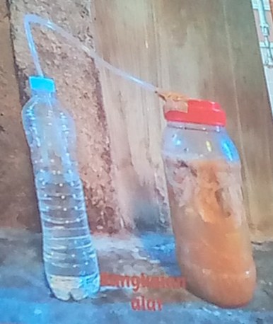

pupuk organik => dari sisa tanaman dan hewan. mengalami fermentasi. dapat dibantu dengan EM4 dalam pembuatanya. untuk mempercepat pembuatan dan meningkatkan kualitasnya. ia mengandung mikroorganisme fermentasi dan sintetik oleh berbagai bakteri. 

1. membasmi jamur
2. memeperbaiki sifat tanah
3. nutrisi tanah
4. menekan aktivitas hama dan penyakit

EM4 bewarna hitam pekat. dalam karya makmur 2018, dijelaskan manfaat EM4. didalamya terdaapat bakteri asam laktat, dan bakteri sejenisnya, bakteri itu berfungsi untuk mengurai (dipecah), ada juga bakteri yang mengurai vitamin. ada bakteri yang memecah karbohidrat => gula => alkohol. 

EM4 apakah bisa diganti dengan minuman fermentasi lain (misalnya yakult), juga bisa karena didalamnya juga mengandung bakteri. EM4 harga 18.000 (bewarna kuning). 

> kita dapat memecah nutrisi di laboratorium, tetapi bakteri juga bisa melakukan demikian

kandungan kimiawi maksimal didalamnya maksimal adalah 5% (Simamora, 2005). POC = Pupuk Organik Cair. 

>C-Organik 0,10 %
>N-total 0,4 %
>NPK 0,11%
>Kalsium 26,85%
>Magnesium 0,03%

komposisi diatas sangat tergantung dari bahan dasar pembuatan POC, misalnya bahan dasarnya adalah wortel, maka kandungan vitaminya akan tinggi, kalau sawi itu akan mengandung banyak kalsium oksalat, kalau tumbuhan klorofil akan mengandung Mg. 

Air cucian beras, gula, dan EM4. ini adalah garis besar pembuatan pupuk organik cair. air cucian beras untuk menambahkan kandungan, kalau gula adalah untuk makanan untuk bakteri yang berada pada EM4. air beras itu adalah karbohidrat akan diurai oleh EM4, selain itu dalam karbohidrat juga mengandung Oksigen sehingga juga akan dimanfaatkan oleh EM4. selain itu air cucian beras mengandung berbagai mineral misalnya adalah zat besi. air cucian beras saja juga bisa untuk dibuat pupuk.  

dalam toples reaksi diberi selang agar melalui udara, selang dimasukkan dalam suatu air sehingga udara dari luar tidak bisa masuk. setelah itu disaring agar bening. takaran penyeprotan yaitu dicampur dengan 5-10 liter air. takaran boleh ditambah jika terlalu pekat. . penyemprotan lebih baik dilakuakan pada situasi tidak akan hujan, terik matahari, dan malam hari sehingga tidak ada sinar matahari. 

> jika ada pertanyaan ditambahkan di PPT

> pupuk 390 ml bisa dijual sampai dengan 40.000 rupiah

