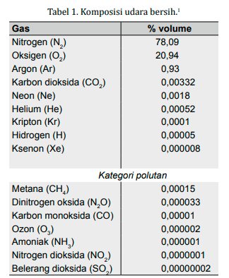

setiap 1 cm kubik permukaan tanah diselimuti oleh sekitar 1 kilogram udara. sekitar 99,99% udara berada pada ketinggian sampai 80 KM dari permukaan bumi. dan sekitar separuhnya berada pada ketinggian antara 3 sampai 5 kilometer diatas permukaan bumi. suhu udara turun sampai -70 celcius pada ketinggian sekitar 10 sampai 12 kilometer. 

Pada keadaan normal, udara bermuatan negatif. Secara alami, muatan negatif berasal dari interaksi antara uap air dengan sinar matahari. oksigen dari proses fotosintesis pada tumbuhan juga bermuatan negatif. unsur penyususn oksigen sebagai berikut

Belerang merupakan pengotor
S + O2 -> SO2
dalam suhu tinggi reaksi berikut juga dapat terjadi
N2 + 2O2 -> 2NO2