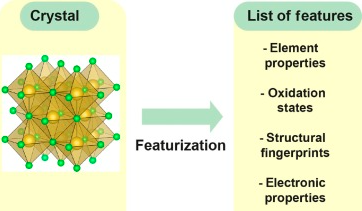

Rahm dan rekan kerja telah menunjukkan bahwa dua fundamental dari sifat unsur, yaitu tabel periodik dan unsur elektronegatif dapat berubah secara drastis pada tekanan tinggi. 

Misalnya, Li akan bergabung pada grup p pada tekanan 300 gigapascal. K dan logam alkali yang lebih berat akan menjadi logam transisi. lebih lanjut lagi, Na akan menjadi elemen paling elektropositif

berbagai sifat material seperti band gap, bulk and shear modulus, and vibrational properties telah berhasil dipelajari oleh mesin. studi tersebut telah dihubungkan pada properti komposisi, termasuk struktur kristas

> Database kristalografi seperti Inorganic Crystal Structure Database (ICSD), the Open Crystallographic Database, or the Cambridge Structural Database

