tanah liat bisa menghantarkan panas. kalau listrik itu berrati ada muatan yang dapat dipindahkan. pita valensi

awal terciptanya adalah terjadi loncatan konduksi ke pita valensi. kalau pita valensi cukup sangat dekat. (energi antar pita) band gap energy. kalau energi gp kecil, maka ketika ada sinar yang tidak terlalu tinggi, maka elektron akan loncat. kalau gp nya tinggi maka disebut dengan semikonduktor, kalau isolasi itu bandgapnya sangat tinggi, harus menggunakan sinar-X untuk meloncatkan elektron

mungkin cuma loncat, kemudian balik lagi. antara pita valensi dan pita konduksi

kalau loncat, maka akan memberikan lubang (bermuatan positif) karena elektron meninggalkan. pasangan elekron hole. sel elektrolisis itu dibutuhkan

elektron keatas maunya balik lagi kebawah. untuk mecegah tersebut. maka jarak dibuat jauh, maka 

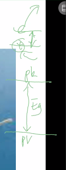

jika jauh untuk terjadinya rekonduksi. Eg juga tidak terlalu jauh, dan tidak boleh terlalu dekat. tetapi kejauhan Eg dibutuhkan agar tidak terjadi rekombinan. 

semikonduktor dipakai untuk prosessor. LED itu juga semikonduktor, transistor juga. kapasitor juga merupakan materila semikonduktor. 

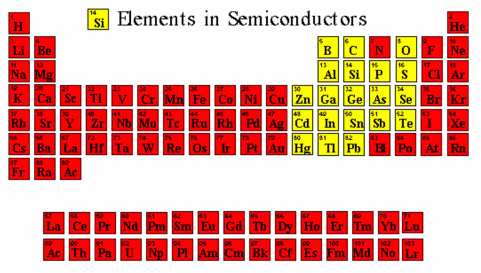

semikonduktor adalah yang warna kuning. kecuali silicon semua adalah campuran. proses pembuatan silikon murni itu susah, tetapi itu dipakai banyak di teknologi.  yang membuat sinar matahari menjadi UV aalafh ingkatanya

yang bisa berdiri sendiri hanyalah Si, banyak digunakan untuk sel surya. 25% paling efisien dikonversi ke listrik dari panel surya. silikon itu banyak, pasir itu juga mengandung silikon, kebanyakan dalam bentuk SiO2. teknologi solar sel generasi 2, menggunakan CdSi, sel generasi ke-3 dyed synzetised solar sell, mengadopsi sistem fotosintesis tumbuhan. yaitu dengna klorofil yang bewarna gelap. 

hubungan semi konduktor dengan energi, energi berbanding terbalik dalam lambda. semakin tinggi panjang gelombang maka energinya semakin rendah. 

singal FM dan AM, gelombangnya lebih tinggi AM (jangkauan lebih luas). FM lebih pendek, frekuensi lebih tinggi, lebih jelas. 

gelombang inframerah, infra berarti sebelumnya, maka gelombang setelah inframerah adalah gelombang merah. 

E = (h.c) /lambda

E adalah 1.2 - 3.6 elektrovolt. jika masuk itu maka itu termasuk semikonduktor. jika E diatas 3.6 maka isolator. 

360 nm sampai cahaya kuning sekitar 700

jadi itulah energi tempat kerjanya semikonduktor. UV a - sinar kuning, sinar matahari itu kandunganya itu, agar efektik (mencari energi yang pas agar semikonduktor berjalan baik

mengabungkan materila2 yang bewarna kuning tadi di laboratoriam

misalnya TiO2 itu energinya 3 - 3,4 eV. maka semikonduktor bekerja di daerah sumber sinarnya itu (agar tidak terjadi rekombinasi)

*Ketika elektron di pita konduksi melampaui celah energi dan mencapai pita valensi, ia menjadi stabil dan menempati posisi lubang di pita valensi. Dengan aksi ini, elektron dan lubang menghilang. Ini disebut rekombinasi pasangan elektron-lubang atau rekombinasi sederhana dalam semikonduktor.*

Silikon murni -> jangkauan kerjanya adalah 0,6 sampai 3,8 (infrared sampai UV) itu bisa dilihat jangkauanya sangat luas. 

WO3 adalha kombinas (tungsten Oksida 3)

sintesisnya bagaimana, apakah kristal, amorf, atau apa. 

TiO2 Eg nya adalah sekitar 3.2

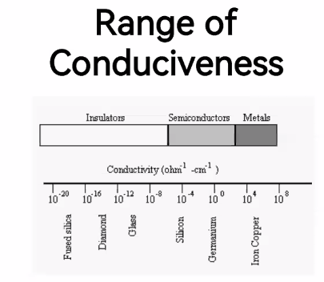

itulah rangenya, agar tidak terjadi. itu terkait dengan loncatan elektron. 

semikonduktor ditemukan pada 1824. yaitu john jacob dnegan mengisolasi silikon. semikonduktor dimanfaatkan tahun 1900. 

tegangan (V)(beda antara + dan -) hole dan eletktron

**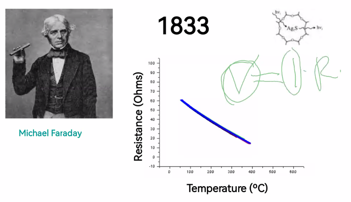**

semakin tinggi teperature maka semakin hambatan tinggi. semakin. yang dipelajari adalah Ag2S (semikonduktor). tahun 1873 menemukan selenium sebagai material semikonduktor, ini dapat memisahkan muatan positif dan negatif. sinar dapat dihantarkan dalam aliran listrik. fotokopi merupakan aplikasi semikonduktor. 

detektor juga menggunakan material semikonduktor. 

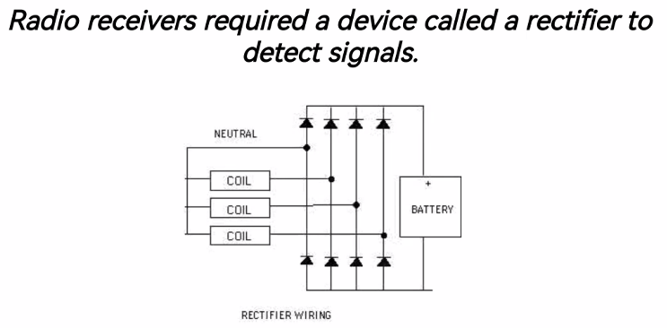

quantum digunakan untuk membantu menjelaskan semikonduktor electricity. "saya tidak bisa menjelaskan mana pita valensi dan mana pita konduksi bila tidak tahu konsep 1s, 2s,3s. maka pita dengan energi paling tinggi. 

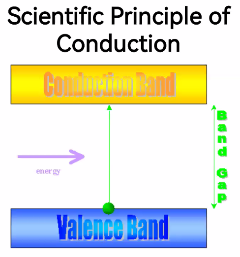

band gap adalah energi yang dibutuhkan untuk meloncatkan elektron 

pita valensi, itu orang organik dibilangnya adalah HOMO. (Highest occopied energy band)

pita konduktsi itu orang organik dibilangnya adalah LOMO (energi terendah dari orbital terendah yang tidak ditempati elektron, yang memungkinkan elektron dari valensi untuk meloncat).  dalam keadaan dasar, pita konduksi itu kosong

pita konduksi pasti energinya lebih tinggi dari valensi. 

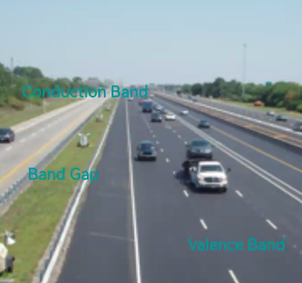

meloncat dari valensi ke konduksi yang lebih kosong. 

sedangkan konduktor, elektron bisa berpindah walaupun energinya rendah itu bisa berpindah

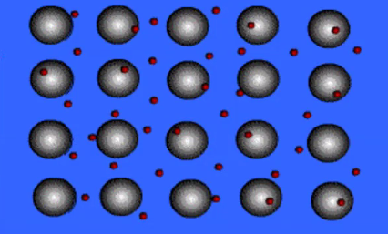

mereka punya elektron yang bisa bergerak walaupun energinya rendah. 

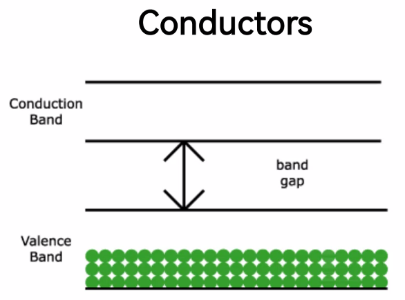

pita konduksi adalah pasti kosong pada material konduktor. 

itu gapnya rendah, 

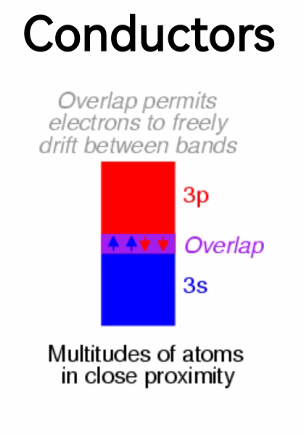

terkadang dianggap tidak ada gap 0. ... ev

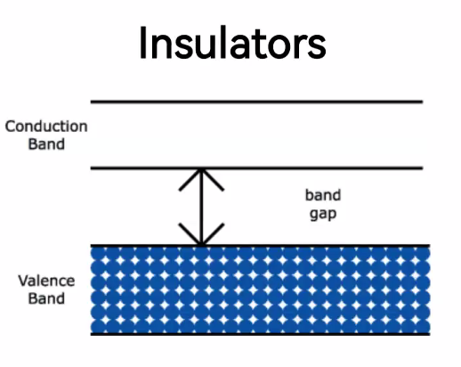

band gap sangat tinggi. 

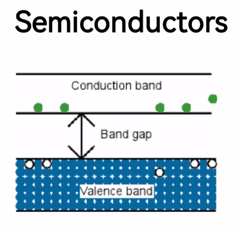

pita valensi penuh, band gap tidak terlalu jauh. adanya pelompatan, dan meninggalkan hole. 

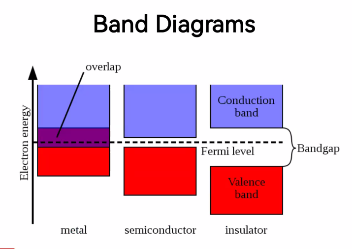

struktur silicon murni

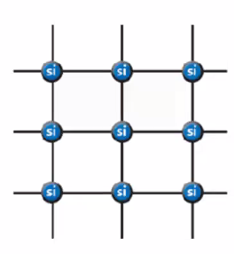

antar silikon terjadi ikatan kovalen. 

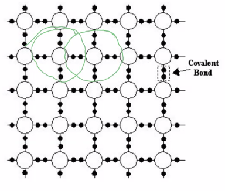

silikon kristal 

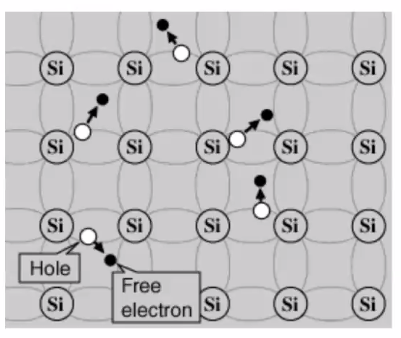

ada elektron bebas yang bisa perbindah sehingga bisa menciptakan hole, adanya hole menandakan adanya elektron yang meloncat. elektron hole merupakan awal dari proses penghantaran listrik. 

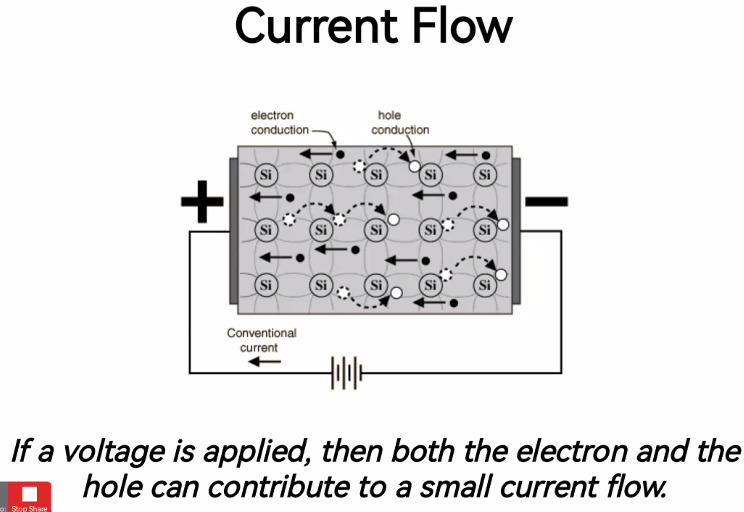

semikonduktor. 

CACAT KRISTAL (IMPURITY)

mungkin ada atom yang hilang, atau ada atom yang terganti (tercampur). ketidaksempurnaan tersebut ternyata mempermudah meloncatkan elektron. 

menyebabkan sifat semikonduktor berubah, karna ikatan dan muatan yang dipengaruhi oleh elemen doping. 

P-Type doping : kelebihan muatan positif

N-Type doping : kekurangan muatan positif

diganti dengan boron atau galium

silicon punya elektron valensi 4 sedangkan boron mempunyai 3 elektron valensi, ketika boron didoping ke silicon, menyebabkan struktur silicon itu kekurangan 1 elektron (P-type doping)

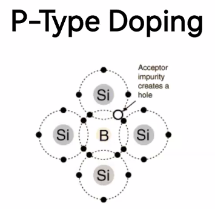

terjadi kekosongan satu (disebut P-Type doping) 

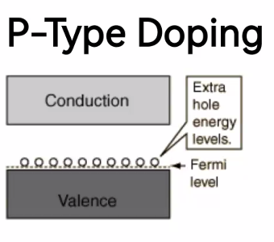

ketika terjadi loncatan elektron membuat hole lebih banyak. hole itu akan sangat senang jika menerima elektron. sehingga membuat seperti perpindahan yang berantai

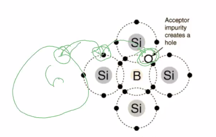

p-type membuat elektron cepat sekali berpindah. 

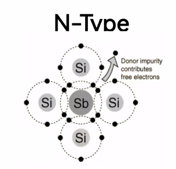

kalau N-type itu ada elektron yang bebas membuat fermi level akan naik. baik p-type mauapun n-type akan memperbaiki sifat dari silikon. 

maka untuk melihat p-type atau n-type adalah dengan melihat atom yang didoping itu negatif atau positif

ketika n-type digabung ke p-type digabungkan akan menyebabkan alirasn listrik

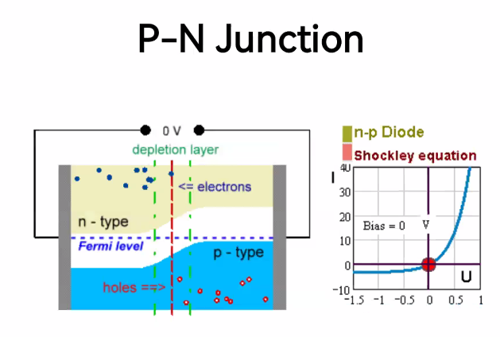

gabungan P dan T (P-N junction) bahkan tanpa 0 listrik, akan terjaid aliran listrik. karena ada pergerakan dari hole yang dihasilkan dari p-type, dan elektron yang dihasilkan dari n-type. dan aliran listrik akan berhenti ketika semua lubang telah terpenuhi. 

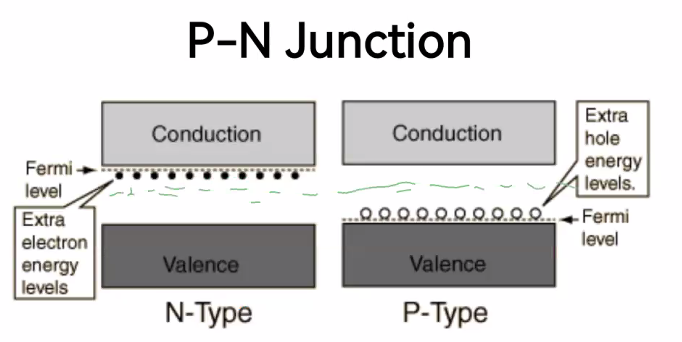

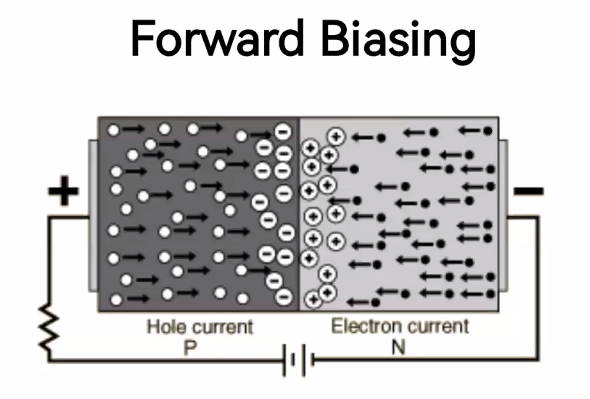

diterapkan pada solar sel generasi pertama. membentuk P-N junction. 

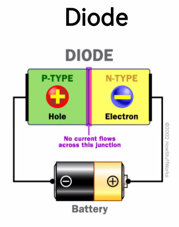

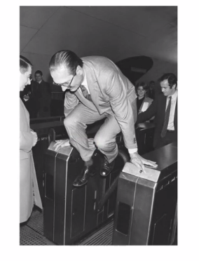

jika anda membalikkan voltage, maka arus balik itu akan terbalik. 

P-N junction

**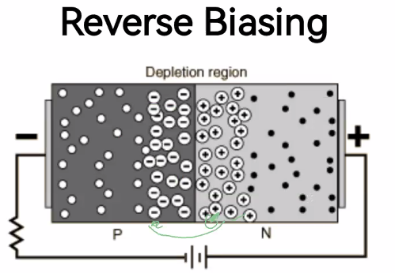**

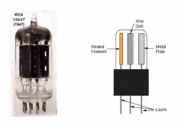

transistor, ini tidak membutuhkan pemanasan, sebagai amplifikasi muatan. mengamplifikasi singal elektronik. 

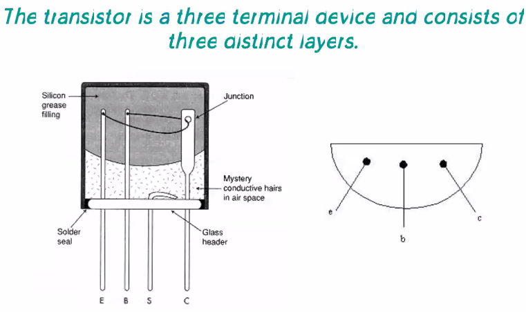

ada dua jenis

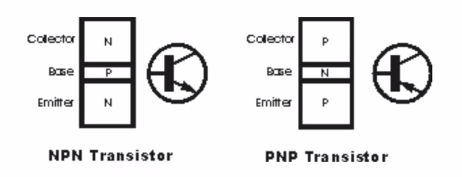

N-type, P-type. membuat N dan P itu memerlukan proses doping ygy. dibikin lapisan sandwitch untuk membuat P-N junction, diatas itu disebut dengan wafer (karena diapit oleh dua jenis yang sama).

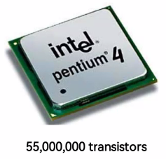

radio paling kecil, itu sangat kecil, sudah bisa menghantarkan suara. penelitian terkini adalah menggantikan silicon dengan germanium

**SUPERKONDUKTOR**

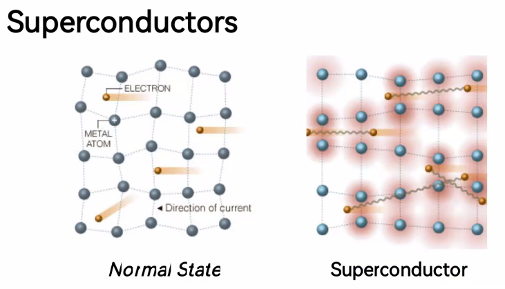

perpindahan elektron sangat cepat

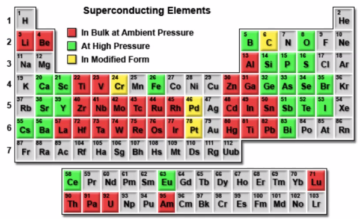

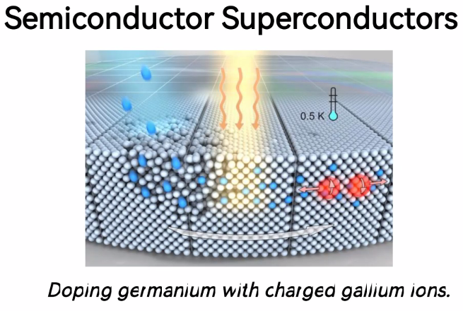

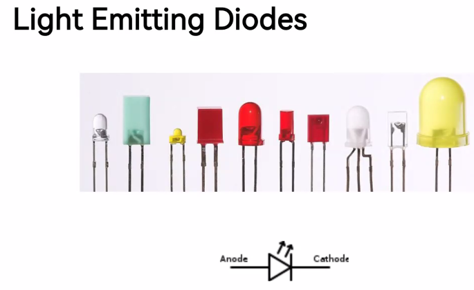

energi dari sinar apapun walaupun rendah bisa dipindah ke energi listrik. 

sintesis semikonduktor > > fotokatalisis

limbah berbahaya, mendegradasi senyawa berbahaya. yaitu dengan membuat OH radikal dari H2O oleh fotokatalisis, radikal tersebut akan direaksikan dengan limbah berbahaya. 

BIomaterial, Nanoteknologi, Smart material. ketika material diberi aksi, maka material tersebut akan memberikan reaksi secara cepat terhadap stimulus pada keadaan tertentu. 

contohnya kaca mobil, ketika siang itu gelap, ketika malam itu terang. contoh lainya adalah ketika diberi pH lemah, maka material tadi lunak dan sebaliknya. maka dia bisa kembali ke keadaan semula. 

contonya adalah shape memory alloy (SMAs). memiliki memori kembali ke bentuk semula. dari keadaan padat, dia bisa transparan dan tidak transparan, yang berubah adalah strktur kristal. terjadi perubahan struktur. 

NiTi itu berkaitan dengan perubahan tekanan darah dalam tubuh manusia. 

Smart gel : bisa berubah sebagai respon dari stumulasi external, biasanya mengandung larutan yang terdiri dari 

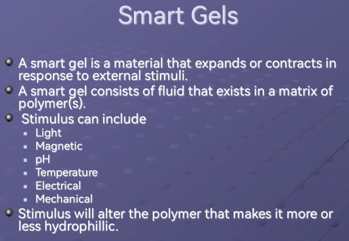

percobaan tanaka untuk uji smart gel. ketika dikasih sinar, yang mendekati adalah yang berbentuk lingkara, dikasih pH yang mendekat adalah kotak

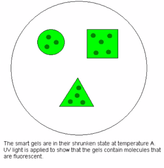

drug delivery, dan obat adalah yang biasanya menggunakan ini. ini bisa untuk penyakit kanker, yaitu dengan mengenali apakah sel ini sehat atau sakit, jika sakit drug delivery akan melepas obatnya sehingga yang terebunuh hayalah sel sakit. 

RHEOLOGICAL MATERIAL

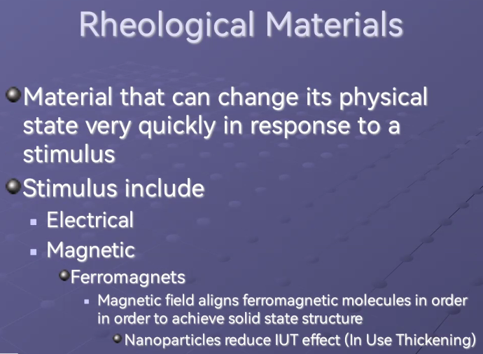

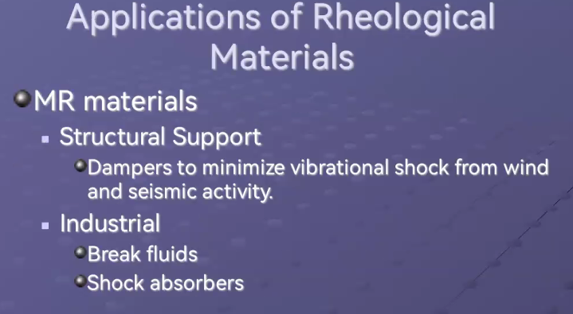

UAS :