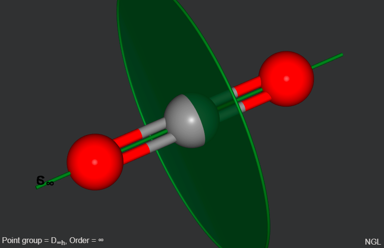
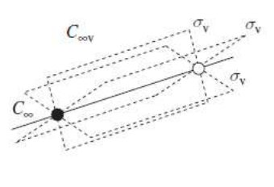
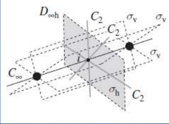
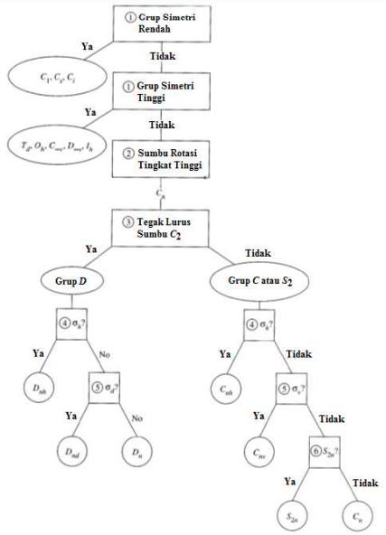
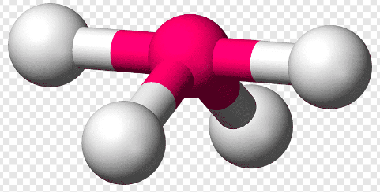
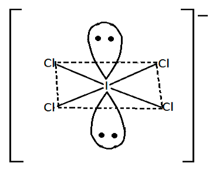

1. group dengan simetri rendah,
2. group dengan simetri sangat tinggi
3. group dengan sumbu rotasi Cn
4. group dengan titik diheral (Dn)

> ini akan mempengaruhi bagaiman molekul melakukan streaching dan lain lain yang berdampak pada energi, sehingga menimbulkan spektral yang bermacam-macam

## group dengan simetri rendah
group C1, yang memiliki operasi **E saja**. dan Group Cs, yang memiliki operasi **E dan bidang cermin saja.**  Group Ci yaitu hanya punya **operasi E dan inversi** saja. 

## group dengan simetri sangat tinggi
### Linear
terdapat dua jenis, linear dan polihedral. contoh linear HCl, Hbr, CO2. Polihedral tetahedral Tetrahedral atau Oktahedral Ikosahedral atau Dodekahedral. 

> apabila ada sumbu utama Cn yang tegak lurus dengan n2 c2 maka itu termasuk Group D (dehidral), kalau tidak ada fenomena tersebut adalah Group C

> salah satu syaratnya adalah jarak atomnya harus sama, apabila ada atom yang terdistorsi maka sudah berbeda

**C tak hingga**

**D tak hingga**

### Poliheral
Tetrahedral, Oktahedral, dan Ikosahedral. contoh ikosahdral adalah fluorence

## group dengan sumbu rotasi Cn
golongan hanya memiliki unsur simetri E dan Cn. 

## group dengan titik diheral (Dn)
ketika sumbu utama (Cn) tegak lurus dengan N2 C2. D6 vertikal  (D6v) tidak ada

## Alur menentukan group molekul

struktur lewis, misal struktur jungkat jungkit

jawabanya adalah C2v

jawabnaya adalah D4h

