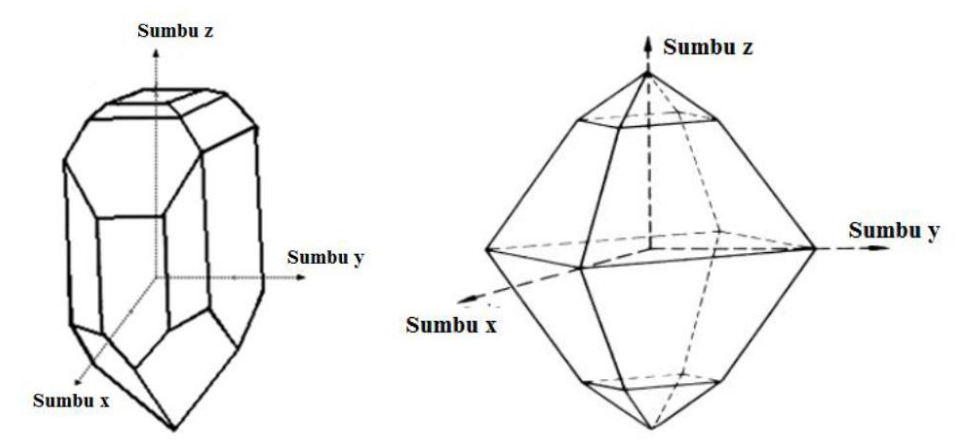

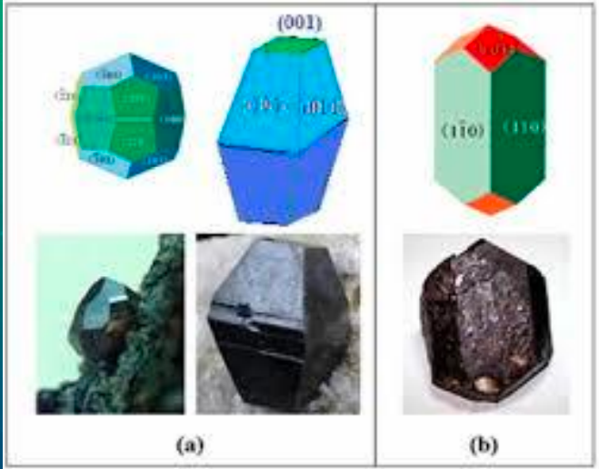
(001) adalah situs yang paling aktif. pemberian nama menggunakan koordinat kartesian. 

# Hukum indeks rasional
## indeks weiss
kemudian diperbaiki oleh miller. indeks weiss
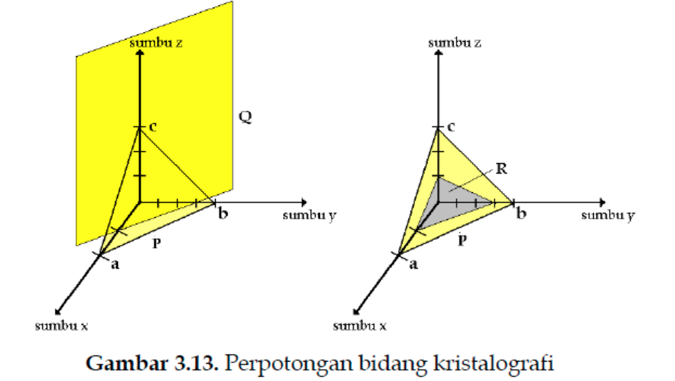
bidang kuning adalah bidang yang memotong di a 1/2, dan b 3/4 satuan, dan c tidak memotong. sedangkan pada P 1/1 untuk a, 1/1 untuk b. 1/1 untuk c sehingga ditulis (111), atau jika dilihat dari q adalah (2,3,~).

untuk gambar kananya yaitu untuk R. adalah (1/2, 3/4, 1/3) atau jika dibulatkan adalah (6,9,4)

> pembacaanya dari x, y, z.

## Indeks Miller
sepersatuan yang disebut dengan (h,k,l). seper indeks weiss. diperbaiki karena dalam indeks weiss ada nilai tak hingga. maka dibuat 1/indeksweiss. misalnya untuk indeks weiss  (2,3,~) diubah menjadi indeks miller adalah 1/2, 1/3, 0). dinamakan dengan kisi resiprok atau (h,k,l). 

apabila terdapat notas [1,1,1] ini berbeda, menandakan adanya sumbu yang tegak lurus dengan bidang itu. kalau (1,1,1) menunjukkan bidangnya 

## Indeks Miller Bravais
menunjukkan untuk hexagonal yang dapat dipandang sebagai 4 dimensi (x,y,z,u) atau (h,k,i,l)
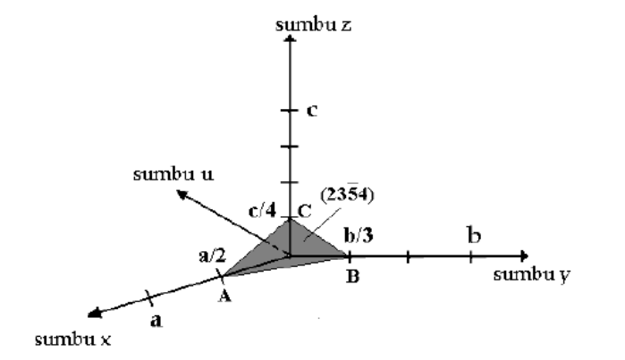
 dimana i adalah -(h + k) sebagai dimensi ke-4. 
 
 # Pola dan motif
 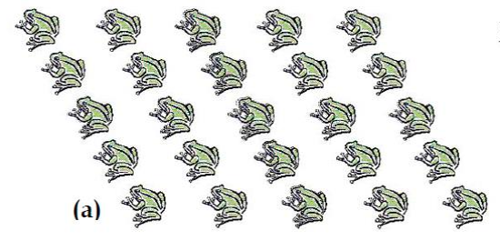
 *pola* disebut dengan kristalin
 
 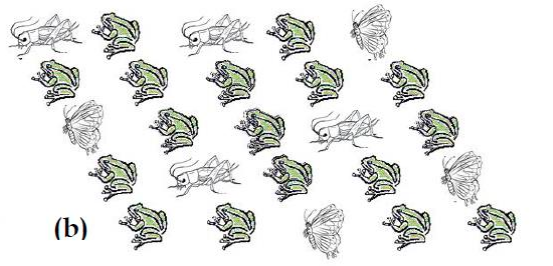
 *bukan pola* disebut dengan amorphous
 
apabila hexagonal maka menggunakan miller bravais. apabila bukan hexagonal maka dapat menggunakan miller.
pertama kali adalah membuat sumbu (x,y,z) atau (h,k,l)
 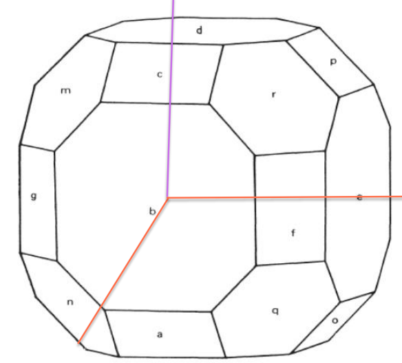
 
pada bidang d adalah (001) (miller) atau (~,~,1) (weiss). pada bidang b adalah (100) (miller) dan bidang e adalah (010) (miller).

sehingga didapatkan gambar seperti dibawah
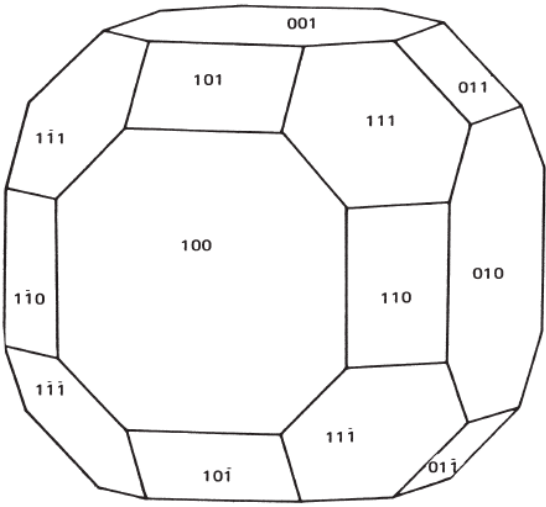

# Tugas
z tidak kelihatan karena mengarah kepada pengamat. aturan tangan kanan seperti dibawah maka z atau c bernilai ~ (weiss) atau 0 (miller)
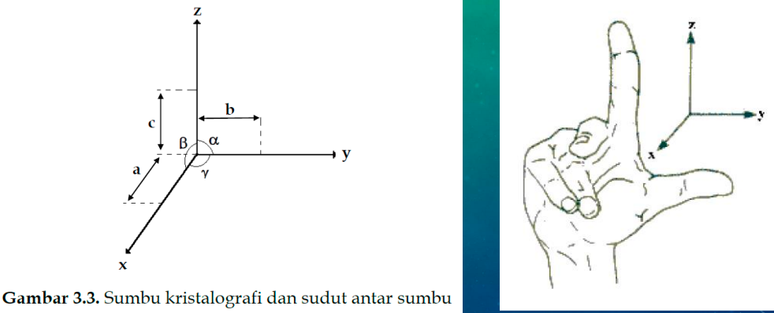

sebutkan indeks millernya dibawah ini

a. (2, 3, 0) (miller) atau (1/2, 1/3, ~) (weiss)
b. (1, 2, 0) (miller) atau (1/1, 1/2, ~) (weiss)
c. (-1, 1, 0) (miller), dikatakan negatif ketika tegak lurus dengan sumbu

untuk bidang 3D
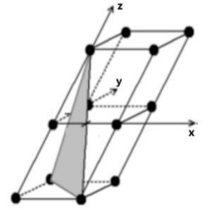
*(1,-1,2)* (weiss) atau *(1,-1,1/2)* (miller)

bisa dikerjakan dirumah untuk pengayaan saja. 	
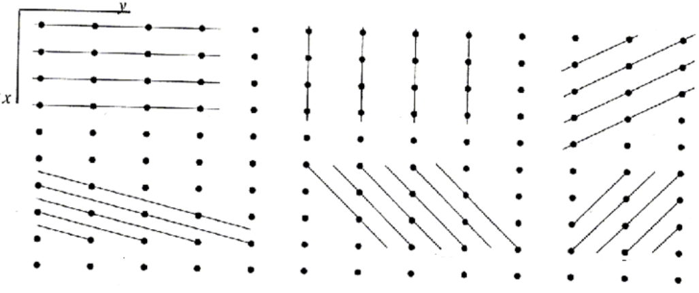

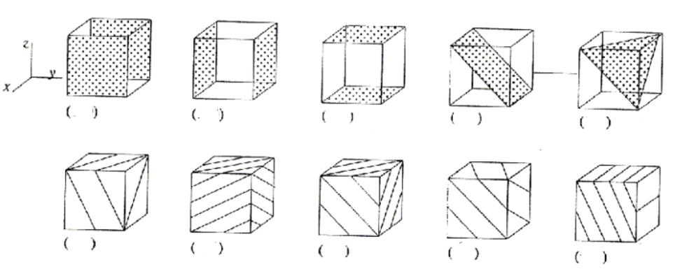

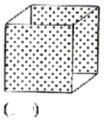
*(1,0,0)* atau (-1,0,0)

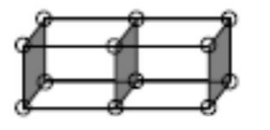
*(1,0,0)*

cermin dari 100 adalah -100 yaitu yang tidak terlihat oleh mata. dinamakan dengan stereogfrafi menggambar 3D dengan 2D.

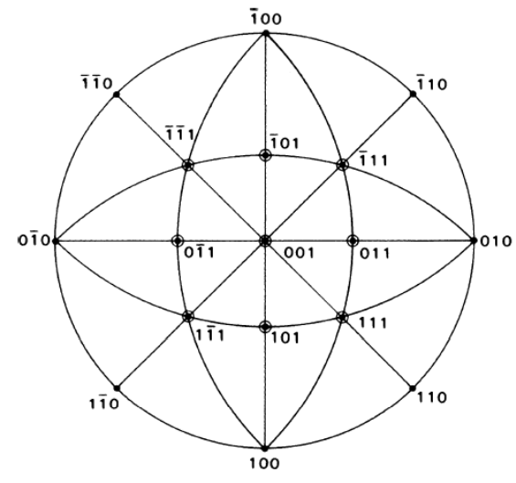

> penjelasan lebih lanjut ada di onenote

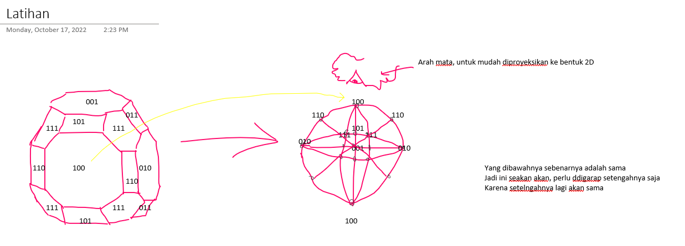

apabila kristal tidak simetris, maka perlu membuat dua stereografi. misalnya dibawah, adalah menggambar dari atas dan dari bawah

Kristal TiO2. secara alam akan tersedia dan bisa jadi berukuran besar karena sudah ditempa ratusan tahun. sedangkan sintesis kristal TiO2 akan berbentuk kecil (serbuk) untuk menumbuhkan kristal mungkin cukup selama dua minggu. dan kristal tersebut memiliki defek, misal ada yang kosong. 
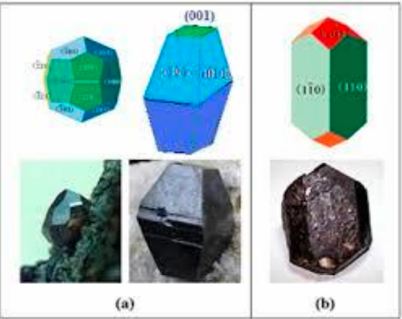

trikrilik : sangat tidak teratur, kabanyakan bahan alam ketika akan dikristalkan. 
kubik : simetri tinggi