kristal tunggal,
kristal dengan tekstur
polikristal, 

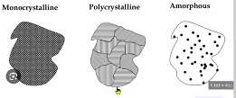
kristal tunggal yang saling terhubung membentuk padatan
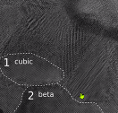

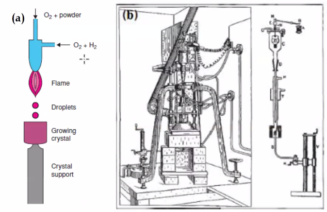
gas pertama (O2) untuk membawa polikristalin (powder). kemudian disuplai reduktor dan oksidator (H2 dan O2). 

sehingga powder tersebut akan meleleh dan menetes pada suatu wadah (growing crystal) sehingga akan membentuk singgle kristal

metode lainya adalah Czochralski, yiatu pemmebntukan polikristal menjadi kristal tunggal 
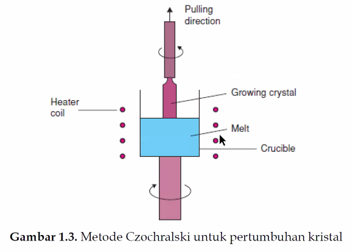
putaran dan ditarik (pulling direction) polikristal diberikan pada wadah kemudian dipanaskan, kemudian tumpu diputar dengan berlawan arah dari atasnya. sehingga didapatkan bentuk kristal seperti silinder (ditarik ke atas). 

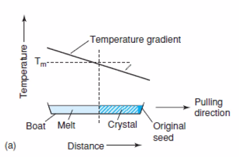
(Metode Stockbarger) sebuah wadah yang memiliki gradien temperature (temperature yang berbeda-beda) sepanjang material tersebut. dengan ditarik ke temperature rendah (pulling direction) akan diperoleh kristal.

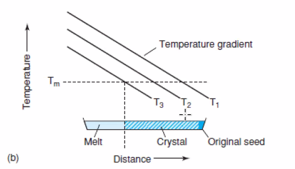
(Metode Bridgman) menggunakan waktu tertentu untuk memanipulasi temperature gradient. 

Metode pelelehan zona
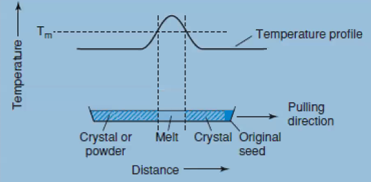
dimulai dari kiri berupa powder, kemudian semakin ketengah temperaturenya naik yang ditunjukkan oleh garis temperature profile kemudian paling kanan akan didapatkan kristal lagi (ke arah pulling direction)	
sehingga semua akan menjadi kristal tunggal. 

> bibit kristal (original seed), digunakan untuk memancing pembentukan kristal lainya, 

#### ada 4 metode pembentukan kristal tunggal, disebutkan prof Heri.

air laut diuapkan menjadi jenuh, NaCl akan mudah mengkristal. contoh kristalografi sehari-hari. 

ini adalah bagus untuk dipresentasikan kepada guru, terutama mereka yang dekat dengan pantai. 

#### Membuat kristal dnegan bantuan mikroorganisme, 
kristalisasi protein, kristalisasi enzim, kristalisasi bahan alam. 

membuat kulit sintesis menggunakan konsep kristalografi. 

> jika itu sudah terjadi, kulit pada wajah (misal kena luka bakar) tidak perlu lagi diganti dengan kulit belakang pupu

#### Pertumbuhan kristal dari jel

#### Pertumbuhan larutan non air
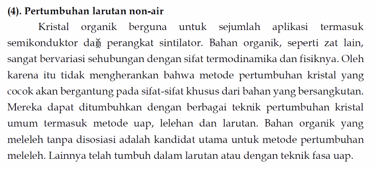

#### pertumbuhan hidrotermal 
(dibawah tekanan) 

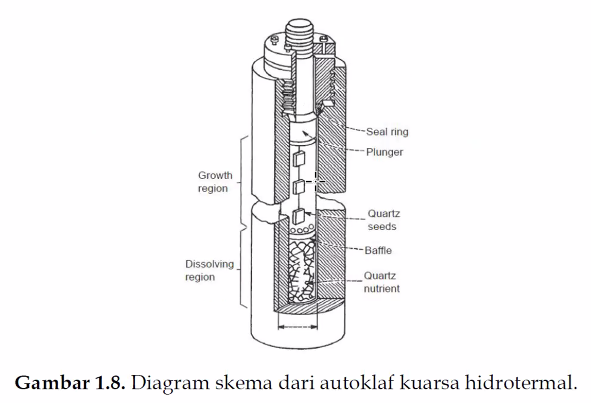
sintesis zeolit menggunakan alat ini, bomb hidrotermal. tekanan pada alat tersebut dapat diatur. 

## pertumbuhan kristal
1. dari lelehan
2. dari air (pelarut)
3. dari fasa uap

fasa uap
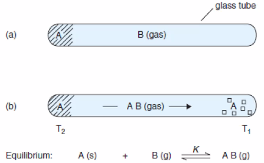
senyawa B adalah katalis untuk calon kristal tunggal A dari mula mula polis kristalin. menggunakan temperature. 
temperature antar ujung tabung tersebut adalh berbeda. 

misal
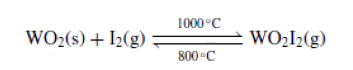
ketika dalam temperature 800 akan menjadi Wolfram. dalam termperarute 1000 akan menjadi WO2I2

juga bisa digunakan untuk pemurnian, misal dari WO2 menjadi W
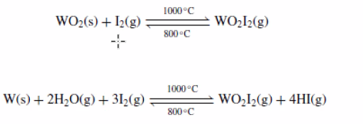
temperature 800 akan terbentuk W (s) sedangkan pada temperature 1000 terbentuk WO2I2 (g)

Reaksi transformasi kimiawi

CD rom (pelapisan) menggunakan reaksi fasa uap, pada temperature tertentu akan menempel pada permukaan CD (metode chemical vapor deposition) atau Metal-Organic chemical vapor deposisiton (menggunakan prekusor organik)

Berikut merupakan kristal tunggal
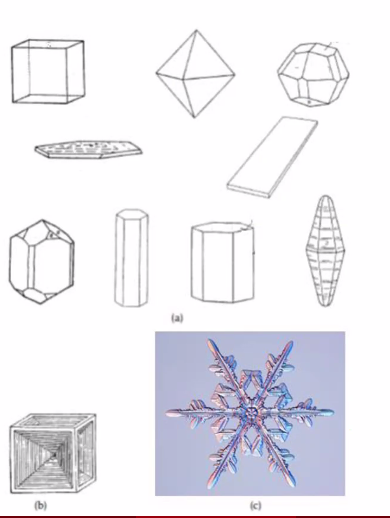
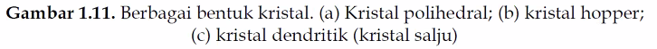

beberapa kristal dapat dilihat, utamanya kristal mineral alam

anda dapat mensintesis kristal, menggunakan temperature dan tekanan tertentu.  tetapi mungkin kurang bagus berbeda dengan kristal yang terbentuk alami selama milyaran tahun. 

> kristal dialam kebanyakan adalah kristal tunggal. 

> kristal itu adalah mengkilap

> serbuk itu juga transparan sebenarnya

> Analisis XRD lebih mudah menggunakan kristal tunggal