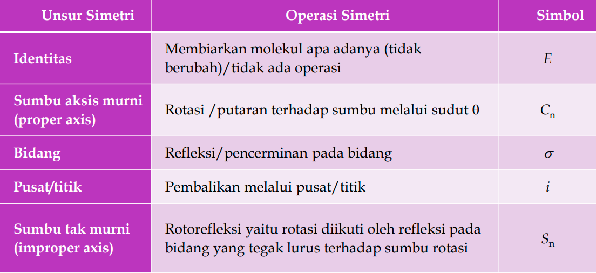
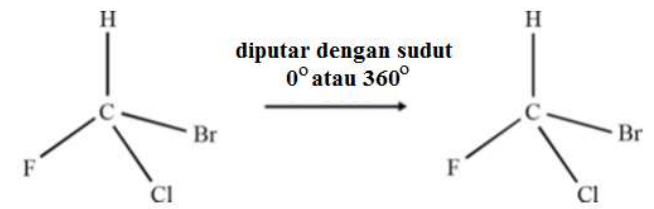
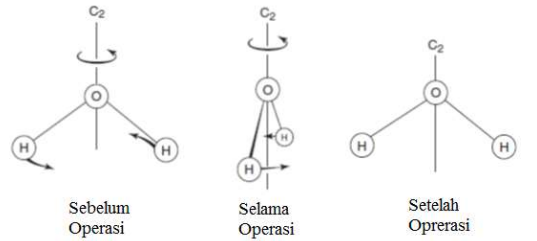
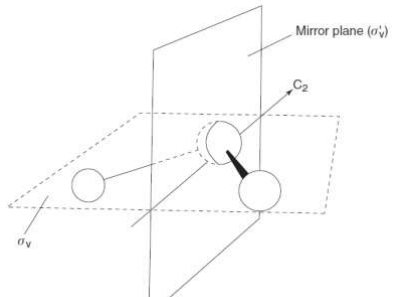
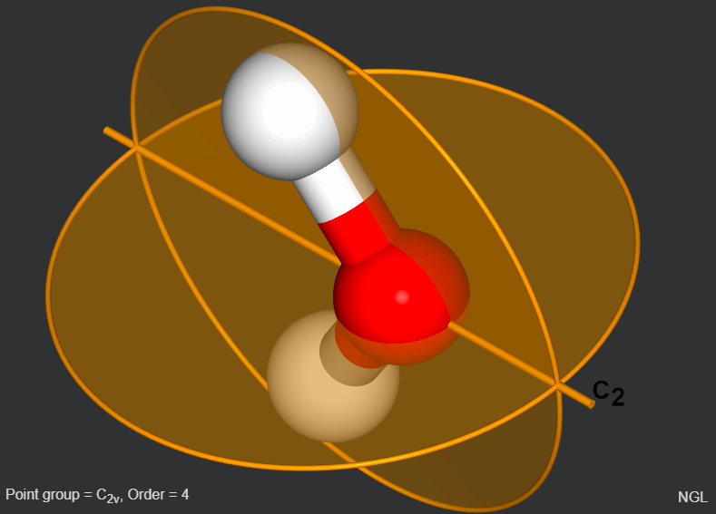
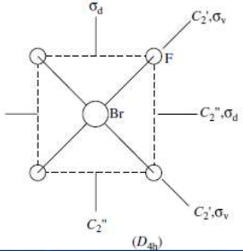
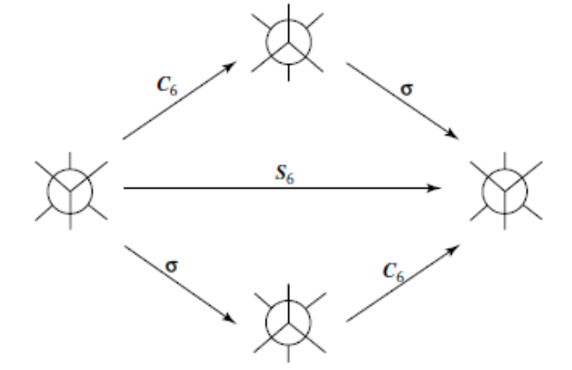

Beberapa operasi

### Identitas
Misal hanya memiliki operasi E. maka benda itu sangat tidak simetri, semkain jumlahnya dikit maka semakin tidak simetris, misalnya

dia cermin, sumbu simetri dll tidak punya, hanya punya satu operasi yaitu Identitas (E)

### Aksis murni
ada operasi aksis murni yang bernilai n dengan notasi Cn, misalnya untuk 360 / 180 sehingga didapatkan sumbu aksis murni C2

### Cermin
, cermin ada dua yaitu horizontal, dan vertikal.

adalah sumbu utama C2.

### Pusat simetri
diperhatikan dalam elektronika. perncerminan terhadap suatu titik.

dibawah memiliki dua vertikal dan dua horizontal

bidang horizontal adalah ketika memotong sumbu utama (Cn). 

### Sumbu rotasi tidak murni
Refleksi rotasi atau disebut juga dengan Rotasi refleksi. 

