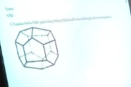
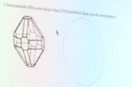
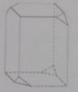
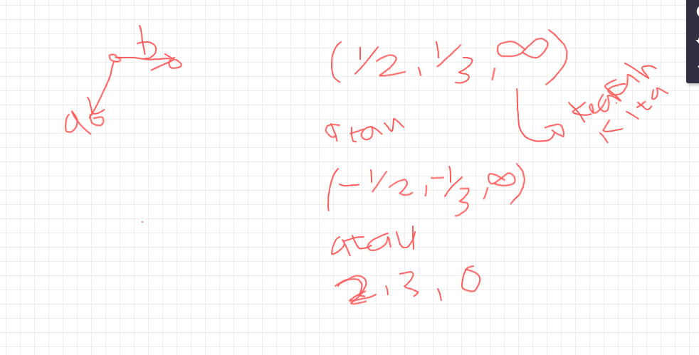

## Stereografi
akan ada 9 bidang yang terlihat / indeks miller dalam stereografi tersebut. 

tentukan dan jelaskan: sistem kristal dan krup kristal/grup punctual/point group dari kristal tunggal. 

## Latihan
menentukan sistem kristal dan grup kristal berikut

diputar dengan poros sumbu z mendapatkan 2 rotasi. 

jawaban selanjutnya adalah tetragonal

sistem kristalnya adalah trigonal, 3mmm (atau disebut juga 3m).

yang jawaban d adalah tetragonal dengan grupnya adalah 4mmmm (atau disebut juga 4m)

yang jawaban a adalah 2m (atau disebut juga 2mm)

tidak pernah memotong sumbu z( yang mengarah ke mata kita). tidak memotong maka adalah tak hingga untuk z, sehingga nomor satu adalah 

jawaban nomor dua adalah misal 
$$ D_{2h} $$

membua x, y, z kemduian di indes (misal (001)) kemudian baru dibuat stereografi