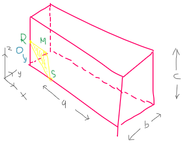
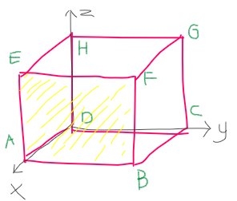

Indeks miller adalah sistem notasi (h, k, l) pada kristalografi. Notasi ini berguna untuk menunjukkan kisi-kisi bidang dan arah dari sebuah kristal.

Masing masing bidang datar memiliki orientasi yang berbeda, kecuali pada bidang yang sejajar yang orientasinya identik

Kegunaan indeks miller
	1. Mendata bidang-bidang dari sel satuan
	2. Menetahui posisi-posisi atom pada sel satuan 

Notasi 
[ … ] menyatakan arah atom
< … > menyatakan kekompok arah

## contoh I

arsir bewarna kuning itu adalah arah rotasi dari bidang kristal yang dimaksud. Indeks millernya (x, y, z). Titik nol tergantung dimana sumbu kartesian berada, dalam gambar tersebut
Sumbu kartesien berada pada pojok kiri bawah, sehingga angka nol (start) dimulai disitu (ditunjukkan panah pada  O). Kemudian nilai dari indeks millernya (x, y, z) adalah perpotongan antara arah rotasi bidang kristal (kuning). Dilihat dari gambar perpotonganya adalah 

	OM = 1/4 a
	OS = 2/3 b
	OR = 1/2 c

Sehingga titik perpotongan pada a, b, c adalah 1/4, 2/3, 1/2. Langkah selanjutnya adalah menentukan bilangan respirok
Bilangan respirok adalah bilangan yang berbanding terbalik dengan nilai titik potong bidang dengan sumbu a, b, c

	Titik potong       : 1/4, 2/3, 1/2
	Bilangan respirok  : 4, 3/2, 2

Langkah selanjutnya adalah menjadikanya bilangan tidak pecah (bilangan bulat)

	Bilangan respirok       :  4, 3/2, 2
	Bilangan bulat terkecil :  8, 3, 4
	
Sehingga indeks miller (h, k, l) adalah (8,3,4) atau 834

## contoh II

Diketahui bahwa sumbu kartesian dimulai dari titik D, sehingga titik D dijadikan sebagai start (0)
Perpotongan sumbu (x, y, z) :

	DA = 1/1
	D~ = 1/~
	D~ = 1/~

	Titik potong : 1/1, 1/~, 1/~
	Bilangan respirok : 1, ~, ~ atau 1, 0, 0
	
Maka indeks miller adalah (100)
	
catatan: keyword ' ~ ' mewakili tidak terdefinisi dalam gambar disamping, tidak ada titik temu antara titik start (0) dengan perpotongan arah rotasi kristal (kuning)

## contoh III

Diketahui bahwa sumbu kartesian dimulai dari titik D, sehingga titik D dijadikan sebagai start (0)
Perpotongan sumbu (x, y, z) :

	DA = 1/1
	DC = 1/1
	D~ = 1/~

	Titik potong : 1/1, 1/1, 1/~
	Bilangan respirok : 1, 1, ~ atau 1, 1, 0
	
Maka indeks miller adalah (110)
	
catatan: keyword ' ~ ' mewakili tidak terdefinisi dalam gambar disamping, tidak ada titik temu antara titik start (0) dengan perpotongan arah rotasi kristal (kuning)