Alkana alifatik (alkana), alkana siklis (sikloalkana)

Hafalkan deret homolog alkana
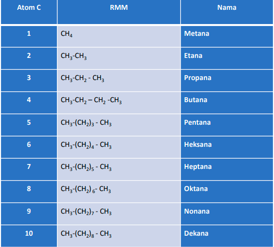

gugus alkil (CnH2n+1)
misalnya 
CH3- (metil)
mulai C berjumlah tiga akan ada isomer, misalnya untuk propana bisa memiliki gugus alkil berupa propil atau isopropil

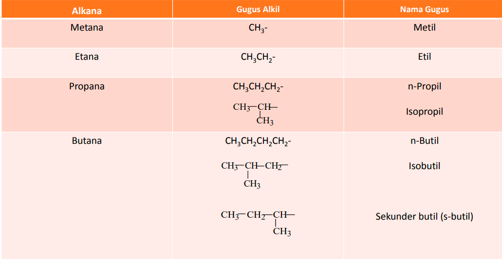
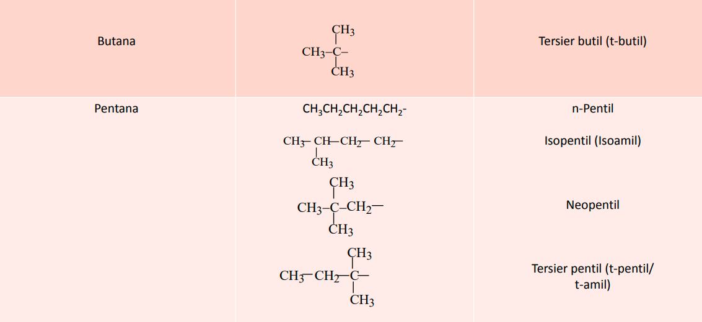
disebut tersier adalah ketika berikatan dengan C yang secara langsung tidak berikatan dengan Hidrogen.

ada dua penamaan secara umum, **trivia** yang dibahas diatas dan penamaan secara **IUPAC**
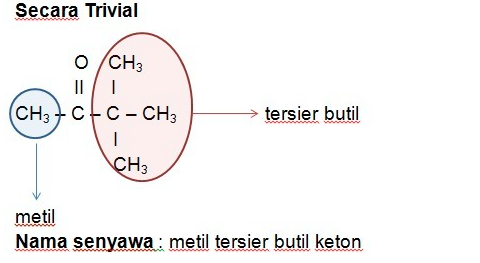
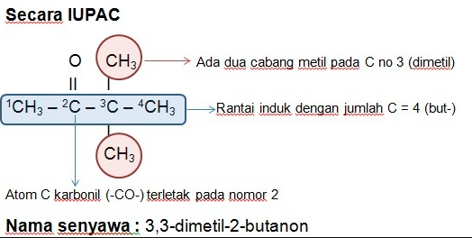

# Penamaan Alkana
alkana rantai lurus (normal) yang memuluku rantai karbon terbuka dan tidak bercabang diawali dengan n- , singkatan dari kata normal, 

alkana rantai karbon bercabang, penamaanya menentukan rantai karbon terpanjang **sebagai induknya** dan di inisiasi agar cabang mendapat nomor serendahnya

*mendapat nomor cabang lebih rendah*
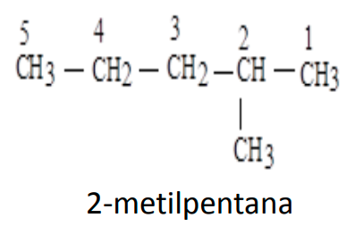

*mendapat nomor cabang lebih tinggi*
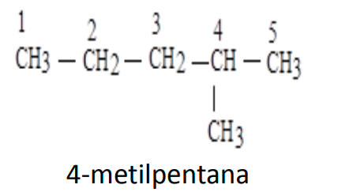
penamaan didahului dengan nama gugusnya terlebih dahulu baru diikuti nama rantai induk
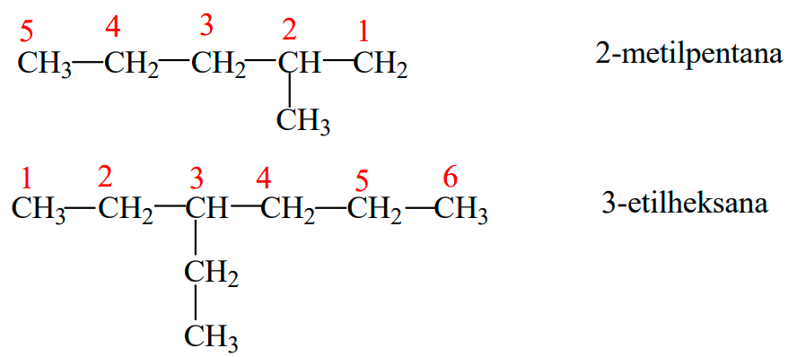
jika ada lebih dari satu metil, maka keberadaanya tetap ditulis dengan angka yang dipisah dengan koma, dan karena berjumlah tiga maka dinamakan **trimetil**
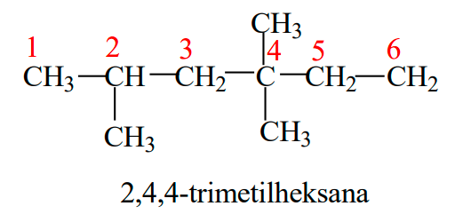

apabila gugus terdapat lebih dari satu dan berbeda, dan apabila berada pada nomor yang sama (sama-sama bisa diposisikan sebagai tiga) maka penamaanya diurutkan dengan abjadnya 
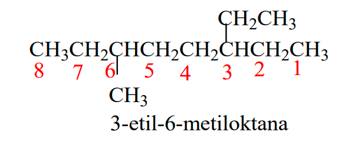
diatas adalah karena e lebih dahulu daripada m (secara abjad) maka e didahulukan terlebih dahulu dalam penulisanya

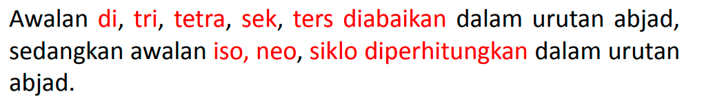
misal di**metil**, tetra**metil** dan lain-lain maka yang diperhitungkan adalah nama metilnya. 

Latihan
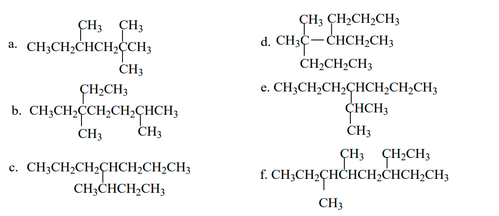
a. 2,2,4-TriMetilHeksana
b. 5-Etil-2,5-DimetilHeptana
c. 4-SekunderButilHeptana (bisa)
c. 3-Metil-4-PropilHeptana (bisa)
d. 4-Etil-5,5-DimetilOktana
e. 4-IsoPropilHeptana
f. 3-Etil-5,6-DimetilOktana

> ketika didepan gugus ada dua nomor, maka penamaan gugus tersebut diawali 'Di', misal 5,6-Di... atau 2,2,4-Tri... atau 2,5-Di...

# Penamaan Sikloalkana
secara garis besar 1) sikloalkana, 2) sikloalkana satu substitusi (monosubstitusi), 3) sikloalkanan dua substitusi (disubstitusi), 4) dan sikloalkana dengan lebih dari dua substituen

kalau hanya ada satu substituen, maka tidak perlu dikasih penomoran
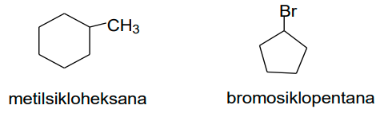
apabila jumlah karbon sikoalkana lebih sedikit dari jumlah karbon pada alifatik, maka sikloalkana tersebut memposisikan dirinya sebagai substituen
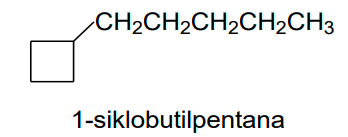

apabila mengikat dua substituen dan mereka adalah gugus alkil, maka penomoran pertama diberikan pada nama gugus dengan abjad paling awal
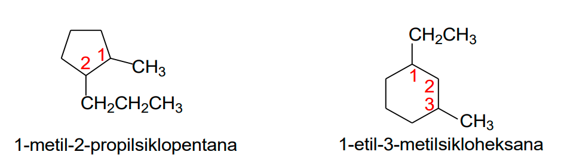

> misal karena m dari metil lebih dulu daripada p dari propil, maka nomor satu diberikan pada gugus metil

misal lagi untuk **1**-**I**soPropil-**2**-**M**etilSikloPentana

#### Lebih dari dua substituen
substiuen yang diberi nomor satu, adalah substituen yang menghasilkan substituen kedua serendah mungkin. 

1. langkah pertama menentukan urutan abjad untuk inisial gugus
2. menuliskan gugus tersebut dari abjad terendah
3. memberi nomor dengan urutan nomor besar ke kecil

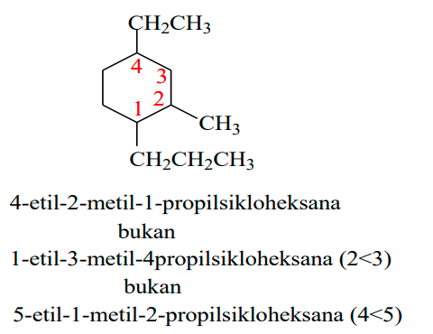
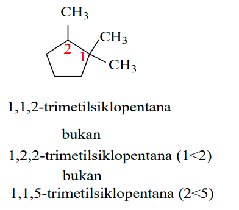

substituen yang terikat ada yang bukan gugus alkil, maka substituen yang memiliki prioritas tinggi didahulukan diikuti substituen berikutnya. adalah OH lebih tinggi prioritasnya daripada Br. tetapi OH itu tidak diberi nomor tetapi dimasukkan dalam nama induk (Heksan**Ol**)
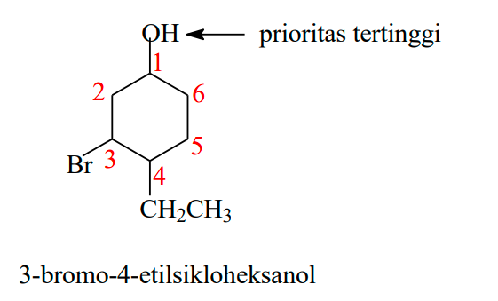

mencari urutan prioritas gugus fungsi dalam tatanama IUPAC?

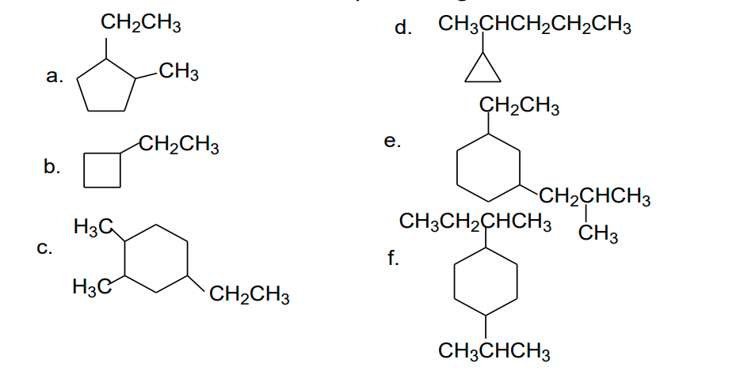
a. 1-etil-2-metilsiklopentana
b. 1-etilSiklobutana
c. 4-etil-1,2-dimetilsikloheksana
d. 2-siklopropilpentana
e. 1-etil-3-isobutilsikloheksana
f.  1-Isopropil-4-SekunderButilSikloHeksana
f.  1-Sekunder**B**util-4-**I**sopropilSikloHeksana

yang dihitung adalah yang B (untuk f) pada bagian sekunderbutil

## Klasifikasi Karbon dan Hidrogen
dibedakan mulai dari terkecil yaitu primer, sekunder,  tersier, dan kuartener
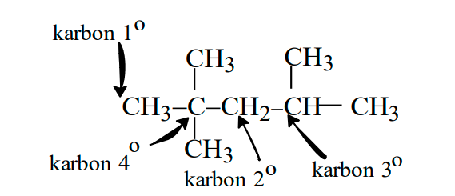

alkana bersifat non polar, berarti momen dipol adalah nol. alkana, mulai dari dengan jumlah atom C yang meningkat, maka fasenya akan menuju pada fase padat. alkana tidak memiliki momen cukup besar untuk bereaksi heterolitik, yaitu memutus ikatan H pada atom C karena perbedaan elektronegativitasnya rendah. 

menurut pauling elektronegatifitas paling besar adalah F dengan nilai 4.0. 
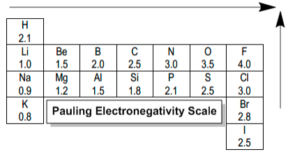

alkana normal (alifatik atau normal) kenaikan jumlah atom karbon akan meningkatkan titik didih sebanyak 30 celcius. 

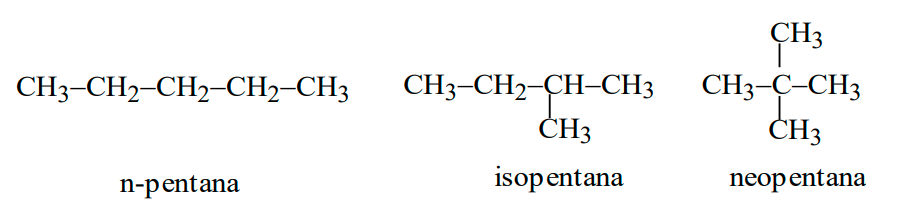

neopentana memilik titik didih terendah, meskipun memiliki rumus empiris yang sama antara ketiganya. 

## Reaksi alkana
### Oksidasi
pembakaran sempurna berikut adalah persamaan reaksinya 
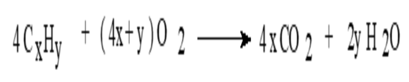

> sikloalkana tidak dapat dioksidasi sebab semua ikatan sigma karbon-karbon membentuk siklis dan memiliki tegangan sudut

C5H12 memiliki banyak isomer, contohnya neopentana

### Oksidasi rantai samping
alkil sebagai rantai samping yang terikat pada cincin benzena. ketika terjadi reaksi oksidasi (+ O2) akan terbentuk gugus -COOH. 
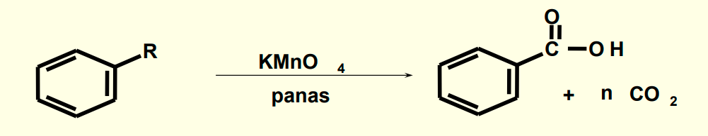

### Reaksi substitusi
substitusi (pengganti) reaksi penggantian spesi (molekul, gugus, atom, ion) dari suatu senyawa oleh spesi yang lain.

##### apabila diganti dengan spesimen atom halogen, disebut halogenisasi
Jika spesi penggantinya klorin (Cl2)disebut reaksi klorinasi
Jika spesi penggantinya bromin (Br2) disebut brominasi
Jika spesi penggantinya Iodin (I2) disebut iodinasi

tergantinya satu spesimen disebut dengan monosubstitusi. pada klorin (Cl2) akan terjadi reaksi Homolisis / Homolitik / Radikal, yaitu atom yang terpecah membawa elektron sama rata
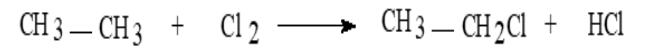
satu radikal Cl akan menyerang atom H primer dari etana membentuk *transition state*

Selanjutnya TS melepaskan HCl dan terjadi radikal etil. Radikal etildiserang oleh radikal klorin yang satunya membentuk terjadi etil klorida.

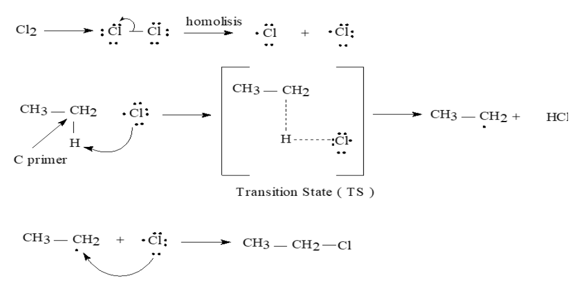
sedikit kesalahan untuk notasi ilustrasi diatas, yaitu pada reaksi homolisis seharusnya dua Cl memiliki elektron yang sama (7). kemudian penyerangan radikal ke atom ditunjukkan oleh panah dengan setengah busur

dikatakan C sekunder adalah ketika dia mengikat dua atom C primer
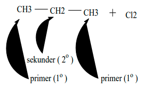
akan ada 2molekul, yaitu apabila Cl menyerang C sekunder, atau C primer
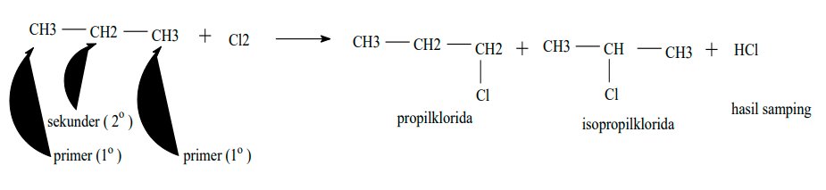

> mekanisme reaksi homolisis / radikal hanya terjadi karena adanya energi hv. 

CH3CH3CHCH2CH3 memiliki empat jenis karbon, sehingga apabila terjadi reaksi homolisis dengan Cl2, akan terbentuk 4 produk. radikal Cl dengan karbon primer, radikal Cl dengan karbon sekunder, radikal Cl dengan karbon tersier, radikal Cl dengan karbon tersier.

CH3CH2CH2CH2CH3 memiliki tiga jenis karbon, sehingga apabila terjadi reaksi hololisis dengan Cl2, akan terbentuk 3 produk. 

> kesimpulanya, apabila nama adalah sama, berarti itu adalah identik

reaksi terhadap klorosiklobutana
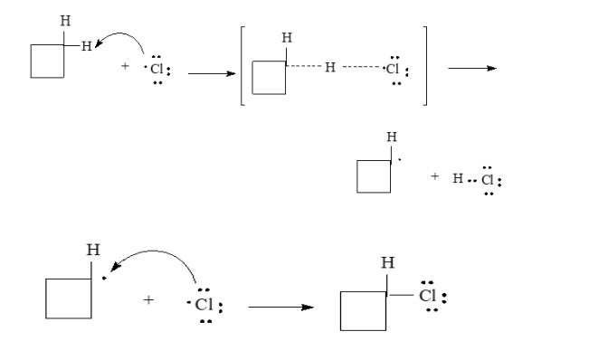
*panah seharunya hanya setengah busur (mata pancing) untuk penyerangan radikal*

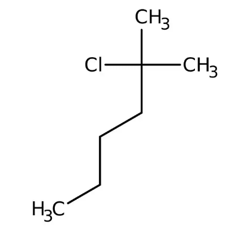
*2-kloro-2-methylheksana*