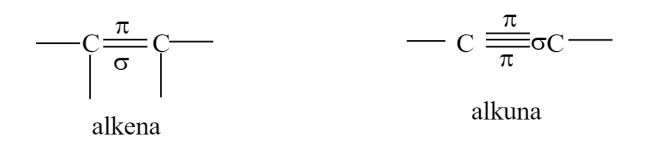
alkuna punya 2 ikatan pi 1 sigma
- p-p
- p-p
- sp-sp

alkena punya 1 ikatan pi 1 sigma
- p-p
- sp-sp

> p-p adalah ikatan adanya awan elektron
> sp-sp adalah ikatan langsung

etana, atau asetilen dalam merk dagang.
merupakan siklik
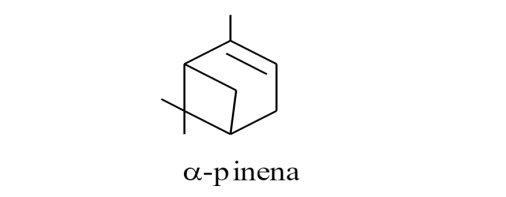

**penamaan ada beberapa cara**
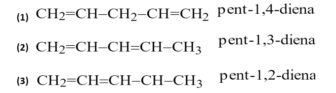
sebagai berikut
1. 1,4-pentadiena
2. 1,3-pentadiena
3. 1,2-pentadiensa

terakumulasi adalah ketika ikatan rangkap dua terkumpul pada salah satu sisi. 

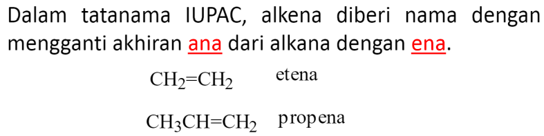
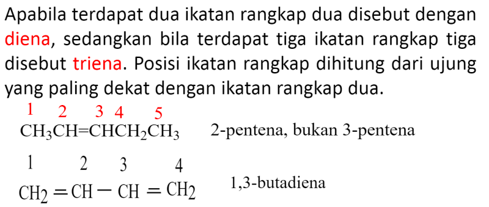
nomor yang depan (yaitu 2) yaitu letak diena dimana.  maka 2-pentena, bukan 3-pentena. 
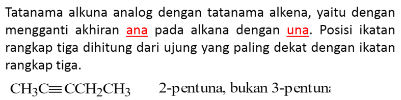
bahwa awalnya adalah heptana, maka diganti dengan heptuna dengan menunjukkan dimana ikatan rangkap 3 berada, seperti dibawah ini
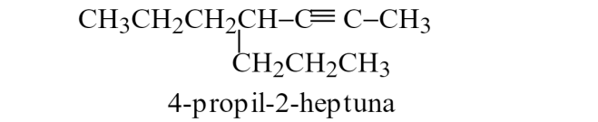

ketika ada alkuna dan alkena, maka alkena yang diutamakan untuk memperoleh nomor terendah
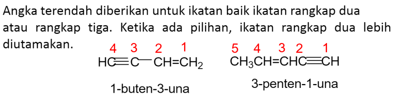
nomor 1 menunjukkan ena nya (rangkap duanya) sedangkan una menunjukkan (rangkap tiganya). 

## Senyawa siklo
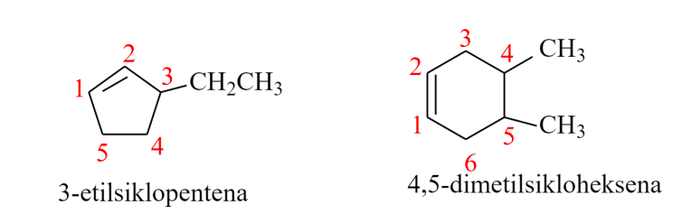

prioritas gugus fungsi untuk mendapatkan nomor terendah
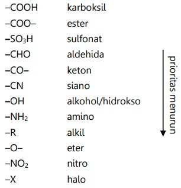

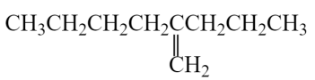
diatas untuk agar alkuna mendapat nomor terendah sehingga 2-propil-1-heksena. yaitu penomoran dari alkuna (rangkap dua)

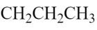
*2 menunjukkan letak gugus propil*

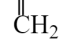
*1 menunjukkan letak alkena*

*dan heksena menunjukkan rantai induknya*

> Alkana : rangkap satu
> Alkena : rangkap dua
> Alkuna : rangkap tiga

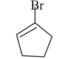
1-bromosiklopentena

1-penten-4-una

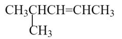
4-metil-2-pentena

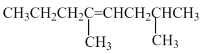
2,5-dimetil-4-oktena

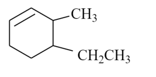
4-etil-3-metilsikloheksena

# Isomeri
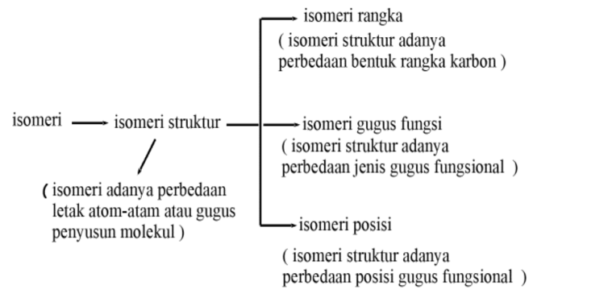

isomeri gugus fungsi adalah ketika berbeda gugus fungsinya. tetapi jumlah atom C, H, O adalah sama.
isomeri posisi misal:
CH3CH2CH2OH
atau 
CH3CHOHCH3
isomer rangka:
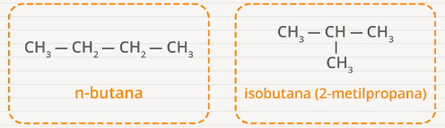

isomer geometri
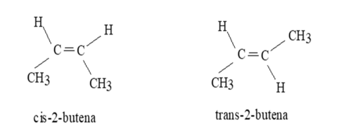
apabila keempat atau ketiga atom berbeda, maka mereka tidak punya isomer geometri, maka mengunakan E-Z (entgegen - berlawanan | Z zusammen - bersam sama)
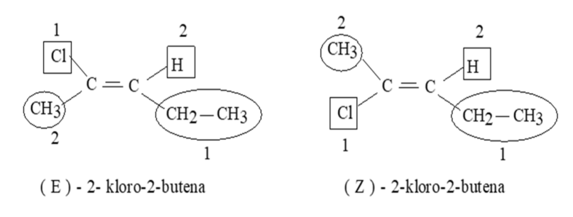
menentukan bagaimana prioritasnya, berdasarkan nomor atom, ini juga digunakan pada stereokimia. 

> bukan prioritas gugus fungsi yoo

lalau bagaimana aplikasinya,
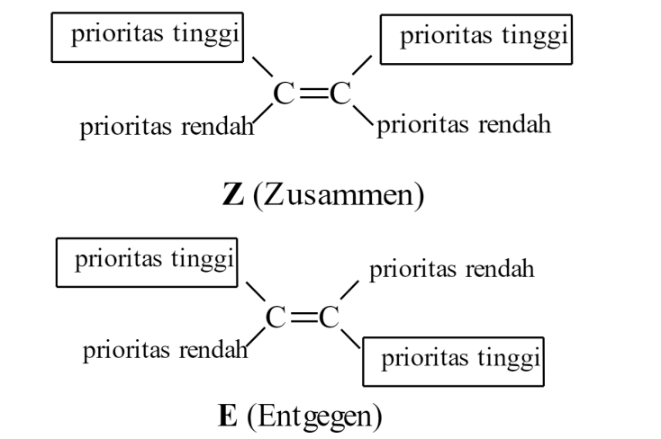

contoh menentukan prioritas, menggunakan aturan **cahn-ingold-prelog**
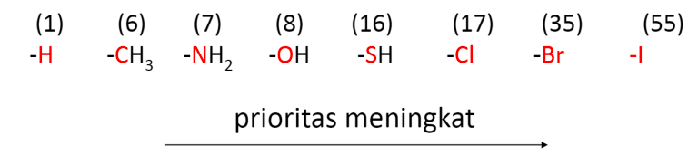
ditentukan berdasarkan nomor atom (berikatan langsung). 
kemudian apabila nilai nomor atom sama (misal sama-sama CH2, maka dilihat atom yang mengikat setelahnya
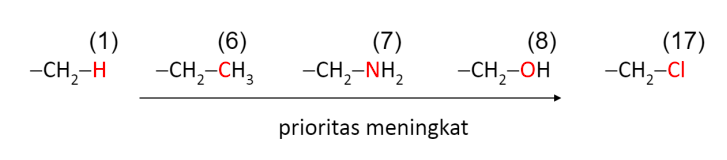
apabila rangkap dua, maka dianggap mengikat dua atom yang sama, maka apabila rangkap tiga, maka dianggap mengikat tiga atom yang sama. 
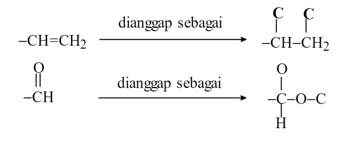

