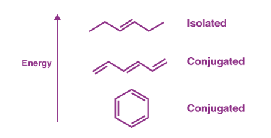
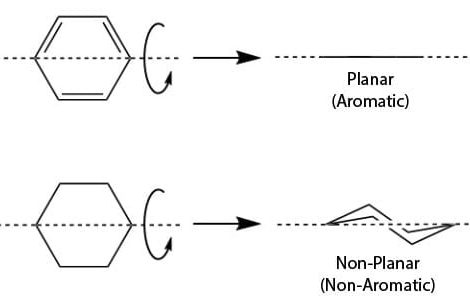
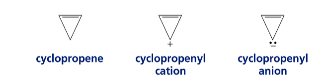
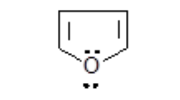
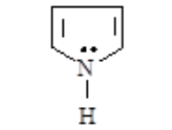
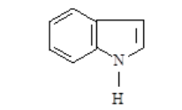
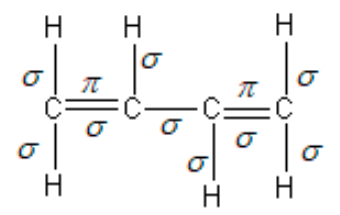
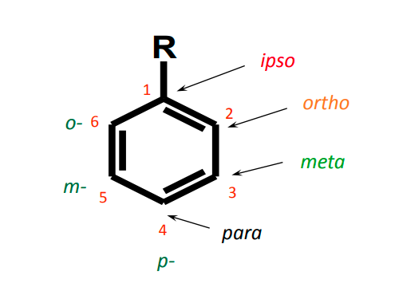
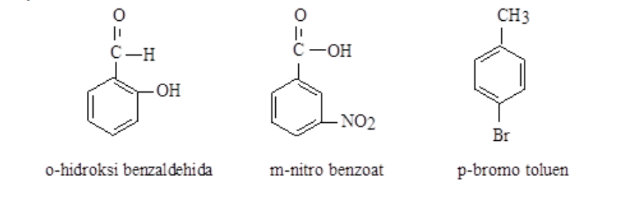
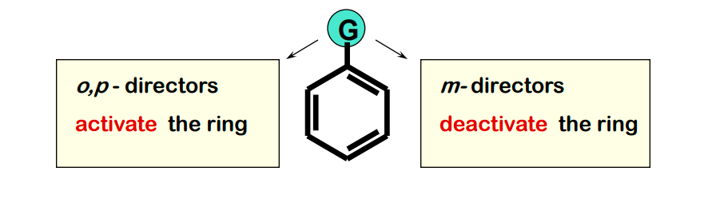

kriteria yang menentukan sebuah senyawa dikatakan sebagai aromatik. 

- bersifat siklis
- planar
- terkonjugasi
- memenuhi aturan Huckel

*konjugasi*

*plannar and non plannar*

aromatic, non-aromatic, anti-aromatic
examples are siklopropena. Siklopropena tidak bersifat aromatik, tetapi dalam bentuk kation bersifat aromatik, dalam bentuk anion bersifat antiaromatik

### Hückel's Molecular Orbital Theory
suatu senyawa akan stabil apabila setiap orbitalnya terisi dengna elektron berpasangan. misalnya sebuah benzena memiliki elektron 6, angka 6 adalah salah satu angka yang dapat dihasilkan dari operasi 4n + 2, dengan n adalah 1. misalnya naftalena memiliki elektron 10, angka 10 adalah salah satu angka yang dapat dihasilkan dari operasi 4n + 2, dengan n adalah 10. 

contoh senyawa aromatis

*furan*

*piron*

*Indol*

> ikatan pi dan ikatan sigma
> 

Senyawa aromatik diklasifikasikan menjadi aromatis homosiklis (satu jenis) dibagi menjadi homosiklis monosiklis dan homosiklis polisiklis. klasifikasi selanjutnya adalah aromatis heterosiklis (lebih dari satu jenis) dibagi menjadi homosiklis monosiklis dan homosiklis polisiklis. 

penomoran

apabila substituen pada posisi 1,2 disebut orto, substituen pada posisi 1,3 disebut meta dan substituen pada posisi 1,4 disebut para.

**Deaktivasi** 
suatu proses di mana suatu gugus fungsional tertentu mengurangi reaktivitas cincin benzena terhadap serangan elektrofilik. Ini berarti bahwa cincin benzena yang mengandung gugus tersebut menjadi lebih sulit untuk mengalami substitusi elektrofilik.

o, p, m means ortho, para, meta.

