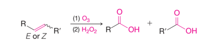
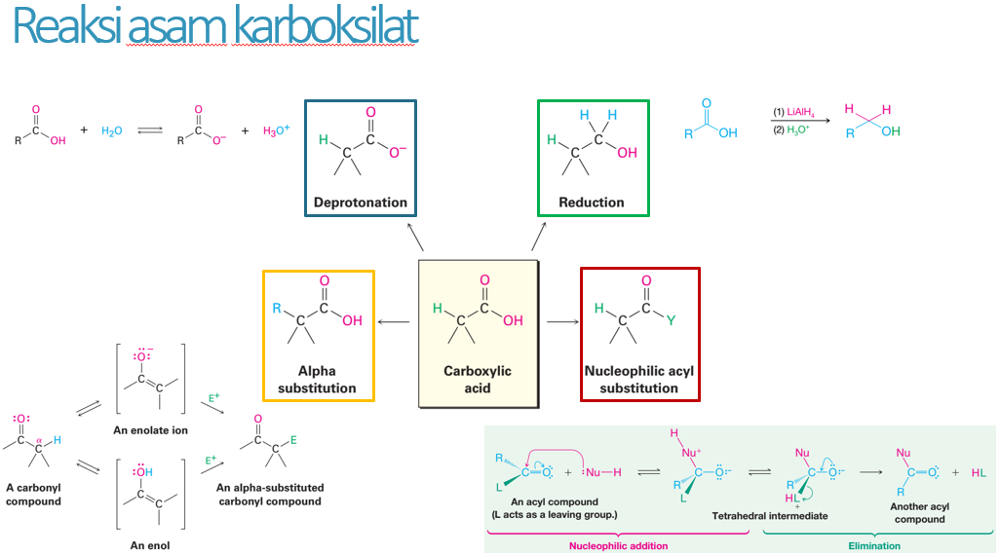
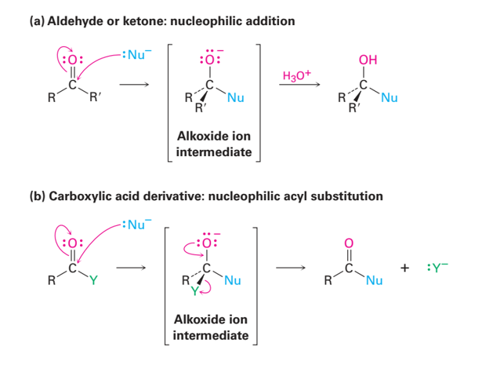
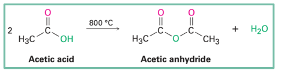
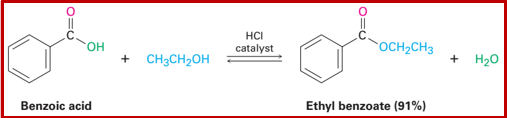
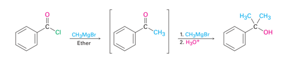
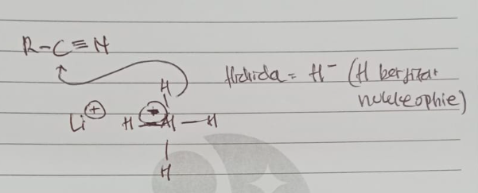
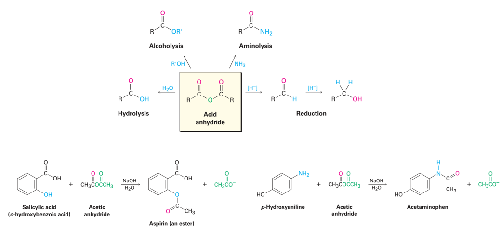
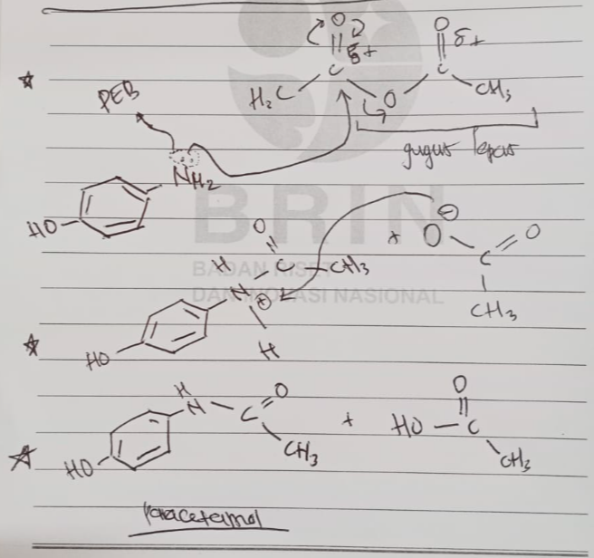

*salah satunya melalui oksidasi*

*atau melalui hidrolisis sianid* *melalui SN2* *kemudian mengalami hidrolisis*

*garis besar reaksi yang mungkin terjadi dalam asam karboksilat*

*aldehide dan asam karboksilat ketika diserang nukleophile*

*turunan asam karboksilat, asetit anhidrida dapat terbentuk pada 800c*

> bagaimana mereka dapat mengetahui hal tersebut terjadi, apakah melalui pendekatan komputasi. 

*esterifikasi*

*substitusi nukleophilic acyl* *dengan nukleophilic metil*
**CH3-MgBr**
*Reagen greagnad yang mengandung metil*

paracetamol, aspirin merupakan turunan dari asam karboksilat. 

ciri nukleophile adalah memiliki pasangan elektron bebas

LiAlH4 (Lithium Hidrogen Hidrida)

*Sintesis paracetamol (acetaminophene) dari asam karboksilat*