oxo adalah gugus keton. 
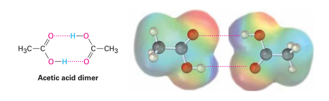
dikatakan dimer ketika terdapat dua asam asetat yang saling berikatan melalui ikatan hidrogen. 

menghitung Ka
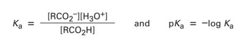
dengan memperhitungkan konsentrasi ion negatif dengan konsentrasi positif kemudian dibagi dengan senyawa. 

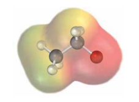
kulit yang bewarna merah menandakan kerapatan elektron yang tinggi yang disebabkan adanya unsur oksigen yang memiliki elektronegatifitas yang tinggi. 

kemudahan senyawa melepas proton, adalah definisi lain dari asam. 

terdisosiasi
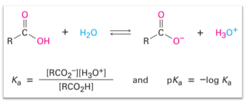
adalah ketika sudah terbentuk ion ion. persentase larutan terdisosiasi dapat diketahui melalui persamaan Henderson-Hasselbach dengan menghubungkan persamaan pKa. 

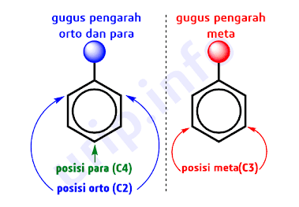
salah satu gugus pengarah meta adalah karboksilat (-COOH). sedangkan pengarah ortho atau para adalah alkohol (-OH).
berkaitan dengan pengaktifasi atau pendeaktifiasi. pergeseran elektron (resonansi) atau moment dipole (induktif)

benzene bertindak sebagai nukleophile karena dapat mengalami resonansi sehingga elektron dapat mengalami pergeseran secara terus menerus menyebabkan benzene seakan-akan kaya akan elektron. pada akhirnya kaya elektron bersifat sebagai nukleophile. 

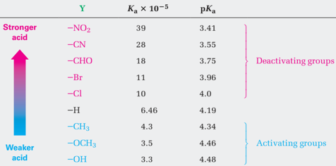
maksud dari pengaktivasi adalah ketika benzene yang sudah kaya elektron tadi akan ditambahi elektron lagi dari -OH (one of member activating groups)

> keasaman ditinjau dari mudahnya lepas proton (H). semakin banyak H+ dalam **sistem** maka semakin asam. 

maka ketika diposisi para, bersifat asam lemah atau proton (H) tidak mudah lepas. 

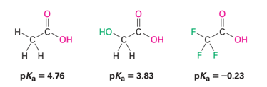
pada atom CH3 disitu tidak terdapat atom yang bersifat elektronegatifitas sehingga tidak terjadi efek induksi. pada contoh nomor dua disitu terikat dengan atom O yang bersifat elektronegatifitas hal ini akan mengakibatkan efek induksi dimana elektron-elektron akan ditarik ke atom yang bersifat elektronegatifitas. pada contoh yang ketiga ia berikatan dengan tiga atom elektronegatifitas (F) sehingga elektron pada atom H akan tertarik (induksi) mengarah ke F sehingga terjadi kerapatan elektron pada atom F mengakibatkan **H mudah lepas**. H mudah lepas berarti semakin bersifat asam. 

> atom elektronegatifitas, sebuah atom yang menyukai elektron sehingga akan menarik elektron ke dirinya sendiri.

***
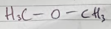
*Di Metil Ester*

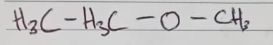
*Etil Metil Ester*

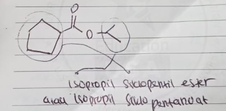
*terdapat asam karboksilat dinamakan juga dengan -oat*

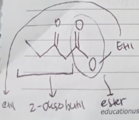
*oxo adalah gugus keton (=O)*

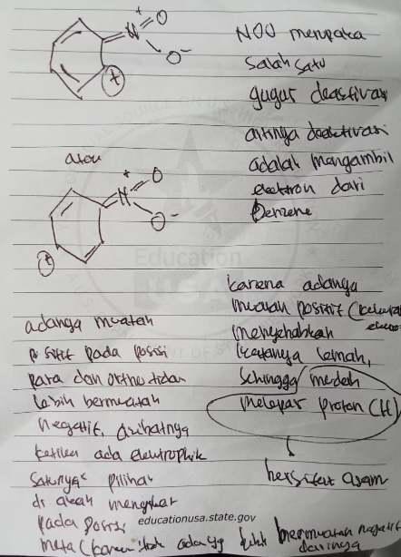
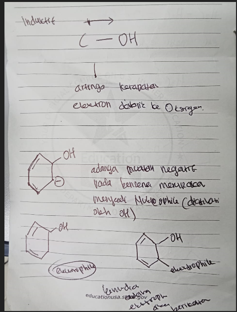

***
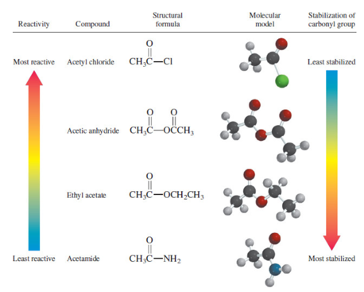
palaing atas adalah paling reaktif, ketka mendapat serangan, karboksil akan langsung melepas gugus Cl, berbeda yang paling bawah, paling tidak reaktif, ketika mendapat serangan, NH2 tidak dilepaskan malah akan ikut menstabilkan dengan cara menarik sebagian elektron pada atom O. 

akibatnya asam klorida paling mudah diubah ke bentuk lain (turunan), sedangkan amida paling susah diubah ke bentuk lain (turunan).
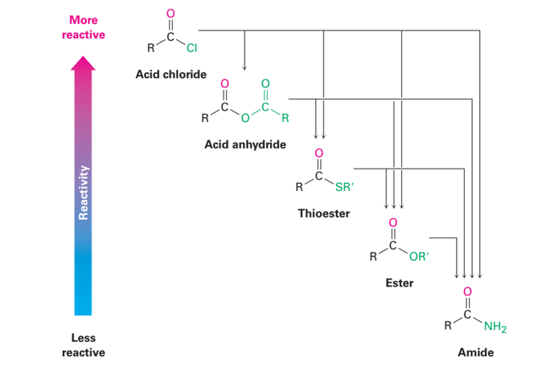

sebagai substituen disebut amino
sebagai rantai disebut amina

