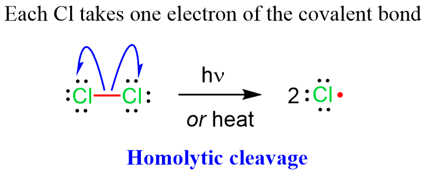
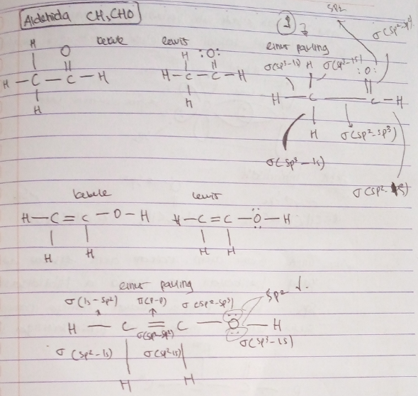
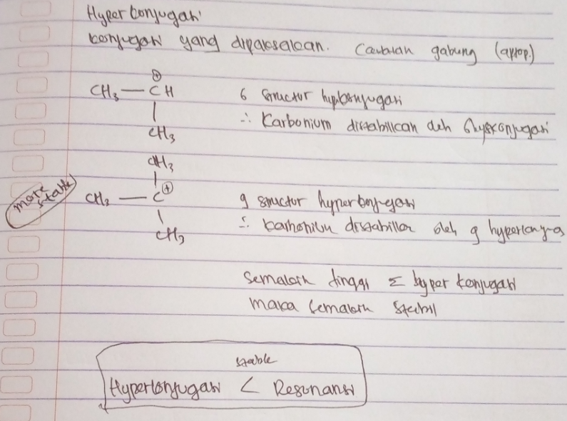
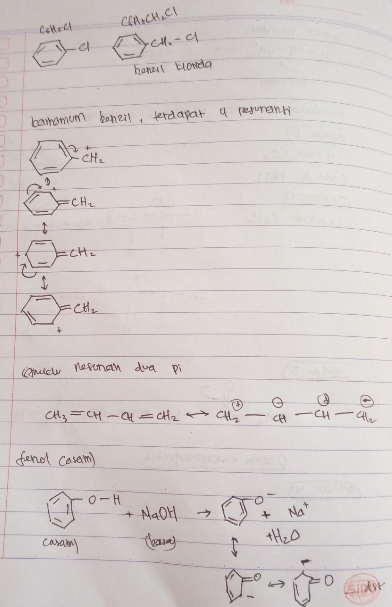
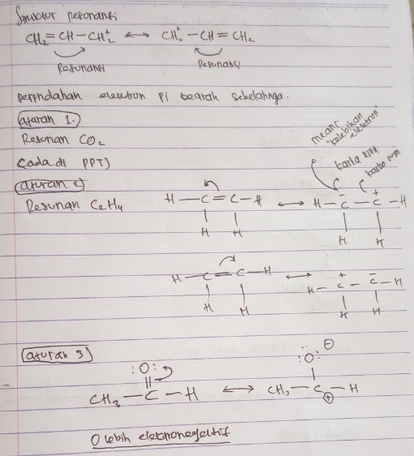

1. Homolisis, pemutusan dimana masing2 elektron dengan jumlah yang sama sehingga akan menjadi radikal 

2. heterolisis, pemutusan dimana salah satunya (A) akan bermuatan negatif, dengan syarat (A) lebih elektronegatif. 

##### Karbonium dan Karbanion
antara karbon mengambil elektron (karbanion) dan karbon melepas elektron (karbonium) oleh atom yang lebih elektronegatif. 

##### Nukleophile dan elektrophile
nukleophile menyukai nukelus (bermuatan positif) suka yang elektropositif (elektrophile).

> miskin akan suka dengan kaya dan sebaliknya

jika nukleophile berbentuk ion, maka akan memiliki muatan negatif, misalnya H-, BH4-, -CN, RCO2-.
Elektrofil adalaj spesies yang kekurangan elektron, sehingga ia suka akan elektron, contoh H+, H3O, +NO, PhN2+. 

> Logam relatif bermuatan positif

