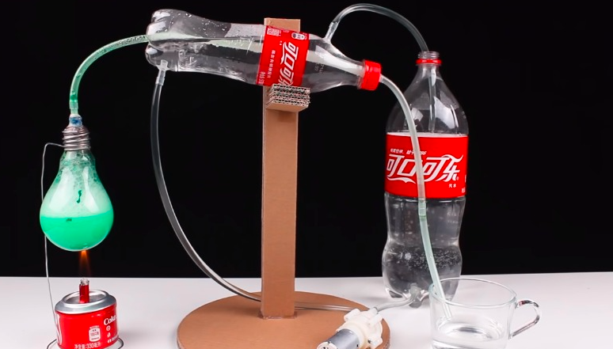
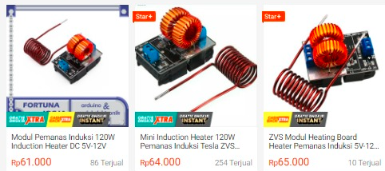

Desain sederhana destilasi

PID controller sudah diterapkan pada industri kimia, terutama pada distilasi kolom. bagaimana jika anda membuat destilasi dengan panas yang diatur dengan PID, dengan menggunakan modul panas induksi yang dikontrol dari arduino

*modul induksi panas*
koil dililitkan pada labu pemanas dan diberi logam didalam labu pemanas. sensor dipasang dari tutup	

> kenapa tidak menggunakan cooler petier? 

> belum ada material yang bisa menghasilkan differensiasi yang sangat tinggi, mentok sepertinya hanya 85

coil pada pemanas induksi tidak terlalu tinggi. sebagai perbandingan, logam yang terinduksi panas memiliki suhu 345, sedangkan koil yang menginduksi memiliki suhu 45. 

urgensi dibuatnya projek ini adalah memberikan solusi alat destilat optimal yang murah. 

