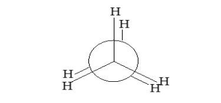
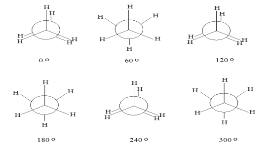
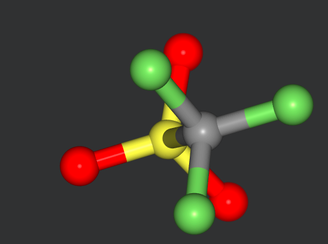
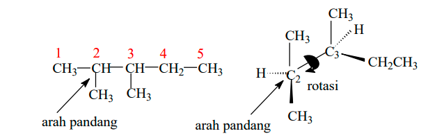
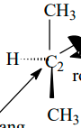
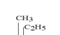
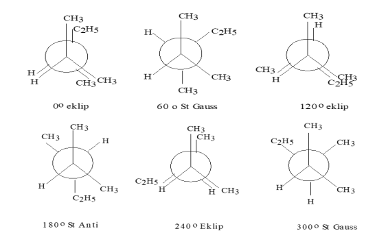
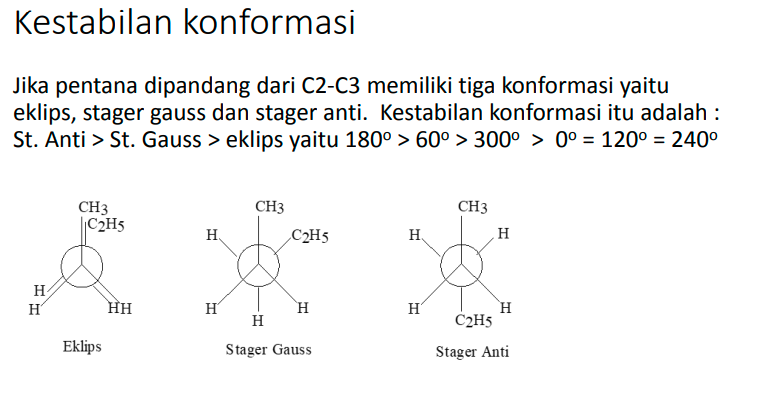
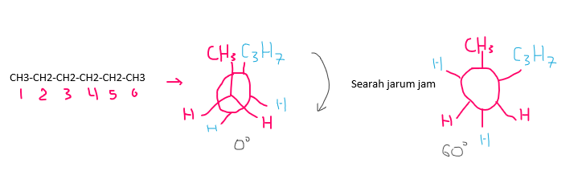

ikatan sigma karbon-karbon yang berotasi. 
konformasi 0 derajat

selanjutnya dapat diputar lagi sampai 360 (0) 

konformasi pada 0 = 120 = 240 disebut konformasi eklip adalah ketika antar atomnya semua linear

konformasi pada 60 = 180 = 300 disebut konformasi stuggered adalah ketika antar atomnya tidak linear

*konformasi staggered*

aplikasi pada molekul 2,3-dimetilpentana

dilihat dari C2 (sebagai arah pandang) didepan. yaitu mengikat gugus CH3 CH3 dan H

gugus yang besar dibuat segaris (yang memiliki nomor atom besar) ketika dalam konformasi eklip.

itu adalah ketika derajatnya adalah 0. jika ingin diputar, yang diputar yang dibelakang saja.

(searah jarum jam).

posisi gaus adalah ketika letak antara gugus H dengan gugus H membentuk sudut 60

posisi stegered anti adalah ketika etil (C2H5) membentuk sudut 180 (paling jauh) dengan CH3. ini adalah bentuk yang paling stabil. sedangkan paling tidak stabil adalah eklip.

> bahwa pertama adalah menentukan C2 dan C3 (tergantung soal), dengan C2 sebagai arah pandang (didepan)

misal konformasi paling stabil dari heksana dilihat dari C2-C3

