Tegangan sudut pada sikloalkana dikenal dengan Bayer Strain. paling stabil adalah yang memiliki BS lebih kacil dari duabelas derajat.

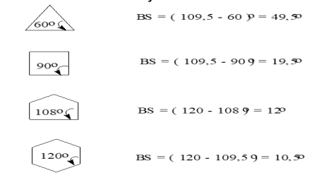

yang paling stabil adalah sikloheksana. (paling bawah). 

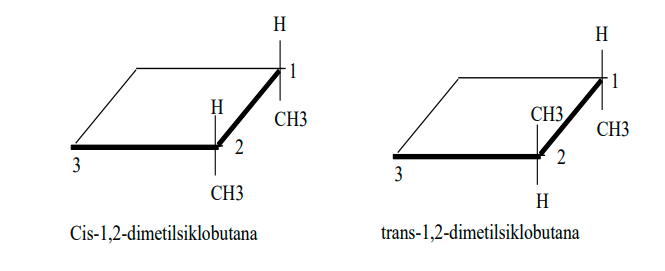
cis ketika metil selinear, sedangkan trans ketika metil berseberangan terlepas dimana metil berada
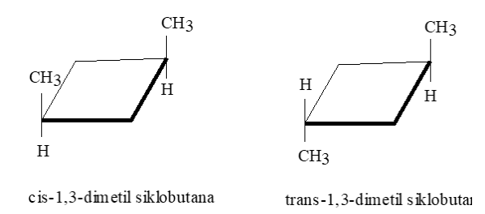
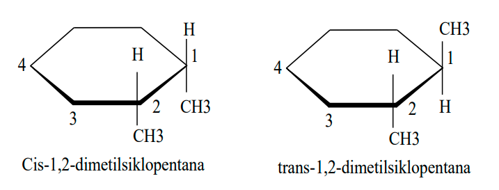
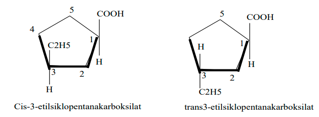

> jangan lupa penamaan, gugus yang kedua (etil) adalah bagaimana agar mendapat nomor sekecil mungkin

#### Konformasi sikloheksana ada dua, yaitu bentuk perahu dan kursi
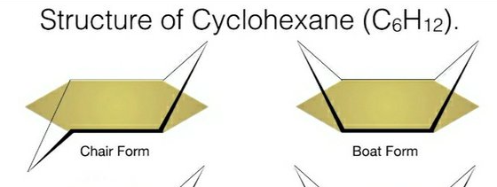

perubahan konformasi kursi I ke kursi II disebut dengan **flapping**.

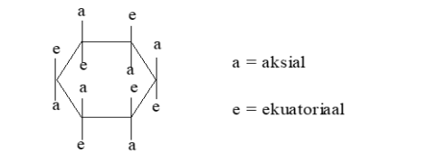
ada aksial keatas dan aksial kebawah akan selang seling, aksial adalah ketika sejaja dengan sumbu imaginer. begitu juga ada ekuatorial kebawah dan ekuatorial kebawah. 

aksial keatas-ekuatorial kebawah-aksial kebawah-ekuatorial keatas-aksial keatas-...

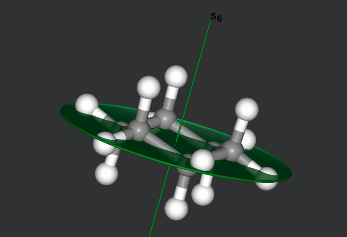
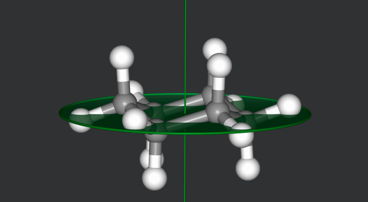
*aksial adalah yang sejajar dengan sumbu S6*

konformasi cis dan trans

ketika gugus metil sama-sama berada pada aksial, maka dikatakan trans
ketikga gugus metil berada pada aksial dan ada di equatorial, maka diakatakan cis

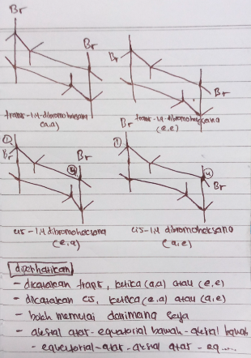

> jangan kebalik, adalah dikatan trans = e,e atau a,a dikatakan cis = a,e atau e,a

konformasi paling stabil adalah ekuatorial equatorial. **equatorial pertama adalah bagaimana letak gugus nomor satu, apakah equatorial (e) atau aksial (a)**
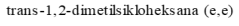

