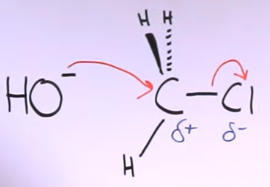
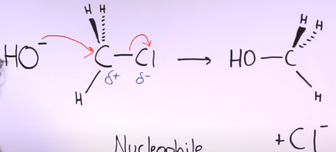
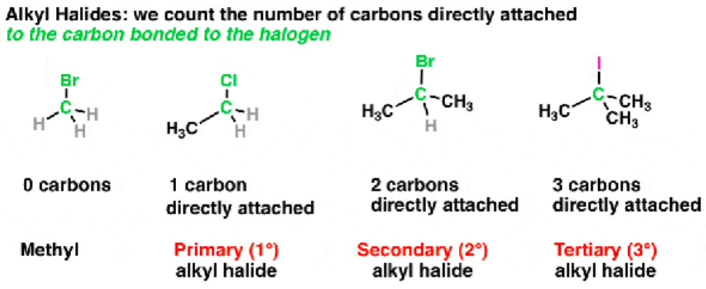
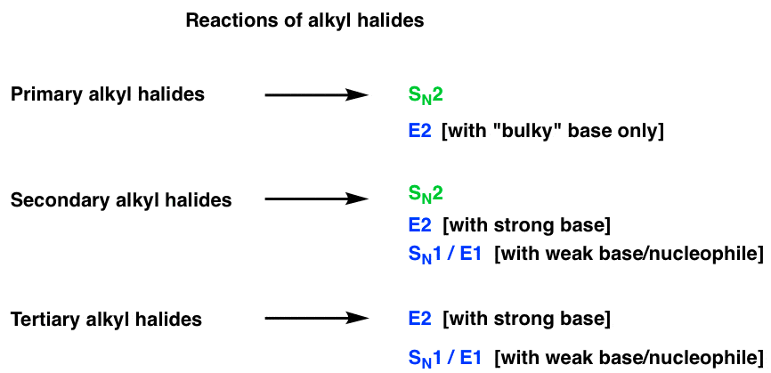

Reaksi substitusi SN (Substitusi Nukleofilik) adalah salah satu jenis reaksi kimia yang sering terjadi dalam kimia organik. Reaksi ini melibatkan penggantian gugus fungsional pada molekul organik dengan suatu gugus nukleofil atau biasa disebut serangan nukleophile ke elektrophile. 

terdapat dua jenis utama reaksi SN yaitu jenis satu(SN1) dan jenis dua (SN2). SN1 melibatkan dua transisi dalam proses reaksinya, berikut adalah contoh reaksi subsitusi nukleofilik 1

Cl lebih elektronegatif daripada C sehingga dalam ikatan kovalen tersebut, elektron lebih terkumpul pada Cl. produk akhir akan tampak seperti ilustrasi dibawah

HO menyerang C sebagai elektrophile
Karena C hanya dapat mempunyai 4 ikatan, sehingga ia harus memutuskan 1 ikatanya, yaitu Cl. Akhirnya Cl diputuskan karena Cl lebih elektronegatif (terjadi muatan parsial). **SN1 hanyan terjadi pada alkil halida tersier**

> Halida adalah penamaan ketika karbon berikatakn dengan unsur halogen, alkil primer, sekunder, terseier menentukan banyaknya karbon yang terikat langsung dengan karbon
> 

## Summary
