unsur halogen ditunjukkan bola warna hijau
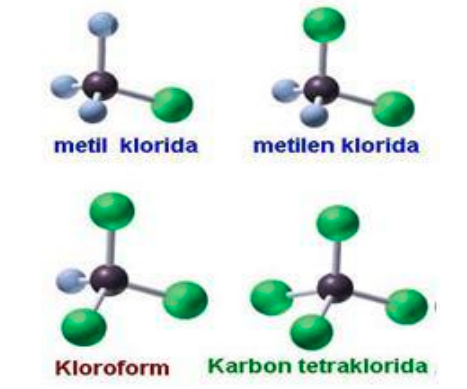
merupakan derivat halogen dari hidrokarbon. 
dibedakan menjadi empat kelompok: 

# alkil halida, 
satu atom H diganti oleh atom halogen. (R-X). penamaanya disebut Haloalkana. 
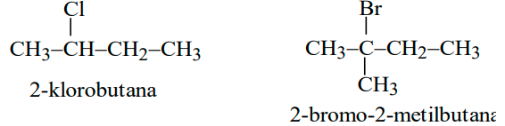
secara trivia, menyebutkan terlebih dahulu nama gugus alkil yang mengikat halogen kemudian diikuti nama halidanya. misal alil klorida (CH2=CH-CH2-Cl). 

posisi gugus halida ditunjukkan dengan angka romawi (alfa, beta, ...) dengan inisiasi berada pada C yang terikat X (Br) 
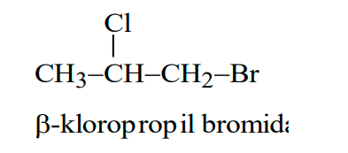
menunjukkan atom kloro ada di posisi beta (alfa ada di posisi CH2). 

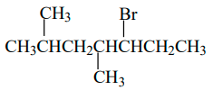
*3-Bromo-4,6-DiMetilHeptana*

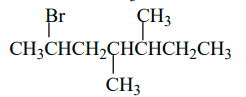
*2-Bromo-5,6-DiMetilHeptana*

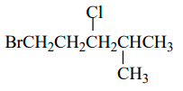
*1-Bromo-3,4-DiMetilPentana*

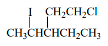
*1-Kloro-3-Etil-4-IodoPentana*

> perhatikan 1) prioritas halogen agar memberikan nilai terkecil untuknya 2) antara I dan Cl mana yang lebih diprioritaskan untuk mendapat nilai lebih rendah

Halogen memiliki elektronegatifitas tinggi. cenderung menjadi nukleophile (X-). 

### reaksi alkil halida
termasuk kedalam reaksi substitusi dan eliminasi. apabila reaksi substitusi spesies penggantinya nukleofil disebut reaksi subtitusi nukleofilik(Sn). unimolekuler untuk Sn1 dan E1 sedangkan bimolekuler untuk Sn2 dan E2. 

**mekanisme reaksi Sn1**
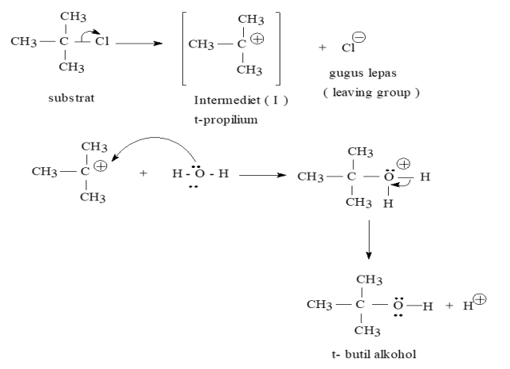
terjadi pada **alkil halida tersier** 
secara singkat akan terjadi (dua tahap)
1. pembentukan karbonium 
2. penyerangan nukleophile

pada proses pembentukan karbonium, terjadi secara lambat sehingga pada fenomena ini akan menentukan laju reaksi. berkagantung pada konsentrasi satu saja misal [RBr]

pada proses penyerangan nuklophile terjadi secaa cepat. 

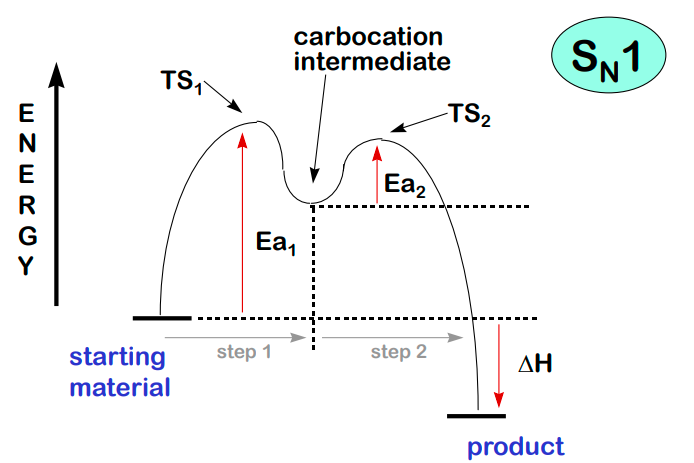
*profil energi Sn1* akan ada dua transision state. 

**mekanisme reaksi E1**
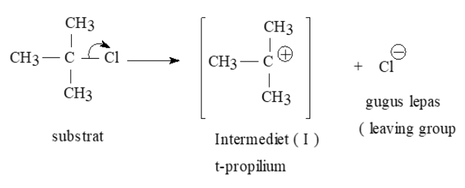
terjadi pada **alkil halida tersier** . 
Elektronegativitas Sp2 lebih besar daripada Sp3. 
contoh eliminasi pada halogen
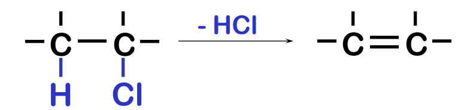
merupakan kebalikan dari reaksi adisi. eliminasi memerlukan spesimen basa kuat
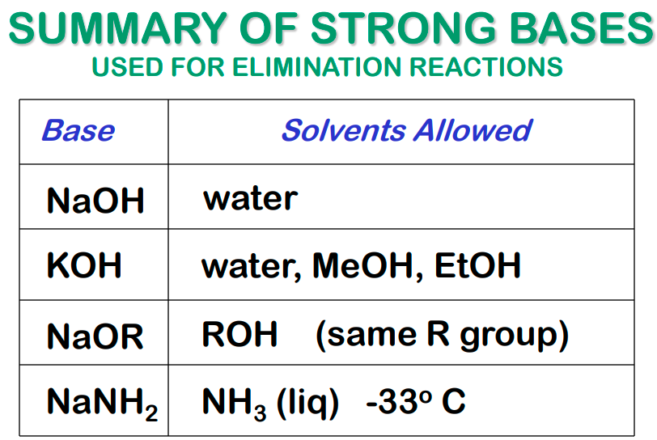
NaNH2 lebih basa daripada NaOH dan KOH. 

**mekanisme reaksi Sn2**
**terjadi pada R-X primer**, contoh mekanisme reaksinya. terjadi secara serentak
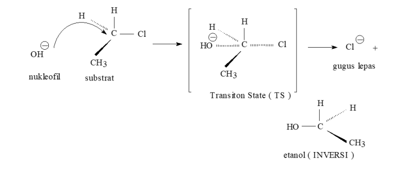
apabila diperhatikan, hanya satu tahap yaitu tanpa melalui karbonium. laju reaksi dipengaruhi oleh konsentrasi nukleophile dan konsentrasi substrat. 

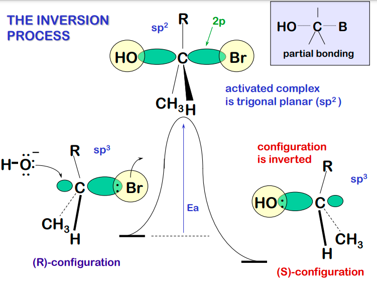
*inversi dilakukan untuk mendapat energi lebih rendah*

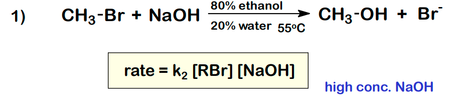

apabila dilihat dari stereokimia, akan terjadi pembalikan karena penyerangan dari arah belakang. membentuk transisiton state bermuatan (-). 

leaving group adalah berupa unsur halogen (X)
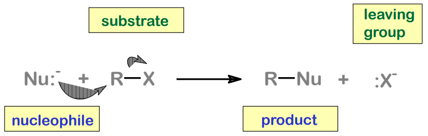

dan reaksi terjadi pada sp3
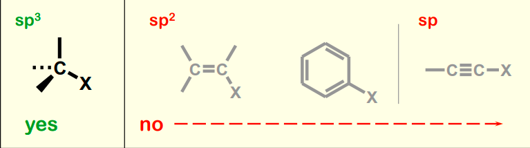
*Compounds that have sp2 or sp carbons generally do not give nucleophilic substitution reactions*

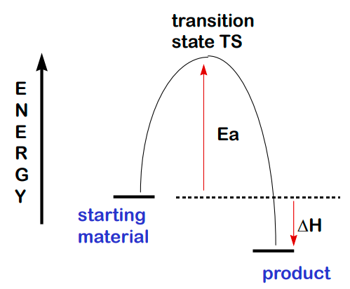
*profil energi Sn2*

**mekanisme reaksi E2**
akan berkompetisi dengan Sn2. syarat adanya reaksi eliminasi adalah memiliki H beta
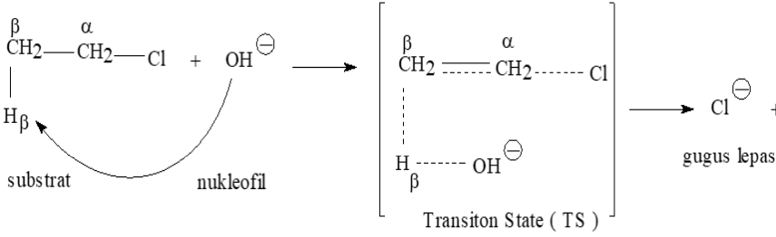

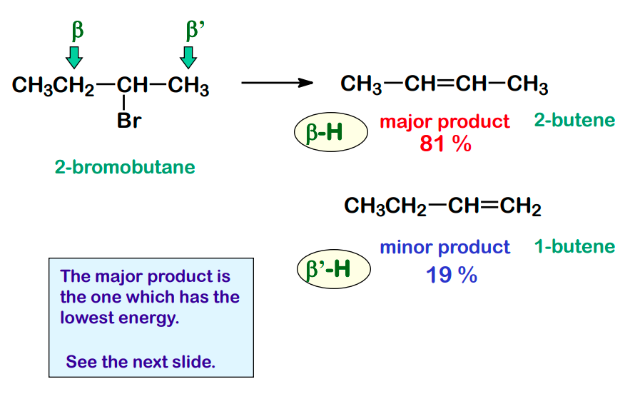
dapat memilih untuk mengeliminasi pada B atau B'. tetapi lebih banyak produk 2-butene. ketika ada 2 H beta, maka produk ada 2 jenis.

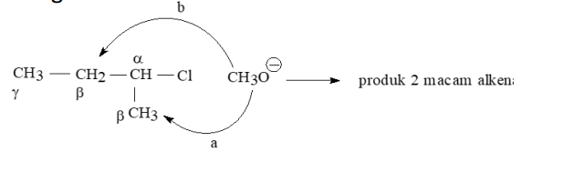
karena terdapat dua H beta, aka ada 2 macam produk. 

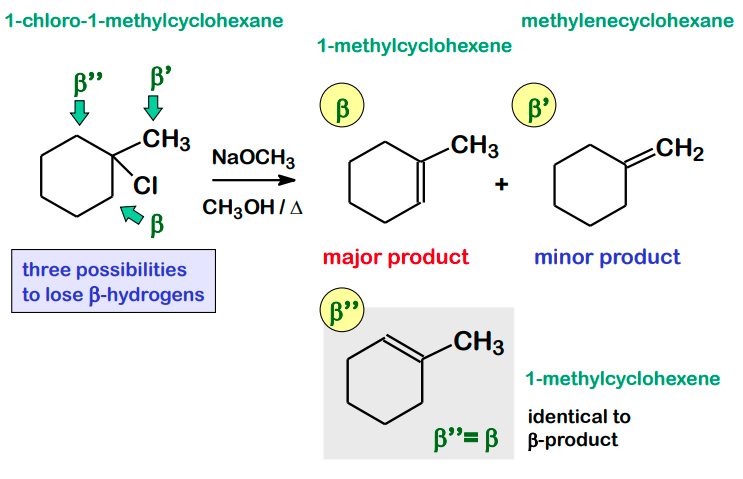
ketika ada 3 H beta, maka produk ada 3 jenis. produk mayor adalah 1-methylcyclohexena. karena terjadi trisubstitusi 

menentukan produk mayor dan minor patuh pada aturan **Zaitsev Rule** bahwa alkena yang lebih tersubstitusi lebih stabil (energi rendah).
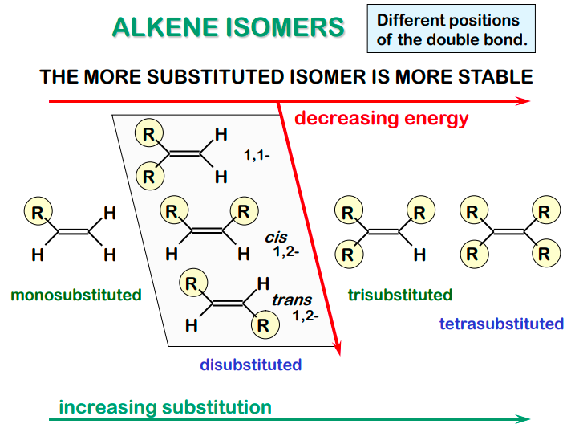

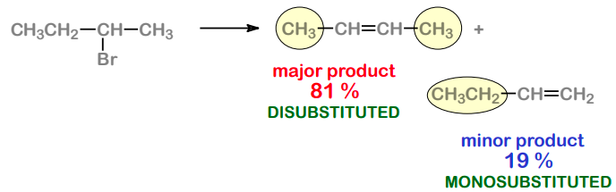
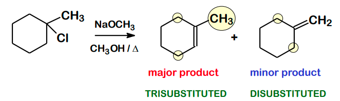

> R-X sekunder dapat melewati Sn1 atau E1 atau Sn2 atau E2 tergantung banyak faktor, salah satunya adalah pelarut. 

> apabila Nukleophile kuat akan Sn2 atau E2 
> apabila Nuklephile lemah akan Sn1 atau E1

Nukleophile kuat
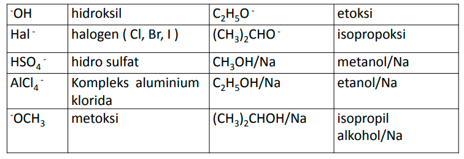

Nukleophile lemah
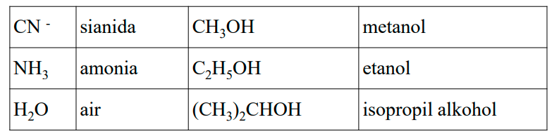
*molekul molekul netral, misal NH3, biasanya masuk dalam nukleopile lemah*

> sekunder lewat? tergantun nukleophilenya
> primer lewat Sn2 atau E2
> tersier lewat Sn1 atau E1

misal ketergantungan nuklephile pada struktur sekunder
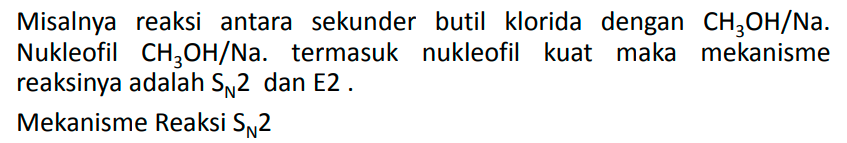
*terdapat nukleophile kuat (OH-)*

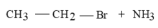
*primer*

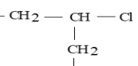
*sekunder*

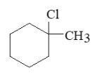
*tersier*

dikatakan produk utama adalah yang didepan
**NaOH** + Cl-

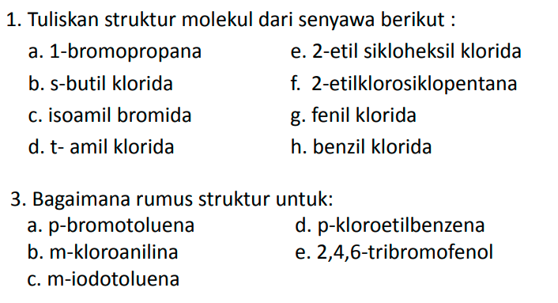
*latihan tata nama*
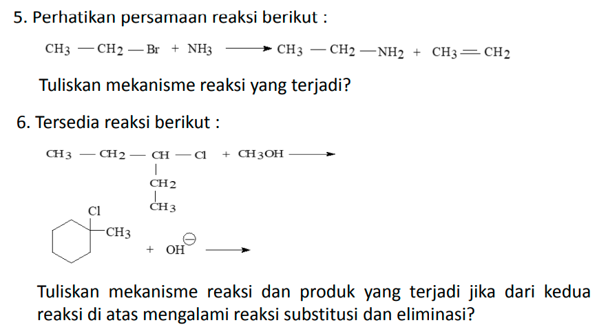
*latihan reaksi substitusi eliminasi*

*Jawaban nomor 6*

# halida tidak jenuh, 
# aril halida, 
# senyawa polihalogen, 
mengandung lebih dari satu atom halogen 

> CH2=CHBr : vinil bromida
> CH2=CHCl : vinil klorida berntuk polimernya adalah PVC (polyvinil cloride)

benzil bromida
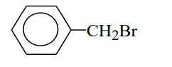