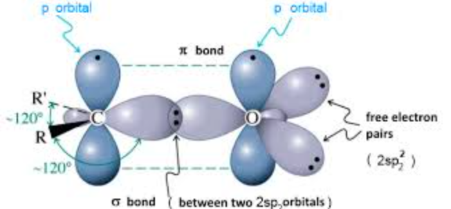
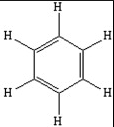

terjadinya resonansi
adalah **perpindahan elektron pi ke arah ikatan disebelahnya**

karbonium alil stabil karena di stabilkan oleh resonansi.
atau **perpindahan elektron pi pindah ke atom sebelahnya** atau ...

## Senyawa konjugasi
adalah selang seling antara rangkap satu dengan rangkap dua

adalah syarat mengalami muatan positif mengalami delokalisasi atau disebut juga dengan resonansi. arti delokalisasi adalah tidak terpusat saja. 

## Hyperkonjugasi
konjugasi yang dipaksakan, terjadi pada atom hidrogen alfa dari ion karbonium. atom H alfa adalah H yang berikatan languns dengan C alfa. C alfa adalah C yang berikatan langsung dengan C karbonium. 

> karbonium model hibridisasinya adalah sp2

karena karbonium memiliki elektronegatifitas tinggi, maka elektron pada ikatan H alfa (pada C alfa) akan ditarik ke karbonium menyebabkan ikatan antara H alfa dengan C alfa melemah. H alfa dapat terputus membentuk H+ dan elektron yang digunakan untuk berikatan tadi diambil oleh C karbonium. 
