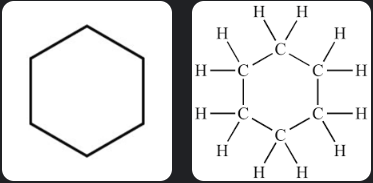
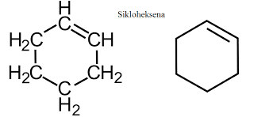

struktur kimia yang dimampatkan, yaitu ikaran yang rangkap satu tidak dituliskan, hanya menyisakan ikatan untuk ikatan rangkap 2 atau 3.
misalnya untuk sikloheksana

sikloheksena

contoh soal
tiga atom karbon terhibridasi sp3 yaitu
**CH3CH2CH3**
satu atom karbon terhibridisasi sp2, dua atom karbon terhibridasi sp2
**CH3CH=CH2**
dua taom karbon terhibridisasi sp3, dan dua atom karbon terhibridisasi sp2
**CH3CH=CHCH3** atau (terisomerisasi)
**CH2=CHCH2CH3**

