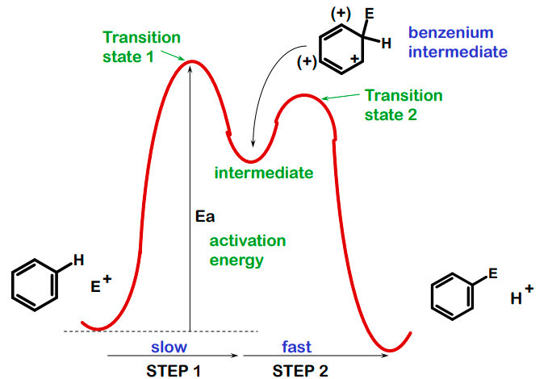
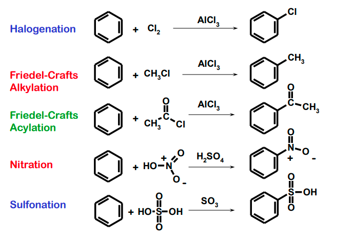

profil energi keadaan transisi

masuk ke keadaan transisi 1 berjalan dengan cepat, masuk keadaan transisi 2 berjalan dengan lambat. senyawa intermediate sulit untuk di sintesis. berikut beberapa reaksi yang umum terjadi pada senyawa benzene

reference [*](file:///C:/Users/admin/Downloads/Reaksi%20Substitusi%20Aromatik%201.pdf)

