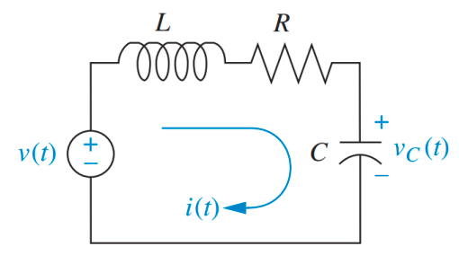
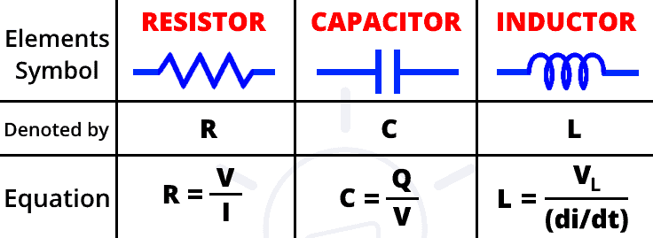
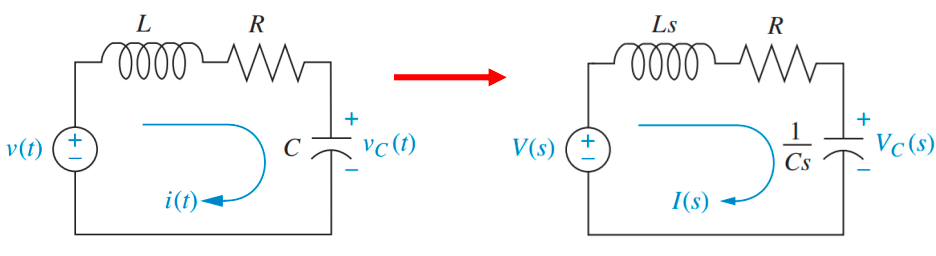
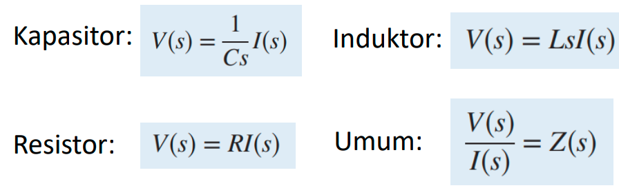
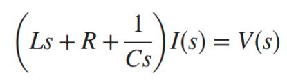
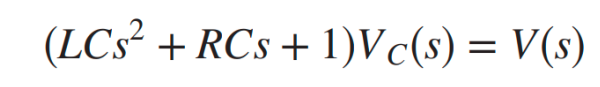
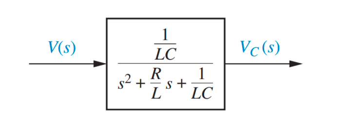

dipandang sebagai Resistor, Kapasitor, dan Induktor. pemodelan matematika didasarkan hukum Kirchhoff. 
Jika tegangan => analisis mesh
JIka arus => analisis node
kompleksitas diukur dari banyaknya loop dalam rangkaian listrik (dalam sistem mekanis adalah massa)

mengubah rangkaian asli ke transformasi laplacenya 

tanda (s) menandakan sudah ditransformasi laplacekan. berikut adalah bentuk transformasi laplace dari setiap komponen listrik

gabungan transofmasi laplace didapatkan sebgai berikut

apabila ditulis diagram blok sebagai 
> I(s) => G(s) => V(s)

dimana G(s) adalah Ls + R + 1/Cs

atau contoh lain yang menghasilkan persamaan transformasi laplace sebagai berikut

apabila ditulis diagram blok sebagai beriku

