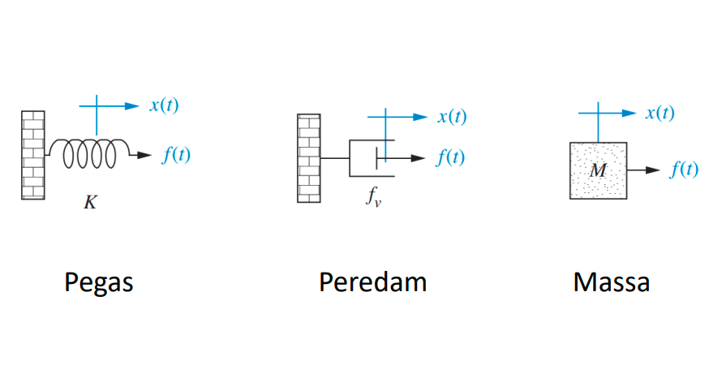
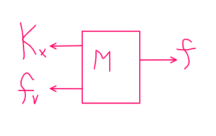
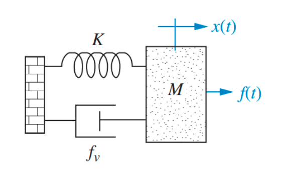
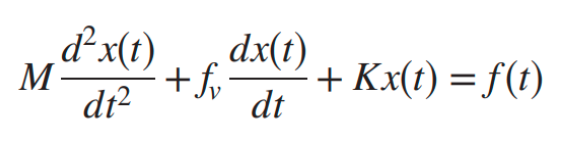
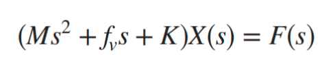
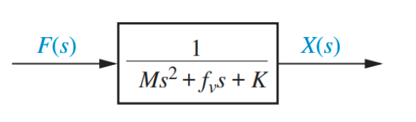

Fungsi transfer mekanis dibedakan menjadi dua yaitu ```translasi``` atau gerak lurus dan ```rotasi```.

derajat kebebasan, ketika terdapat 2 benda maka disebut sebagai 2 derajat kebebasan (dalam sistem listrik ditandai dengan multiloop). semakin tinggi derajat kebebasan maka semakin kompleks karena benda (M) akan semakin banyak berinteraksi. misalnya untuk menghitung M1 jika diketahui derajat bebas dalam sistem tersebut ada dua (M1 dan M2). untuk analisis M1 meliputi perhitungan:

1. M1 bergerak dengan M2 **tidak** bergerak
2. M1 **tidak** bergerak dengan M2 bergerak, kemudian semua dijumlahkan, M1 + M2 untuk setiap analisis.

bisa di analogikan seperti halnya fungsi transfer untuk rangkaian listrik. 

pegas sebagai kapasitor, peredam sebagai resistor dan massa sebagai induktor. sebabnya pegas menggambarkan simpanan energi sedangkan peredam akan mewakili gesekan. 

Sistem mekanik hanya membutuhkan satu persamaan differensial yang disebut persamaan gerak. 

tahapan analisis
1. tentukan arah gerak ( antara + dan - )
2. Analisis diagram bebas benda (free body diagram)
3. Gunakan Hukum Newton dalam kondisi kesetimbangan
4. Tentukan bentuk transformasi Laplace dan fungsi
transfernya

contoh:

ΣF = turunanya

> sistem mekanik hanya membutuhkan satu persamaan differensial yang disebut "persamaan gerak"

ΣF = M.a, menurunkan M.a
ΣF = M(d2x/dt2), dengan ΣF adalah total dari seluruh gaya maka
f - Kx - fv  = M(d2x/dt2), disini anda menentukan arahnya (+ atau -)
setelah itu ditransformasi laplace:
Ms2X(s) + fvsX(s) + KX(s) = F(s), pattern transformasi laplace liat table
bisa representasikan sebagai berikut:
F(s) => G(s) => X(s), dengan G(s) adalah (Ms2 + fvs + K)


atau contoh yang dimodelkan sebagai berikut (aslinya sama):
tentukan fungsi transfer X(s)/F(s) untuk sistem dibawah ini

turunan dari setiap komponen, ketika mereka dijumlahkan akan menjadi sebuah fungsi terhadap waktu. 

ketika ditransformasi laplacekan

dapat dilihat perubahan fungsi f terhadap waktu menjadi fungsi f terhadap keadaan. apabila digambar melalui diagram blok sebagai berikut


