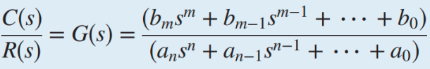
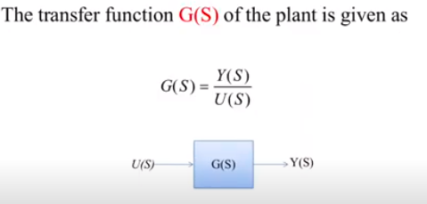
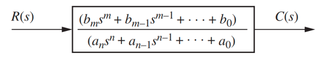

fungsi transfer menggambarkan hubungan antara input dengan output. dapat berupa gabungan setiap subsistem. The transfer function is then the ratio of output to input and is often called G(s) or H(s). fungsi transfer itu inputnya ini nanti outputnya apa. 

> G(s) = output / input

c(t) adalah berisi beberapa turunan output linear orede-n
r(t) adalah berisi beberapa turunan input linear ode-n

kemudian c(t) di tranformasi laplacekan menjadi C(s) begitu juga untuk r(t0)

> t sinonim time function, sedangkan S sinonim state function. 

Fungsi G(s) disebut sebagai fungsi transfer yang
dievaluasi pada kondisi awal nol. dapat juga di ilustrasikan sebagai berikut

dari persamaan diatas dapat untuk mencari C(s), yaitu C(s) = R(s).G(s)
