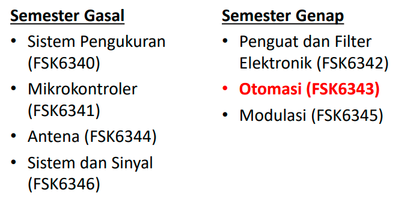
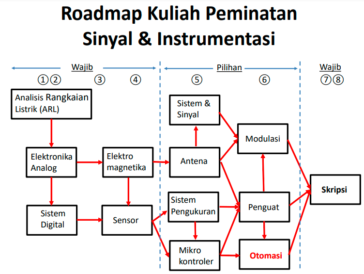
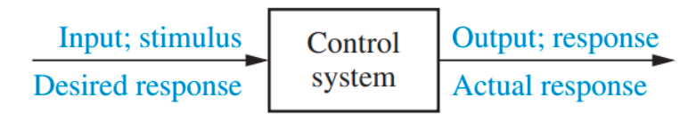
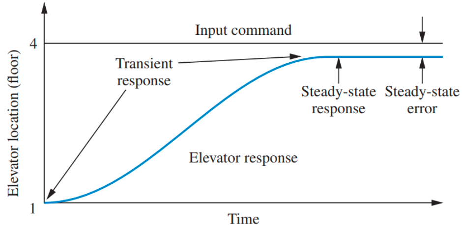
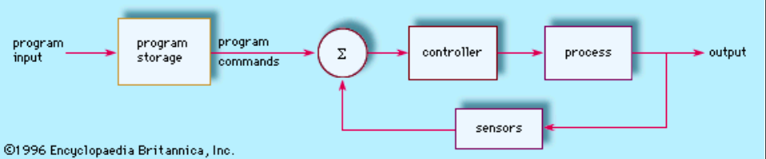

modulasi adalah  proses perubahan (varying) suatu gelombang periodik sehingga menjadikan suatu sinyal mampu membawa suatu informasi. 

Sistem kendali terdiri dari subsistem (komponen) dan proses (plant) yang digabung dengan tujuan untuk memperoleh output yang diinginkan dengan kinerja yang diharapkan berdasarkan input yang diberikan. 

misalnya elevator, Ketika ditekan tombol “Lantai 4”, maka elevator naik menuju Lantai 4 dengan kecepatan dan ketepatan yang
disesuaikan dengan kenyamanan penumpang

steady state adalah keadaan ketika konstan. steady state error yang dimaksud adalah tidak sesuainya dengan keadaan yang diinginkan dengan keadaan sekarang. respon transient adalah bagaimana kecepatan yang paling nyaman untuk penumpang. 

