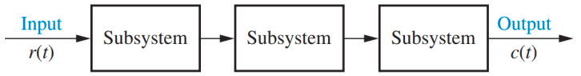

Model matemais dikembangkan untuk mengetahui hubungan antara input dengan output. diinginkan juga model yang dapat menggambarkan hubungan antar subsistem (komponen)

Dalam membangun model matematis dilakukan
banyak penyederhanaan agar modelnya masih
dapat diselesaikan namun juga masih mendekati
bentuk aslinya.

Pemodelan dilakukan dengan dua metode:
1. Fungsi transfer dalam domain frekuensi, melalui transformasi laplace
2. persamaan keadaan dalam domain waktu