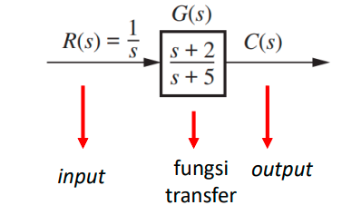
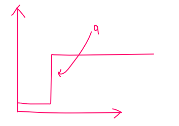
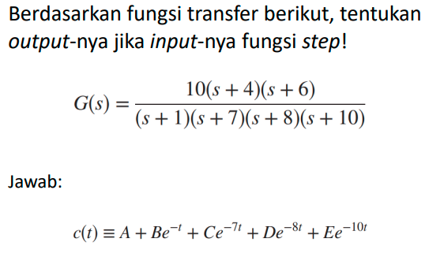
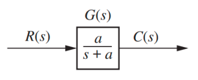
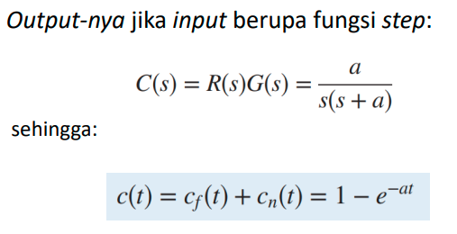
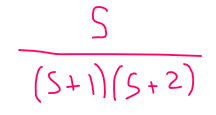
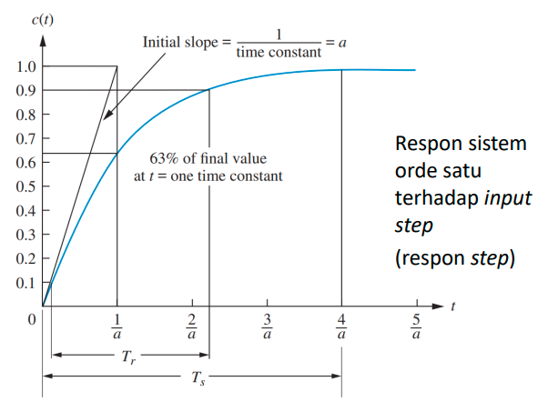
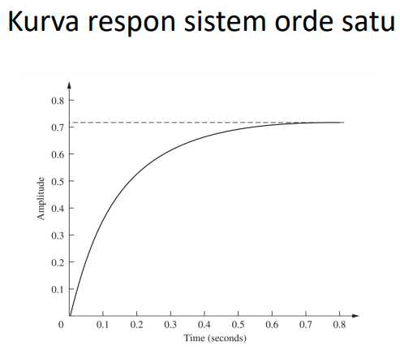
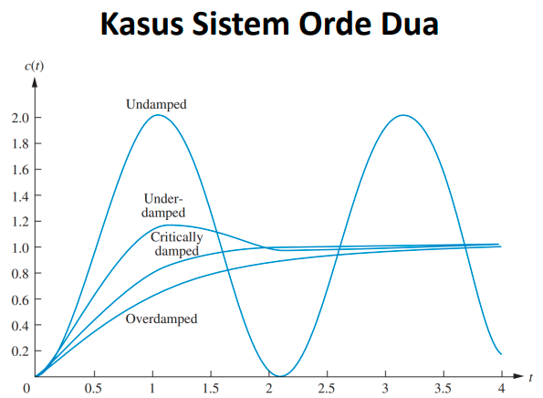

respon keluaran (output) dari sistem merupakan jumlahan dari 2 respon:
1. Respon paksa (steady-state)
2. Respon alami

## Kasus sistem orde pertama

Respon sistem terhadap input step

fungsi step adalah ketika secara spontan (tiba-tiba) ada singal umumnya bernilai antara 0 (tidak ada singal) dan 1 (ada singal). 

misalnya menentukan output dari sistem transfer apabila inputnya adalah fungsi step, maka penyusun outputnya adalah respon paksa + respon alami. 

contoh

variabel **A merupakan respon paksa** sedangkan variabel **B, C, D, E adalah respon alami** dimana nilai eksponensial ditentukan dari s + 1, s + 7, s + 8, s + 10. 

## Kasus sistem orde satu tanpa *zero*

diagram blok

contoh

respon paksa adalah cf(t) yaitu 1. sedangkan respon alami adalah cn(t) yaitu e^-at

respon output juga dapat diperoleh secara kualitatif lewat **konsep pole** dan **konsep nol(zero)**

1. misal untuk konsep pole:

apabila fungsi seperti diatas, ia bernilai -1 atau -2 ( disubstitusikan untuk s pada (s+1)(s+2)) yang membuat penyebut (bawah) bernilai nol sehingga persamaan tadi menjadi tak terhingga.

2. misal untuk konsep nol(zero):
ketika yang bagian atas (pembilang) bernilai nol, sehingga menyebabkan persamaan diatas menjadi bernilai nol (karena pembilang 0 dibagi berapapun akan menghasilkan nol)

grafik

glosarium terkait grafik diatas:
1. **waktu naik (*rise time*)** didefinisikan sebagai waktu yang dibutuhkan kurva respon dari 0,1 ke 0,9 dari nilai akhir. 
2. **waktu penyelesaian (setting time)** didefinisikan sebagai waktu yang dibutuhkan kurva untuk mencapai dan bertahan pada 2% dari nilai akhir

anda pasti penasaran, jika ada orde satu pasti ada orde dua? yap betul dan untuk setiap orde fungsi transfernya akan berbeda.

