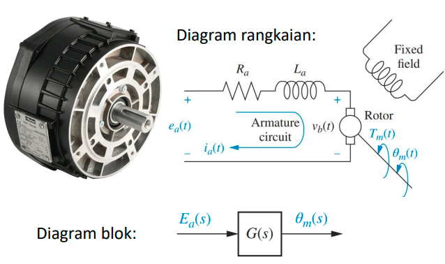
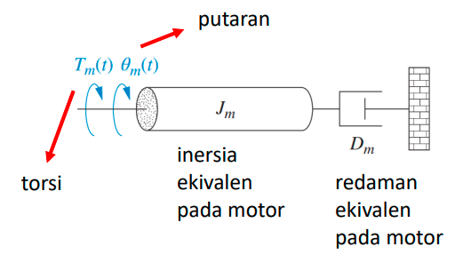
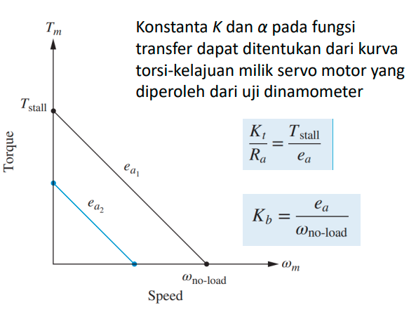
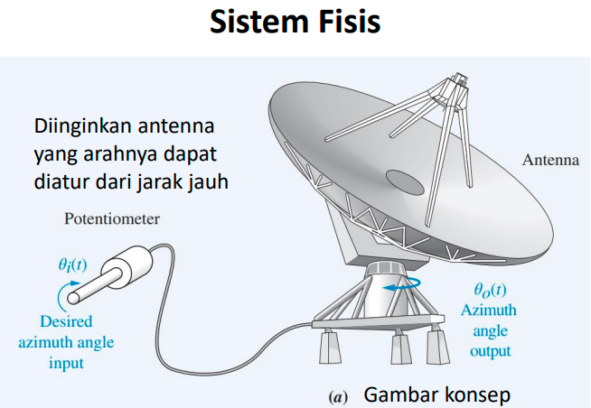
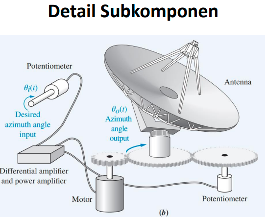
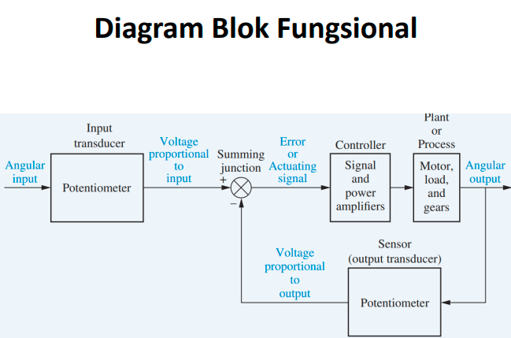
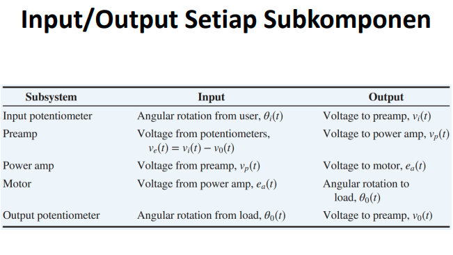

## Motor servo DC armature
merupakan komponen elektromekanik
yang keluarannya berupa gerakan (mekanik)
dengan masukan berupa listrik (tegangan). 
sistem listrik

G(s) = θmekanik / Ea, tidak memiliki beban
G(s) = θload / Ea, memiliki beban (load)
digabungkan:

θmekanik / θload = Nc / Nm, dengan Nc adalah banyaknya gerigi

sistem mekanis

T adalah torsi, dan theta adalah putaran
kurva torsi motor dc armature dapat dibyat sendiri dengan plotting hubungan input dengan output. 

wno-load adalah ketika tidak diberi beban, maka torsi (Tm) bernilai 0. Tstall ketika tidak diberi kecepatan maka torsi infiniti

## Kendali antena

