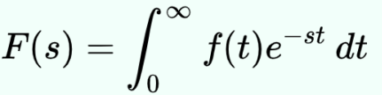
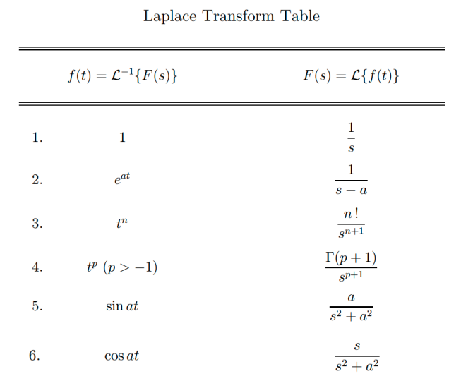
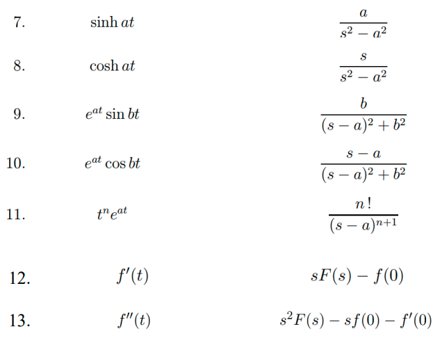

Transformasi laplace adalah suatu teknik untuk menyederhakan permasalahan dalam suatu sistem yang mengandung masukan dan keluaran. dengan melakukan transformasi dari suatu domain pengamatan ke domain pengamatan lain

transformasi laplace dapat memberikan deskripsi fungsional alternatif yang kadang dapat menyederhanakan proses analisis kelakuan dari sistem atau membuat sistem baru yang berdasarkan suatu kumpulan spesifikasi. 

dalam sistem fisik sebenarnya transformasi laplace sering dianggap sebagai suatu transformasi dari cara pandang domain waktu (pada t=0). yaitu masukan dan keluaran dimengerti sebagai fungsi dari waktu. transformasi laplace umumnya akan mentransformasikan dari domain waktu ke domain frekuensi. yaitu masukan dan keluaran yang sama dipandang sebagai fungsi dari frekuensi angular kompleks atau radian per satuan waktu. 

transformasi ini secara drastis mengurangi kerumitan perhitungan matematika yang dibutuhkan dalam menganalisis suatu sistem.

Bentuk umum

tabel

dengan s adalah persamaan komples. 

# contoh
transformasikan laplace persamaan berikut
dy/dt + y = 2
Terapkan transformasi Laplace pada kedua sisi persamaan.
L{dy/dt} + L{y} = L{2}
sY(s) - y(0) + Y(s) = 2/s

>Di sini, Y(s) adalah transformasi Laplace dari y(t), dan y(0) adalah nilai awal dari y(t) pada t=0.

Selesaikan persamaan untuk Y(s)
sY(s) + Y(s) = 2/s + y(0)
(Y(s))(s + 1) = 2/s + y(0), pengeluaran untuk (s+1)
Y(s) = (2 + s * y(0)) / (s * (s + 1))

Y(s) adalah transformasi Laplace dari y(t), yang memberikan representasi dalam domain frekuensi kompleks