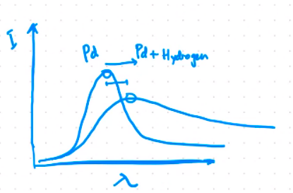
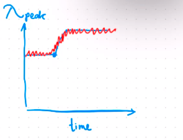

Data yang diperoleh dari fenomena SPR maupun LSPR perlu diolah untuk memudahakan proses analisis

Ketika analit (Hidrogen) bereaksi dengan sensor yaitu Paladium maka puncak akan bergeser ke panjang gelombang lebih tinggi dengan intensitas plason yang seiring menurun

gambar diatas adalah dapat dikonversi menjadi perubahan puncak seiring waktu, konversi tersebut dapat menggunakan beberapa metode seperti centroid, namun sebenarnya metode tersebut adalah sebuah pemodelan yang dipilih untuk mendekati singal sebenarnya-benarnya. 

namun data tersebut terkadang terdapat noise pada perekamanan data, noise berupa tambahan singal acak (merah) pada singal sebenarnya (biru). paling tidak singal sebenarnya harus lebih besar dari noise tiga kali lipat. 

gangguan lain yang munking terjadi adalah terjadinya *drift* yaitu pergeseran singal akibat kondisi alam seperti pH, temperature, dan lainya. terkadang AI digunakan untuk memisahkan *drift* dengan singal asli. 