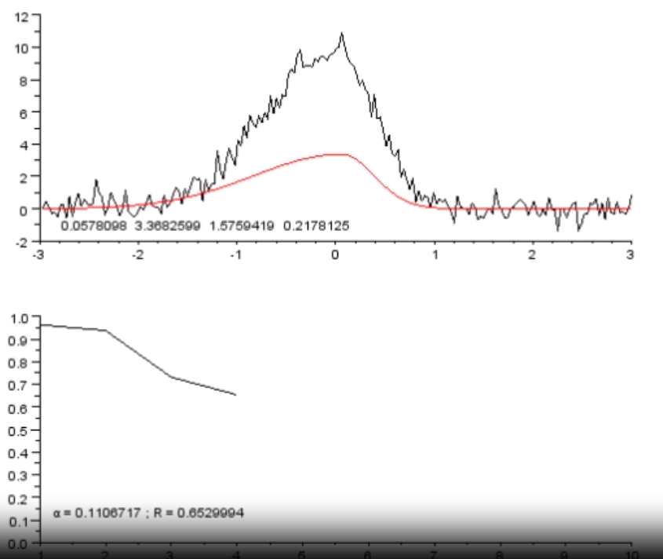

Sebuah model matematika yang merepresentasikan sebaran data. misalnya Lorenzianfit, algoritma ini menggunakan algoritma optimasi untuk mengevaluasi model berdasarkan fungsi fitness yang telah ditentukan, misalnya gradient descent.

