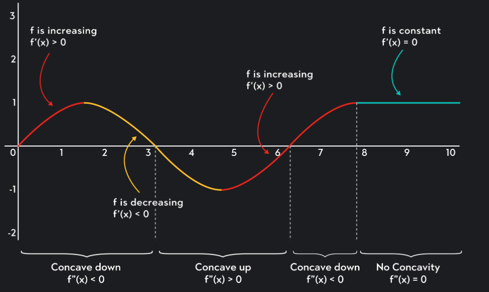
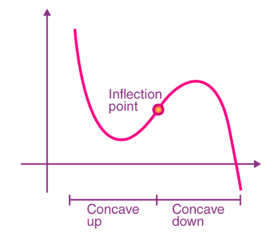
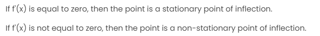
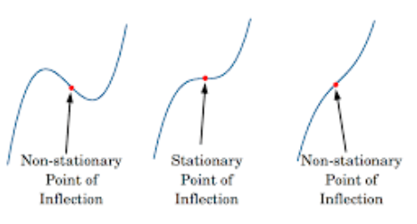

*Calculus*
titik infleksi adalah titik pada kurva fungsi dimana arah lengkungan (concavity) berubah. 

> kemiringan kurva berubah dari positif ke negatif atau sebaliknya. 

Fungsi adalah hubungan antara input dan output. berdasarkan sifat grafiknya, dibedakan menjadi grafik cekung (concev) dan grafik cembung (convex). titik yang fungsinya tidak cekung maupun cembung disebut dengan **titik infleksi**. 

concave (cekung) dibedakan menjadi dua, yaitu 
- concave up, mangkok keatas
- concave down, mangkok kebawah 	

dibuktikan dengan turunan kedua

titik infleksi berada diantara concave up dan concave down

> dalam satu kurva dapat terdapat lebih dari satu titik infleksi

Jika suatu fungsi berubah dari positif ke negatif, atau dari negatif ke positif, pada titik tertentu x = c, maka titik tersebut disebut titik infleksi pada suatu grafik.

