Noise
lamda vs intensitas plasmon
paladium
peak bergeser ketika paladium berinteraksi dengan analit (hidrogen)

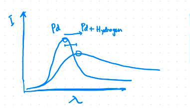

overtime
itu kondisi ideal

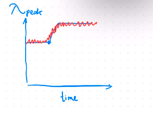
yang merah adalah noise

noise besar

singal harus lebih besar dari 3x noise

pendanaan

pemodelan yang mendekati puncak. untuk centroid

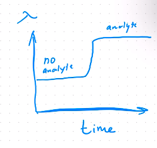

drift, yaitu proses fisika yang tidak sederhana, dirasakan oleh nanopartikel. kehadiran dari molekul. perubahan dari temperature. merubah posisi dari plasmon. 

AI untuk memisahkan drift dari real signal. 

analit: logam berat
mendektesi pb, ion Fe. 

plasmon spektroskopi, menggunakan plasmon, untuk membantu proses katalisis metilen blue. 

fiber optik, LSPR. polimer kitosan
ketika menangkap logam berat kayak pB
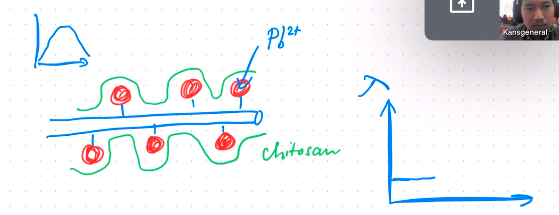

emasnya tidak stabil, ketika dicelupkan dari konsentrasi pb. masalah stabilisasi. 

plasmon katalisis
plasmon enchanced catalysis

metilen blue (limbah)
memecah dengan bantuan nanopartikel. 
menambah panas untuk memecah MB

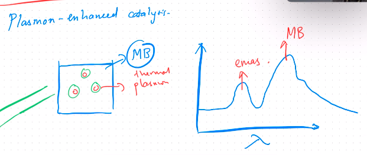

peak emas bergeser kekiri dan intensitas menurun. bergeser panjang gelombang lebih rendah, nanopartikel semakin kecil karena dipecah oleh laser. 

MB, seberapa membantu kehadiran emas untuk degrasi MB, ketika ada penurunan intensitas MB maka konsentrasinya semakin menurun. 

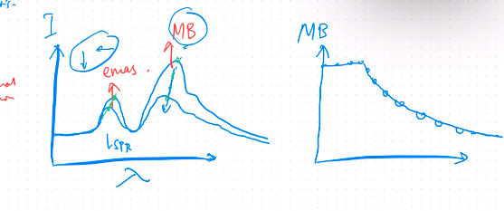

600nm. MB, prosesnya kompleks, menjadi senyawa lebih sederhana, atau lebih transparan (tidak menyerap). rentang 300 sampai 700 hanya ada dua peak.  (cahaya tampak)

SEJARAHHH
SPR
thin film. eksitasi dengan gelombang elektromagnetik. metal adalah material plasmoik. ketika ada gelombang berjalan, maka elektronya juga ikut berosilasi. refraktif index, kepadatan material maka makin tinggi index refraktif

misal udara n=1
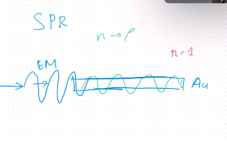
ketika ada air n = 1,3

sulit mengarahkan gelombang elektromagnetik sejajar dengan thin film. maka ditembak dari sudut tertentu, 
syarat
1. panjang gelombang elektromagnetik harus sama dengan panjang gelombang plasma material
2. momentum harus sama juga. dari elektromagnetik harus sama dengan momentum dari plasma.
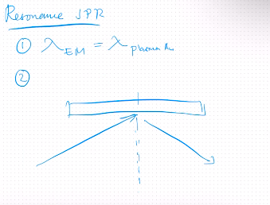

kalau momentum terlalu kuat, maka tidak harmoni plasmanya (tidak sama sama bergerak)
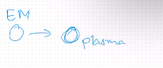

momentum ada komponen vektor, 
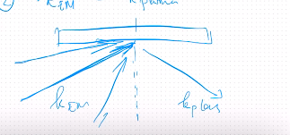
maka penentuan momentum akan penting dengan angle tertentu (angle resonance)

pergeser dinamis
lonceng, ketika lonceng ditempelkan permen karet, trus ditempel permen karet. maka frekuensinya berbeda, ini maka momentumnya juga berbeda. 

SPR dan LSPR menghasilkan data yang sama. yaitu pergeseran plasmon resonansi. 

target pak iwan: ngikutin saya.

GUI:
bright spektrum: backgrounnya (serapan kuvet)
dark spektrum: backgrounnya (serapan kuvet yang ada sampelnya)

Intensitas au = I row - I ref / (dinormaliasi)

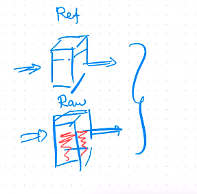

mendapatkan serapan au sebenarnya
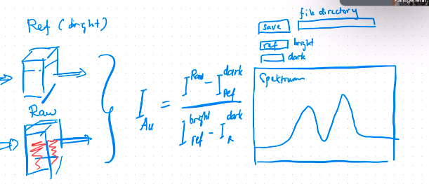

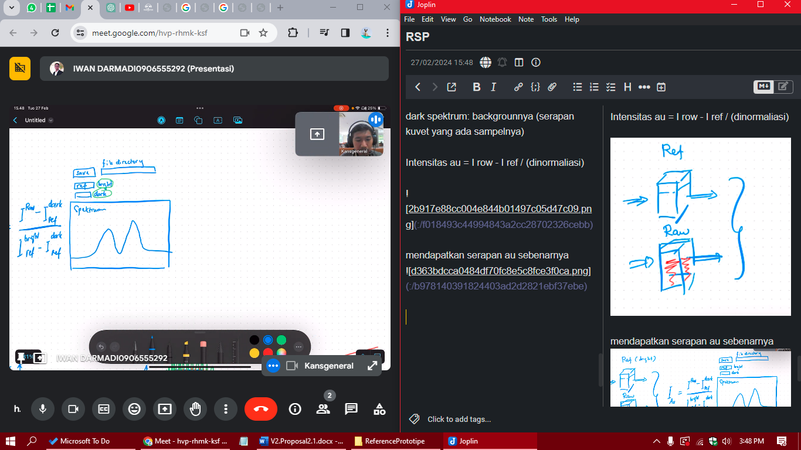

tracking satu posisi dulu saja. 

peak gues: tebakan posisinya dimana misal di 500 (kan harus dibantu)
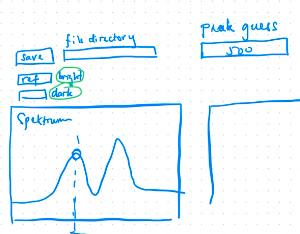

tracking secara realtime
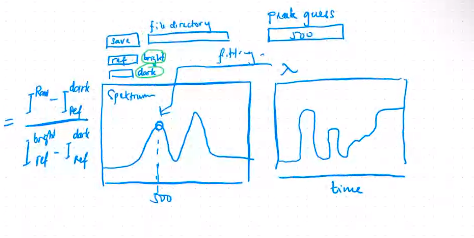 dengan lamda

fitting paling polynomial fitting

excel
WL = panjang gelombang
data = spektrum mentah row, setiap satuan waktu ada spektrum tersendiri. 
t = waktu
spektra = spektrum matang, row yang sudah dikurangi ref
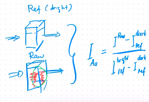
integrasi time (int) = seberapa lama exposure spektrumnya, semakin lama pengambilan data, exposure semakin lama maka semakin lembut
triger time = tidak terlalu penting

peak = hasil fitting
c = centroid, nilai x atau pusat massa
exrinsion = nilain y nya
FWHM = lebar dari puncaknya, ternyata ketika bergeser maka FWHM juga melebar, dan ini bisa dianalisis. 

ada
FWHM 
extinsion c
dan centroid

dilihat mana yang paling stabil dimana noisenya kecil, dan driftnya paling minimum. 

puncak satu peak, yaitu palladium dan hidrogen hidrogen tidak ada peaknya. (atau mungkin peaknya diluar) 

bermain di 300nm sampai 700nm (level 1) yaitu di rentang cahaya tampak. plasmonik lebih advance mereka main di rentang infrared. 