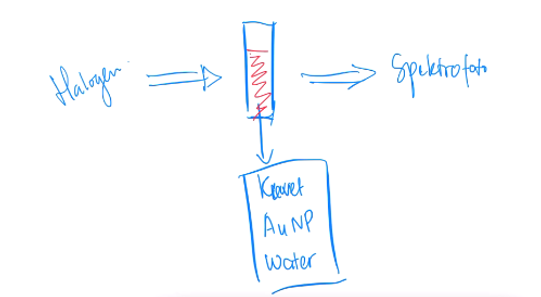
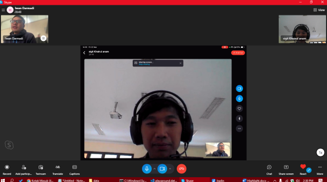

Spektrum yang dapat dibaca oleh spektrometer berada pada jangkauan mikrodetik. Mirkodetik adalah satu per satujuta detik. Gambaran dari Localized Surface Plasmon Resonance

Sumber sinar menggunakan halogen, kedalam kuvet dimasukkan air, nanopartikel emas, dan sampel. dibalik kuvet dideteksi spetrometer untuk mengukur intensitas setiap panjang gelombang serapan. 

## Kalibrasi
Kalibrasi menimbang dua variabel yaitu ref bright dan ref dark. Ketika kuvet dalam keadaan kosong, ref bright adalah ketika sumber sinar (halogen) diberikan sedangkan ref dark adalah ketika sumber sinar (halogen) dimatikan (karena anda tahu akan ada yang bocor). sehingga serapan sampel adalah hasil dari eliminasi kedua variabel tersebut dengan rumus sebagai berikut

Tranmisi Au adalah adalah spektrum asli dikurangi ref dark kemudian dinormalisasi dengan ref bright dikurangi ref dark dikali 100%.

> dalam software bawaan ocean optics sudah ada tombol untuk kalibrasi termasuk ref dark dan ref bright. Tetapi tidak ada fitur fitting dan lainya masih basic, oleh sebab itu kembangkan antarmuka untuk visualisasi data.

> pertama kali pakai skype

Seperti informasi posisi titik inflasi, pergantian model fitting(Lorentzian, Gaussian, Polinomial), posisi pada suatu titik panjang gelombang tetap (misal pada 655 nm), plotting posisi y titik inflasi terhadap waktu, plotting posisi x titik inflasi terhadap waktu, saving data.

***
## Temporary note:
estension posisi = y
ektensi pada panjang gelombang tertentu, misal pada 655 nm
diberi input. (apakah hanya satu?)
tombol
spektrum yang dibaca dan tiga variabel, 
spektrum, hasil peak fitting, extension, extensioat at 655 nm. ( di step berikutnya bisa lebih banyak multiple).

fitting itu distep berikutnya 

fitur fitting
gaussian, polinomial, loretzian
MB ada dua peak maka perlu polinomial. 
deconvolusi (terdiri lebih dari satu puncak)

deadline kapan. urgent: dalam bulan ini. 

data virtual. 