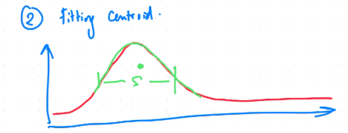
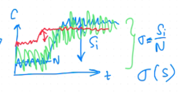

optimasi singal untuk mendapatkan noise yang relatif kecil. 

dalam fitting, salah satu parameter untuk mendapatkan titik tengah atau centroid adalah **spread(?)**

> tidak yakin dengan spread, bagaimana penulisan yang baik. 

spread sebagai garis hijau, dan titik centroid sebagai titik hijau. spread ini akan berpengaruh langsung terhadap pembacaan pergeseran, ketika spread terlalu lebar maka rasio nilai signal-to-noise akan terlalu besar (signal-to-noise adalah sama dengan signal per noise)

pergeseran direpresentasikan sebagai Si dan noise direpresentasikan sebagai N. tetapi ketika spread terlalu kecil, maka pergeseran tidak begitu nampak (tidak sensitif). 

seperti yang direpresentasikan oleh garis warna merah. 

