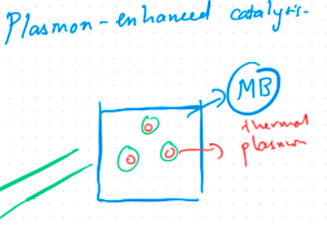
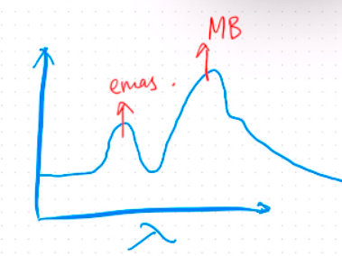
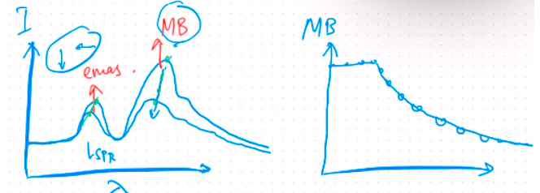

mekanisme yang menggunakan plasmon sebagai sumber pemanas lokal untuk meningkatkan aktivitas reaksi. kelebihanya adalah dapat dipantau secara realtime

Misalnya limbah Metylen Blue yang akan didegradasi dengan nanopartikel

sebuah matylen blue (MB) berada pada nanopartikel emas, nanopartikel tersebut dikenai sinar sampai mendapat kondisi pembangkitan resonansi plasmon. resonansi ini dapat meningkatkan temperature (thermal plasma) pada aktivitas reaksi yaitu mendegradasi MB.

spektrokopi digunakan untuk menangkap refleksi sinar polikromatik dari nanopartikel (LSPR). ketika degradasi MB terjadi maka intensitas dari puncak MB akan menurun disamping itu puncak dari emas sebagai nanopartikel itu sendiri akan mengalami pergeseran. karena MB terdegradasi maka sebenarnya akan terbentuk senyawa baru, senyawa senyawa tersebut bisa saja membentuk puncak baru pada panjang gelombang yang lain. 

> Level 1 adalah plasmon yang diamati pada panjang gelombang sinar tampak yaitu 400 nm sampai 700 nm.

informasi ini dapat digunakan untuk menyimpulkan seberapa membantu kehadiran nanopartikel emas dalam degradasi MB, ketika ada penurunan puncak (intensitas) MB berarti terjadi penurunan konsentrasi MB. 
