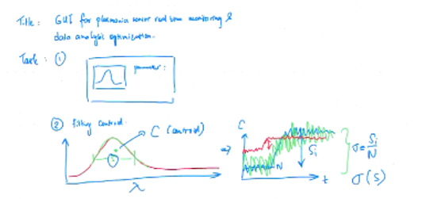
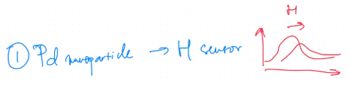
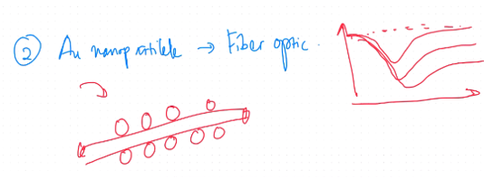
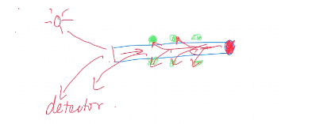

*Judul: **Graphical User Interface for Plasmonics Spectroscooy Realtime Monitoring and Data Analysis Optimization***

*Judul: **Antarmuka Grafis Pengguna untuk Pemantauan Langsung dan Optimalisasi Analisis Data pada Spektroskopi Plasmonik***

Subjek penelitian ini adalah pembuatan GUI dan Optimasi Analisis Data

Data yang digunakan dalam penelitian ini adalah 
1. Palladium Nanopartikel untuk Deteksi Hidrogen	
2. Gold Nanopartikel untuk Degradasi Methylen Blue (**apakah ini bukan plasmonik?**)

Palladium menempel di permukaan kaca, sumber sinar akan menembak ke arah kaca refleksi sinar akan di serap oleh spektrometer sebagai sensor. 

Nanopartikel emas menempel di sekitar permukaan fiber optik. 

sinar akan melalui sepanjang fiber optik, nanopartikel emas disekitar fiber optik akan menyerap sebagian panjang gelombang. sehingga dalam spektrumnya, ketika tidak ada sinar yang diserap maka intensitas setiap panjang gelombang akan penuh, tetapi ketika telah diserap maka akan terbentuk cekungan yang berarti pada daerah itu energinya diserap oleh nanopartikel. 

# Structure
## BAB I PENDAHULUAN
### Latar Belakang
Bagaimana sejarah nanopartikel plasmonik, bagaimana aplikasinya, bagaimana pembacaan spektroskopi berbentuk spektrum plasmonik, apa yang penting dari karakteristik spektrum plasmonik untuk mendapatkan informasi yang baik. 

fitting perlu dioptimalisasi, mengingat terdapat banyak sekali metode seperti centroid, lorentzian, dan polynomial (polynomial adalah teknologi lama).

Ketercapaian plasmonik digunakan sebagai sensor adalah dapat dianalisis secara realtime. 
### Identifikasi Masalah
### Pembatasan Masalah
### Rumusan Masalah
### Tujuan Penelitian
### Manfaat Penelitian

## BAB II KAJIAN PUSTAKA
### LSPR
### Aplikasi Plasmonik Sensing
### GUI

## BAB III METODOLOGI
### Jenis Penelitian
### Waktu dan Tempat 
### Subject dan Object 
Object: Parameter fitting dan (flow) GUI
Subject: Data
### Bahan dan Peralatan
python
library terkait
komputer software hardware
spectroscopy
plasmon
### Teknik Analisis Data
### Diagram Alir
Data Palladium dan Au
GUI
Fitting Optimization
Optimized Data
Optimized Realtime Spektroskopi
### Time Table

## Daftar Pustaka