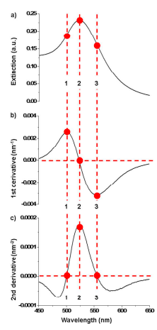
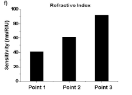
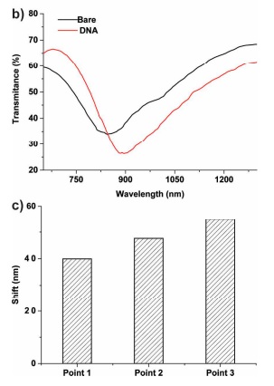

We recognized two such points in addition to peak maximum, namely, the inflection points around the peak maximum. Mathematically, the inflection points appear as local maxima/minima in the first order derivative spectrum and as zerocrossings in the second order derivative spectrum. 

Therefore, they are easily located with the help of the 1st and 2nd order derivative spectra like this image

perbandingan pergeseran titik inflasi point 1, point 2, dan point 3

Point 1 and 3 are two inflection points of the extinction spectrum around the peak maximum, which show 0 value in the 2nd order derivative spectrum. The peak maximum (Point 2) and two inflection points (Point 1 and 3) flanking the peak maximum (Point 2) are highlighted (by red dot).

Therefore, it is reasonable to expect that the method of tracking shift at Point 3 could further yield a better performance for applications in biological sensing.

> With these observations, we propose that tracking at the
inflection point (Point 3) could be used as a general method to enhance the refractive index sensitivity
for many different plasmonic nanostructures

### Penerapan pada sampel DNA

This observation is consistent with that observed on plasmonic nanoparticles that the inflection point at the right side of the peak of extinction/valley of transmittance spectrumyields a larger shift. Therefore, we believe that this novel mathematical method opens an avenue to enhance the sensitivity of plasmonic sensors.

From these observations, it is evident that tracking the shift at Point 3 is better than Point 2, regardless
of the type of nanoparticles and the cause of the shift (bulk or monolayer refractive index change).
Therefore, it is reasonable to expect that the method of tracking shift at Point 3 could further yield a better performance for applications in biological sensing

> ### conclusion
> demonstrate that the inflection point at the red side of the LSPR peak maximum (Point 3) shows higher refractive index sensitivity than the traditionally used peak maximum (Point 2)

