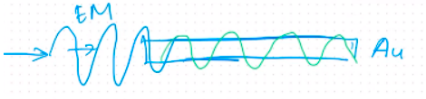
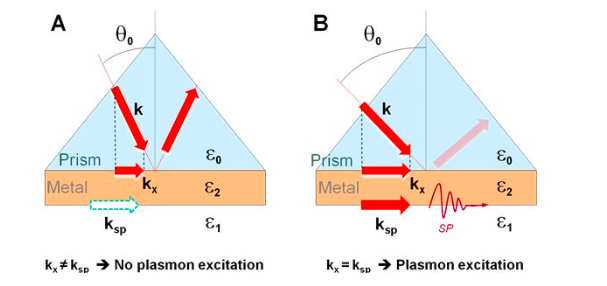
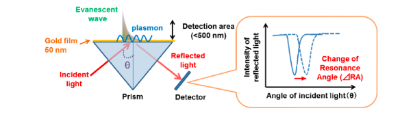
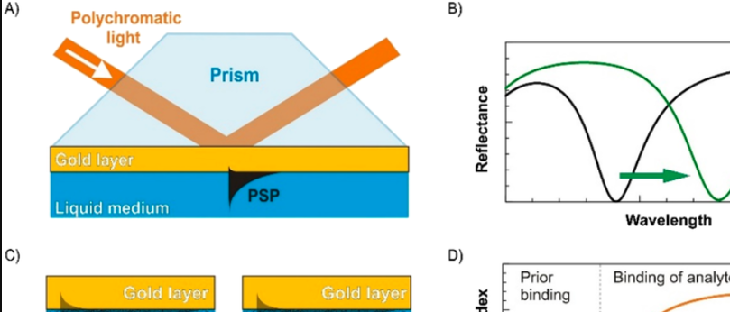

Sebuah fenomena fisika terkait resonansi plasmon pada permukaan. plasmon dapat terjadi pada material logam (disebut material plasmonik), dimana logam mengandung ion-ion positif dan elektron-elektron bebas. 

> plasma merupakan bentuk keeempat dari materi. plasma merupakan gas yang terionisasi, walaupun bermuatan, namun secara kseluruhan plasma bersifta netral karena tersusun atas ion positif dan elektron yang bermuatan negatif dengan jumlah yang sama

surface plasmon resonance (SPR) juga digunakan sebagai nama instrumen dari fenomena surface plasmon resonance itu sendiri. 

ketika permukaan layer metal seperti emas dikenai energi misalnya photon. gelombang elektromagnetik akan membangkitkan plasmon sedangkan resonansi plasmon akan terjadi ketika photon menumbuk dengan momentum yang tepat pada elektron bebas material. jika tumbukan terlalu besar atau terlalu kecil maka elektron bebas tidak bisa beresonansi.

> kalau momentum terlalu kuat, maka tidak harmoni plasmanya (tidak sama sama bergerak)

> Fenomena yang mirip adalah resonansi jembatan. Resonansi terjadi ketika angin membawa getaran dengan frekuensi yang sama dengan frekuensi alamiah jembatan. Hal ini menyebabkan jembatan mengalami osilasi dengan amplitudo yang semakin besar.

sehingga perlu menetapkan sudut yang sesuai agar diperoleh momentum yang sesuai untuk membangkitkan resonansi plasmon. sebenarnya dengan mengarahkan gelombang elektronik sejajar dengan material maka resonansi akan terbangkitkan tetapi kenyataanya sulit sehingga cara lain adalah dengan mengarahkan gelombang elektromagnetik dengan sudut tertentu

> salah satu elemen dalam momentum adalah vektor, sehingga arah yang direpresentasikan oleh vektor akan berpengaruh pada nilai akhir momentum. 

seringkali prisma digunakan untuk mengoptimalkan sudut sinar yang datang untuk dikenai layer logam. ketika sinar datang dan terjadi resonansi plasmon itu berarti sinar dikonversi menjadi resonansi plasmon sehingga terjadi pengurangan intensitas sinar refleksi (gambar B), namun apabila tidak terjadi pengurangan intensitas, berarti sinar yang datang tidak terjadi konversi (gambar A)

mulai dari sudut 0 yang semakin meningkat, maka pada nilai sudut tertentu akan ditemukan intensitas laser yang menurun menandakan pada sudut tersebut adalah sudut tepat momentum didapatkan sehingga dapat membangkitkan resonansi plasmon. 

Detektor perubahan sudut laser dapat menggunakan *photodiode array* atau kamera CCD. 

## Penerapan
SPR dapat digunakan untuk mengamati kinetika terbentuknya makromolekul-ligand. misalnya anda telah menentukan tetapan sudut laser yang mengenai layer logam yaitu 40 derajat. dan saat itu layer telah ditempeli makromolekul

> Lonceng yang dipukul akan menghasilkan sebuah frekuensi berupa bunyi. ketika anda menempelkan sesuatu misalnya permen karet pada lonceng tersebut, maka frekuensi bunyi yang dihasilkan oleh lonceng tersebut juga sudah berbeda. fenomena tersebut dimanfaatkan dalam SPR

ketika makromolekul tersebut berikatan dengan ligand atau dengan kata lain ada perubahan massa pada kesatuan SPR, maka momentum untuk membangkitkan resonansi plasmon juga sudah berubah. Oleh karena itu sudut daripada laser juga sudah berubah untuk mendapatkan momentum sesuai yang dapat membangkitkan plasmon pada layer. 

ketika ligand yang berikatan dengan makromolekul telah lepas lagi, maka sudut laser untuk membangkitkan plasmon akan kembali ke sedikala, dalam kasus ini adalah 40 derajat. 

## SPR Lanjutan
kita tahu bahwa semakin pendek panjang gelombang maka semkin besar energi yang dimiliki. Hal ini dapat dimanfaatkan dalam deteksi perubahan sudut laser. dengan kata lain sinar 500nm dan sinar 600nm akan memiliki sudut yang berbeda untuk membangkitkan resonansi plasmon. 

Sinar polikromatik yang dikenai pada layer logam dapat digunakan untuk mengetahui beberapa panjang gelombang yang dapat terkonversi menjadi resonansi plasmon dengan menukur intensitas serapan panjang gelombang yang terlibat. 
