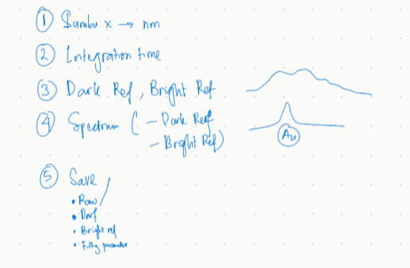

cara membandingkan. range fitting, centroid stand, 

bulan 10 paling cepat. span sama fitting. 

span 10 nnti lebih besar noise lebih besar

noise adalah lambda 

singal to noise

dan melihat shiftnya yang paling besar

10 data, mana yng ini.

inverse desain plasmonic hydrogen sensor. 

1. spektrum indeksnya 0 jangan dimulai dari nol. 
2. integrasi time pindah kedepan
3. save, csv dipisah pake yng disimpan adalah .mat ikutin variabel yang di matlab. 

hasil jadinya saat kalibrasi. 

percabangan beda, maxwell

teori free elektron. drude teori. 

berangkat 

pegas - mnghitung absorption sama scattering - halaman 37.

33 sampai 37. plasmon
plasmonik sensing.

23, review.

tesis + review.

review 23, adalah sensing.

ini adalah fungsi pembimbing. 
