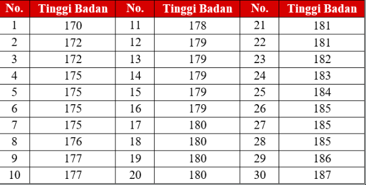
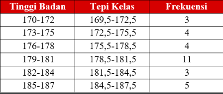

1. mengurutkan data dari terkecil ke terbesar
2. menentukan jangkauan data (range), yaitu dengan mencari selisih data terbesar dengan data terkecil. 
3. menentukan jumlah kelas, dengan aturan rugless, kelas = 1 + 3,3*log(n), dengan n adalah banyaknya data. perhitungan logaritma apabila tidak dituliskan basisnya secara eksplisit berarti logaritma tersebut memiliki basis 10. setelah anda menemukan nilainya bulatkan ke nilai terdekat
4. menentukan panjang interval kelas. membagi range kelas dengan jumlah kelas, RANGE / Σ KELAS, interval kelas ini akan menentukan dalam satu kelas terdapat berapa data yang akan diwakilkan. 
5. menentukan tepi bawah dan tepi atas. 
Tepi bawah     = kelas bawah – 0,5   
Tepi atas          = kelas atas + 0,5, contoh data jadi

6. langkah selanjutnya yaitu mengklasifikasikan data yang sudah diurutkan tadi kedalam kelas-kelas yang telah anda buat, 

diklasifikasikan, representasi frekuensi

