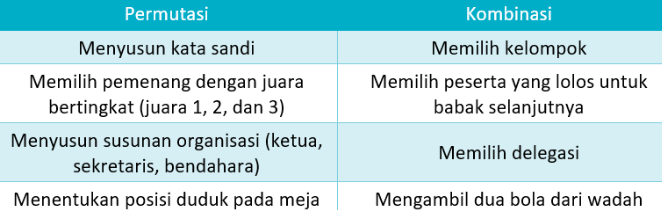
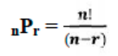
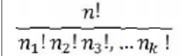
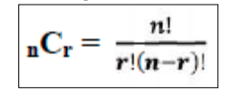
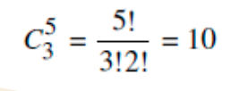

Kombinatorik : tidak memperhatikan urutan
Permutasi : memperhatikan urutan, 

baik kombinasi maupun permutasi, ada dua bentuk yaitu pengulangan diperbolehkan dan pengulangan tidak diperbolehkan. 

misalnya, kasus kombinatorik, 'cariin 3 orang buat main voli'. misalnya, kasus permutasi, 'Nih catet ya, 0897654321. Jangan salah ketik, nanti lo salah kirim'

misal studi kasus yang lebih konkret untuk kombinasi, Suatu kelompok memiliki 3 orang anggota, yaitu A, B, dan C. Seorang guru harus memilih 2 orang anggota untuk mengikuti lomba vokal. Tentukan ada berapa kombinasi yang digunakan untuk mengambil dua orang dari tiga anggota yang tersedia!

## Permutasi
banyaknya permutasi n benda yang berbeda adalah n!. misalnya banyaknya permutasi empat huruf a, b, c, dan d adalah 4! = 4.3.2.1

banyaknya pengambilan r benda dari n benda yang berbeda 

misalnya dari 24 orang, akan dipilih ketua dan sekretaris, dan bendahara maka notasinya adalah nPr = 24P3. 

banyaknya benda yang berbeda yang disusun dalam lingkaran adalah (n-1)!

Banyaknya permutasi yang berbeda dari n benda yang n1 diantaranya berjenis pertama, n2 berjenis kedua, …, nk berjenis ke –k.

misalnya, berapa banyak susunan yang berbeda bila kita akan merangkai lampu dari 3 lampu hijau, 4 lampu kuning, 2 lampu merah	

## Kombinasi
Banyaknya kombinasi akibat pengambilan r benda dari n benda yang berbeda (tanpa memperhatikan urutan)

dari 5 orang anggota sekrup, akan dipilih 3 orang untuk mewakili lomba menyanyi, berapa banyak kombinasi anggota yang mungkin ikut lomba

 5 sebagai n, dan 3 sebgai r.