# Satu Populasi
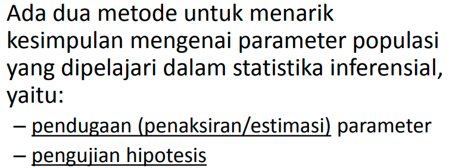

misalnya prediksi nilai test protefl, populasinya adalah seluruh mahasiswa UNY, maka perlua diambil sampel untuk efisiensi.

1. rata-rata
2. ragam
3. proporsi

bisa diuji sampai beberapa populasi, tetapi untuk kuliah ini dibatasi untuk sampai dengan 2 populasi. 

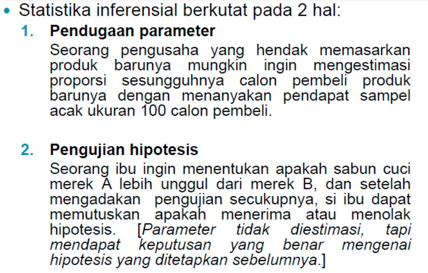

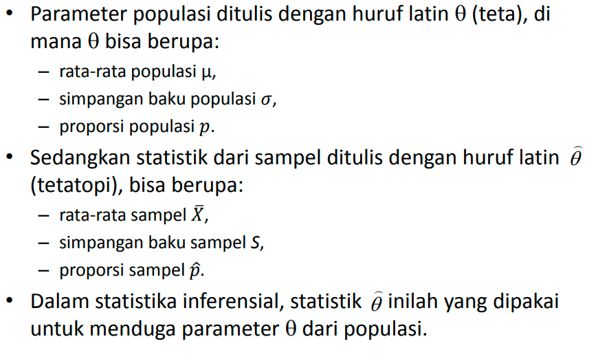
dalam pemilu, mereka menggunakan ini untuk hitung cepat. 

Pendugaan (estimasi)
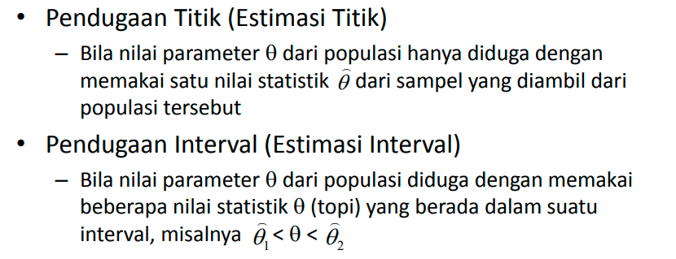

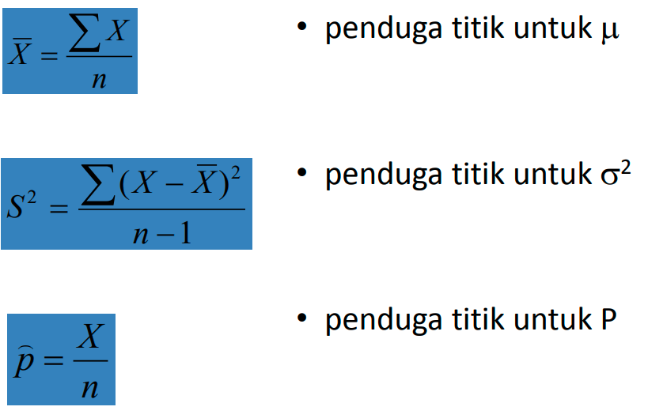
ditengah adalah simpangan baku. 

1. jika simpangan baku diketahui, tanpa memperhatikan n
2. jika simpangan baku populasi tidak diketahui dengan n kurang dari 30
3. simpangan baku tidak diketahui dengan n lebih dari 30

**X bar : rata-rata sampel
myu : rata-rata populasi**

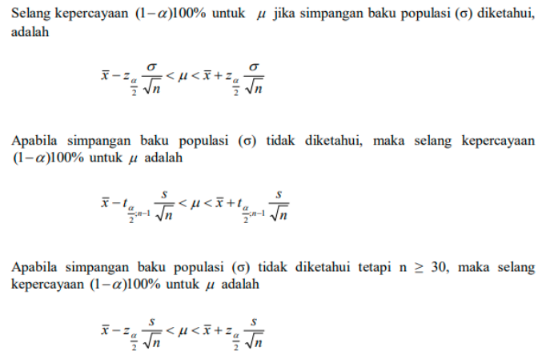

mereka sebenarnya menggunakan uji t dan uji z. 

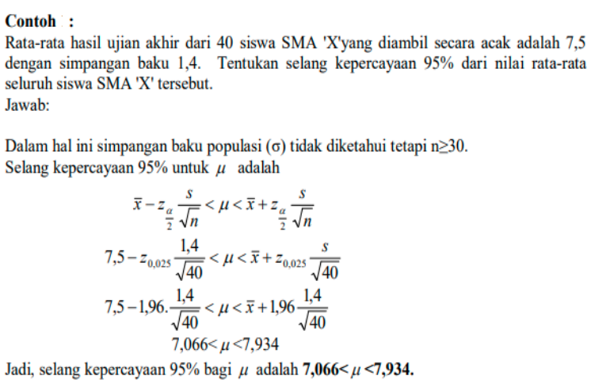
dalam soal diatas, dieketahui simpangan baku sampel (bukan populasi), maka menggunakan kasus yang ketiga (simpangan baku tidak diketahui dengan n > 29)

maka

rata-rata sampel (x bar) : 7,5
simpangan baku sampel (S)  : 1,4
selang kepercayaan : 95%
alfa = 100 -95 = 5%
rata-rata seluruh siswa (populasi ( myu )) : ...?

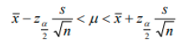

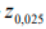 ini dicari di tabel z. z0,025 atau yang mendekati. yaitu 1,96

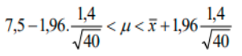

untuk mengetahui jawaban anda benar atau salah. maka dengan apakah X bar yaitu 7,5 masuk dalam rentnag hasil hitung anda atau tidak
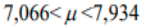 oh ya masuk
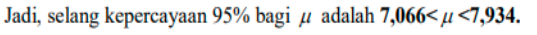

contoh soal bila diberikan simpangan baku populasi
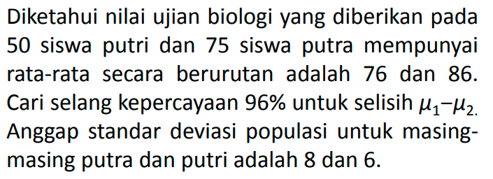
> ditandai dengna standar deviasi populasi

# Dua Populasi
kalau di satu populasi ada tiga kasus, kalau dalam dua populasi ada 4 kasus. 

misalnya simpangan rata2 toefl UGM dan UNY. 

kasus
1. jika simpangan baku populasi keduanya diketahui 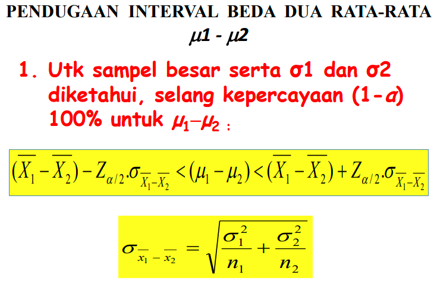 ini  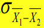mencarinya untuk dimasukkan kedalam 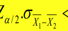 ini adalah untuk contohnya 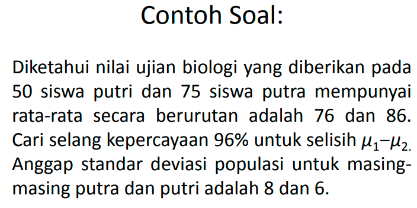 ini adalah menunjukkan untuk kasus pertama. 
2. variasi (nilai)  simpangan baku tidak diketahui, tetapi dianggap sama 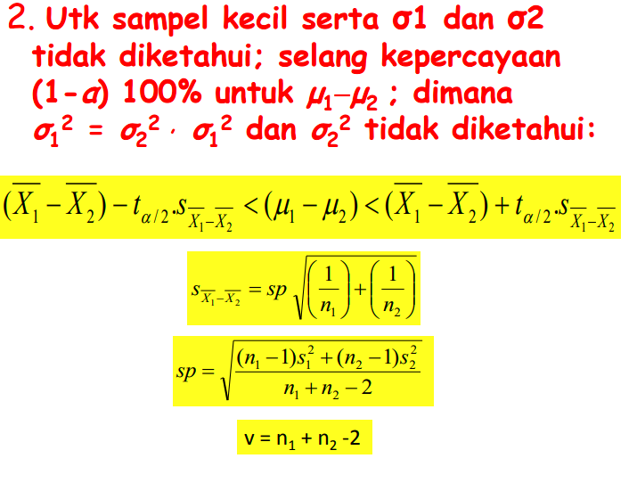
3. variasi (nilai) simpangan baku tidak diketahui, tetapi dianggap tidak sama
4. pengamatan berpasangan, jumlah sampel yang pertama pasti sama dengan sampel kedua. dimana n1=n2 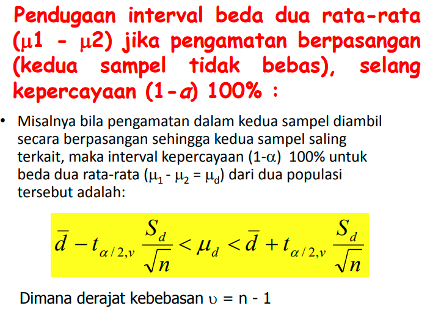
misal 
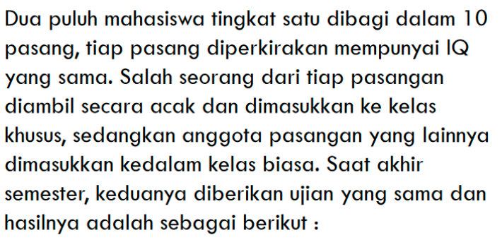

ada 20 orang dibagi menjadi dua kelas. dengan IQ sama. kelas a diberi bimbingan belajar dengan cara 1 dan kelas b diberi bimbiungan belajar dengan cara 2. lalu apa bedanya.

??? ragam = varians = simpangan baku = standar deviasi = S. ragam populasi = S kuadrat. ????

***

diatas masuk dalam kasus simpangan baku populasi 1 dan 2 diketahui. (kasus 1)

X bar1 - X bar2 : yang X bar1 adalah yang nilainya lebih besar. yaitu yang putra : 75 : X bar1

n1 = 75
n2 = 50
X bar1 = 86
X bar2 = 76
alfa = 4% = 0,04
sigma1 = 8
sigma2 = 6
z = alfa/2 = z0,02 = 2,05 (lihat di tabel)

rumusnya ini (kasus 1)
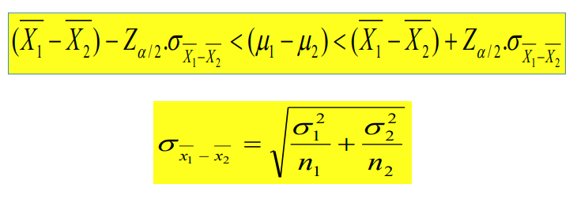

nilai ini 
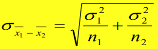
disubstitusikan 
n1 = 75
n2 = 50
X bar1 = 86
X bar2 = 76

maka didapatkan
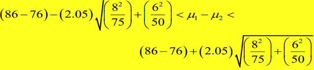
hasilnya adalah 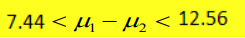
dan itu bisa dicroscek loh nilainya. 

berikut adalah interprestasinya dari hasil perhitungan. 
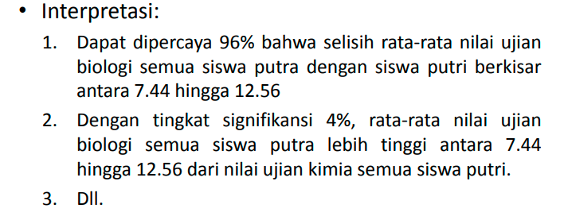

ini untuk kasus 2
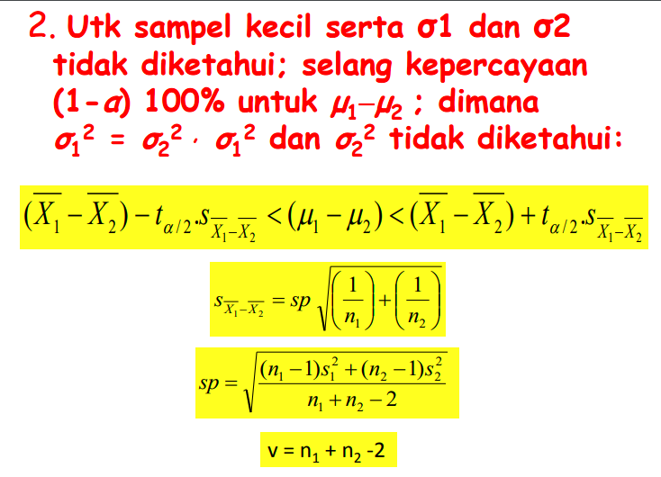

t kan perlu derajat bebas, mka derajat bebas adalah nilai dari v yaitu 

misalnya mencari nilai t untuk soal ini
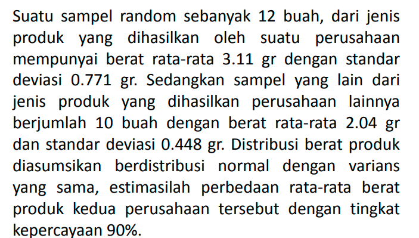

t = alfa/2 -> t0,05
dengan derajat bebas 20 maka ditulis sebagai berikut

t0,05, 20 nilainya adalah 1,725

