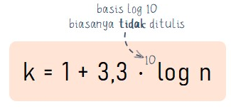
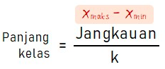
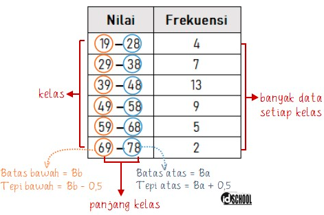
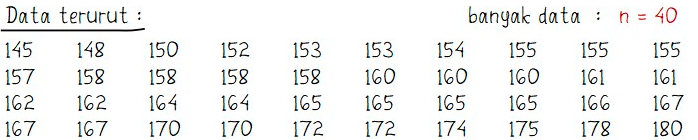
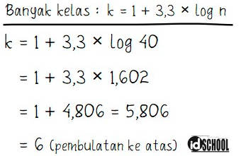
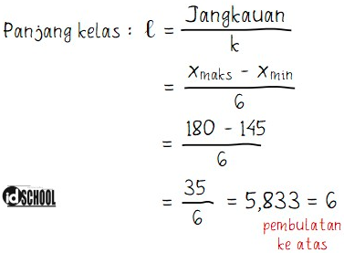

 Metode pengorganisasian data yang paling mudah adalah dengan membuat distribusi frekuensi. 

Aturan strugless dapat digunakan untuk menentukan banyak kelas dan panjang kelas.

k adalah jumlah kelas pada tabel distribusi frekuensi kelompok dan n adalah banyaknya data.
 
 
jangkauan (J) adalah selisih nilai terendah dan nilai tertinggi yang terdapat pada himpunan data.

19, 29, 39 dst. disebut dengan tepi bawah
28, 38, 48 dst. disebut dengan tepi atas
19 - 28 disebut kelas pertama atau interval pertama
29 - 38 disebut kelas kedua atau interval kedua

setiap kelas memiliki batas bawah dan batas atas, dalam ilustrasi diatas, kelas pertama memiliki batas bawah adalah 19 - 1/2 dan batas atas adalah 28 + 1/2

misal studi kasus

menentukan banyak kelas berdasarkan persamaa strugless

***

  