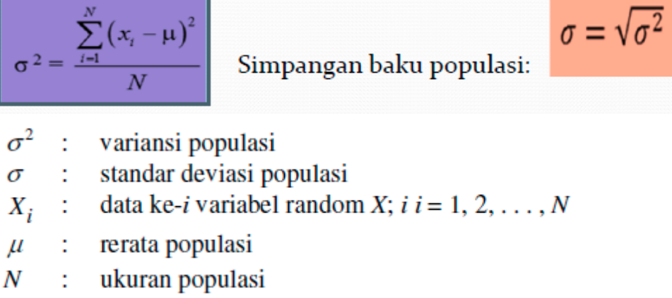
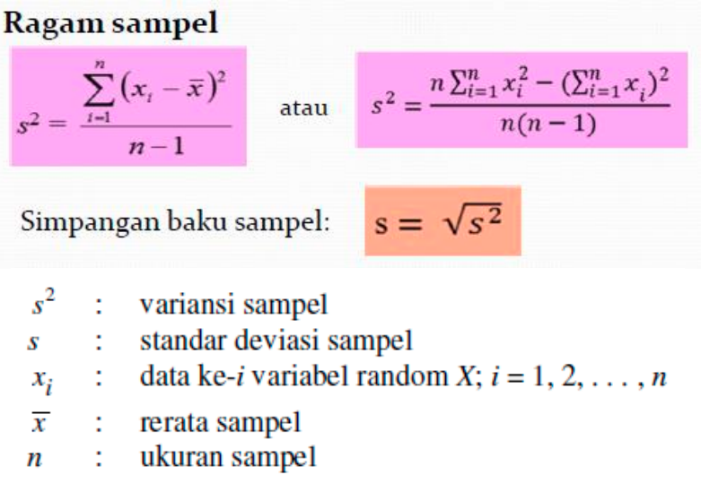
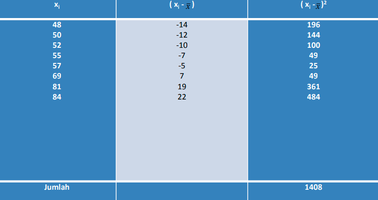
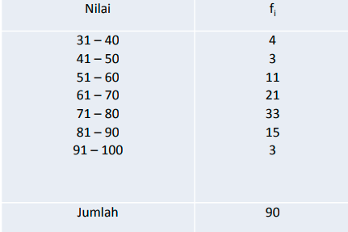
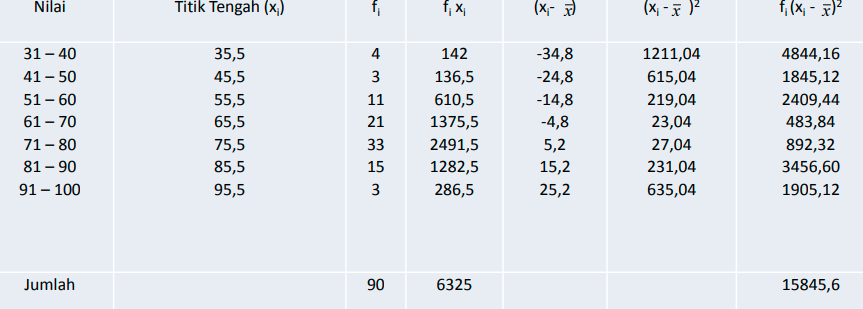
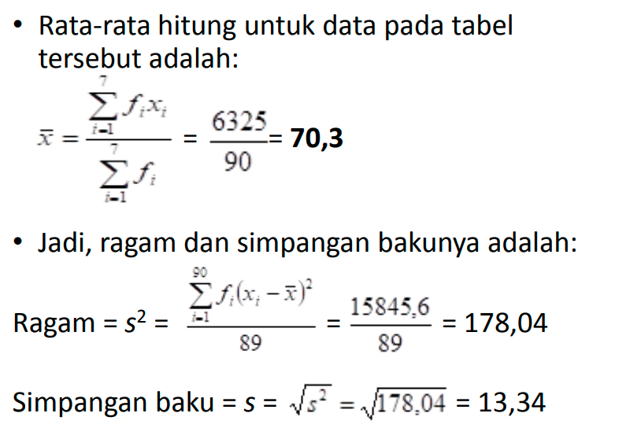

Rentang, selisih antar data terbesar dengan terkecil (Xmax - Xmin)
Rentang Inter-Quartil, selisih kuartil ketiga dengan kuartil pertama I QR = Q3 - Q1

### Ragam (variansi) dan Simpangan Baku (standar deviasi)
ukuran keberagaman data menggambarkan seberapa jauh data menyebar dari rata-ratanya. ragam populasi menggambarkan seberapa jauh data tersebar dalam suatu populasi. simpangan baku menggambarkan seberapa jauh data tersebar dari nilai rata-rata. 

variasni populasi merupakan pangkat dua dari standar deviasi, sehingga dalam rumus tersebut (ungu) jika anda ingin mencari standar deviasi rumus tersebut perlu diakar terlebih dahulu

Ragam sampel

untuk mengerjakan permasalahan seperti diatas, akan lebih mudah apabila dibuat tabel terlebih dahulu

xi, adalah data
xi - x bar, adalah pengurangan data dengan rata-rata	

**Menghitung ragam dan simpangan baku dari tabel distribusi frekuensi**.

dibuat tabel untuk mempermudah perhitungan, 

