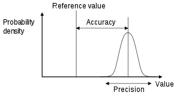
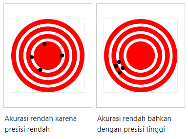

Akurasi adalah seberapa dekat kumpulan pengukuran tertentu dengan nilai sebenarnya, sedangkan presisi adalah seberapa dekat pengukuran satu sama lain. akurasi yang tinggi membutuhkan presisi tinggi.

sample dikatakan akurat jika rata-ratanya mendekati nilai sebenarnya dari besaran yang diukur. sedangkan himpunan dapat dikatakan presisi jika standar deviasinya relatif kecil.
Suatu sistem pengukuran dianggap valid jika akurat dan presisi .