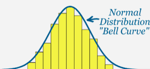

distribusi normal adalah jenis distribusi probabilitas kontinu dimana sebagian titik data mengelompok ke tengah rentang, sedangkan sisanya meruncing secara simetris ke salah satu ekstrem. agar data dikatakan terdistribusi normal, kumpulan data (bila dibuat grafik) harus mengikuti kurva simetris berbentuk lonceng yang berpusat di sekitar rata-rata

Parameter Distribusi Normal 

Seperti halnya teori distribusi lain dalam statistika probabilitas, bentuk kurva serta nilai peluang distribusi normal ditentukan oleh sejumlah parameter. Untuk distribusi ini, terdapat dua jenis parameter yang dijadikan acuan, yakni mean (nilai rata-rata) serta standar deviasi atau simpangan baku. 

Nilai rata-rata digunakan sebagai pusat distribusi atau penyebaran nilai lainnya. Nilai tersebut akan menentukan lokasi titik puncak dalam kurva lonceng, sedangkan nilai-nilai lainnya akan menyebar mengikuti rerata.  

### Sturgless rules
Sturgess Rule adalah aturan yang digunakan untuk menentukan jumlah interval yang optimal untuk menyajikan data dalam bentuk histogram. Aturan ini menyatakan bahwa jumlah interval optimal adalah √n, dimana n adalah jumlah data. Dalam hal ini, √n dianggap sebagai jumlah interval yang cukup untuk menyajikan data dengan baik tanpa terlalu banyak atau terlalu sedikit. Namun, aturan ini hanya merupakan petunjuk dan dapat digunakan dengan fleksibilitas sesuai kebutuhan.